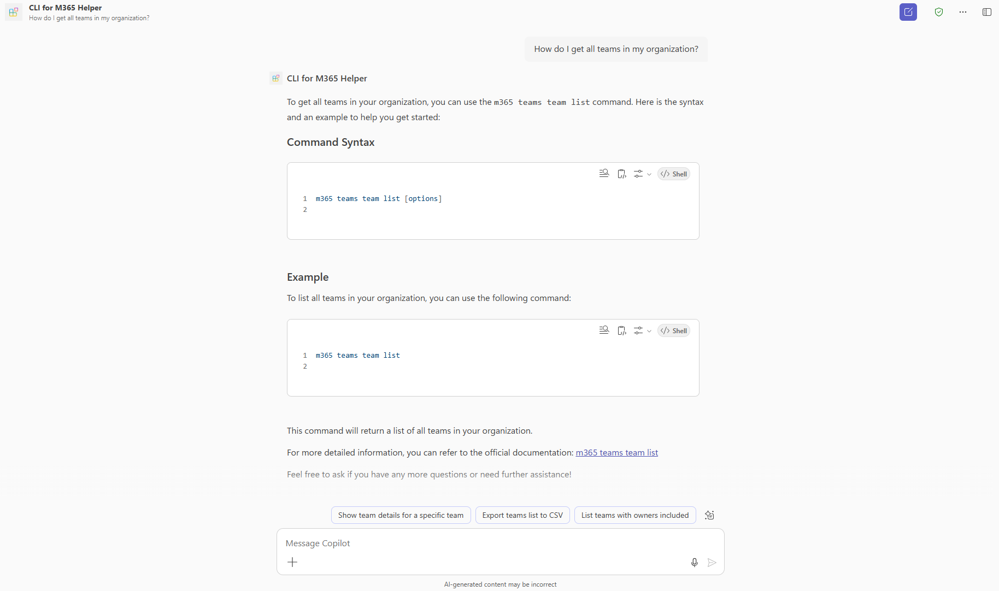

# CLI for Microsoft 365 Command Helper

This declarative agent helps users find and understand CLI for Microsoft 365 commands. It provides guidance on command syntax, parameters, and usage examples by searching the official CLI for Microsoft 365 documentation. For example, users can ask "How do I get SharePoint file versions?" and receive the exact `m365 spo file version list` command with complete syntax and examples.

## Contributors

* [Saurabh Tripathi](https://github.com/saurabh7019)

## Version history

Version|Date|Comments
-------|----|--------
1.0|August 6, 2025|Initial release

## Prerequisites

To run this app template in your local dev machine, you will need:

- [Node.js](https://nodejs.org/), supported versions: 18, 20, 22
- A [Microsoft 365 account for development](https://docs.microsoft.com/microsoftteams/platform/toolkit/accounts).
- [Microsoft 365 Agents Toolkit Visual Studio Code Extension](https://aka.ms/teams-toolkit) version 5.0.0 and higher or [Microsoft 365 Agents Toolkit CLI](https://aka.ms/teamsfx-toolkit-cli)
- [Microsoft 365 Copilot license](https://learn.microsoft.com/microsoft-365-copilot/extensibility/prerequisites#prerequisites)

## Minimal path to awesome

* Clone this repository (or [download this solution as a .ZIP file](https://pnp.github.io/download-partial/?url=https://github.com/pnp/copilot-pro-dev-samples/tree/main/samples/da-CLIForM365-helper) then unzip it)
* Open the project with Visual Studio Code
* Select the **Microsoft 365 Agents Toolkit** icon in the VS Code activity bar
* In the **Accounts** section, sign in with your [Microsoft 365 account](https://docs.microsoft.com/microsoftteams/platform/toolkit/accounts) if you haven't already.
* Create app by clicking **Provision** in **Lifecycle** section.
* Open Microsoft 365 Copilot (web, desktop, or mobile)
* Select the **CLI for M365 Helper** agent from your available agents
* Ask questions about CLI for Microsoft 365 commands, such as:
  - "Can you help me understand what CLI for Microsoft 365 is and how to install it?"
  - "Could you show me all available spo commands?"
  - "Can you help me with a specific CLI for Microsoft 365 command?" 

## Features

- Helps users discover CLI for Microsoft 365 commands for specific tasks across all Microsoft 365 services
- Searches official CLI for Microsoft 365 documentation to provide accurate syntax and examples
- Provides interactive guidance with conversation starters and follow-up questions

## Help

We do not support samples, but this community is always willing to help, and we want to improve these samples. We use GitHub to track issues, which makes it easy for  community members to volunteer their time and help resolve issues.

You can try looking at [issues related to this sample](https://github.com/pnp/copilot-pro-dev-samples/issues?q=label%3A%22sample%3A%20da-CLIForM365-helper%22) to see if anybody else is having the same issues.

If you encounter any issues using this sample, [create a new issue](https://github.com/pnp/copilot-pro-dev-samples/issues/new).

Finally, if you have an idea for improvement, [make a suggestion](https://github.com/pnp/copilot-pro-dev-samples/issues/new).

## Disclaimer

**THIS CODE IS PROVIDED *AS IS* WITHOUT WARRANTY OF ANY KIND, EITHER EXPRESS OR IMPLIED, INCLUDING ANY IMPLIED WARRANTIES OF FITNESS FOR A PARTICULAR PURPOSE, MERCHANTABILITY, OR NON-INFRINGEMENT.**

