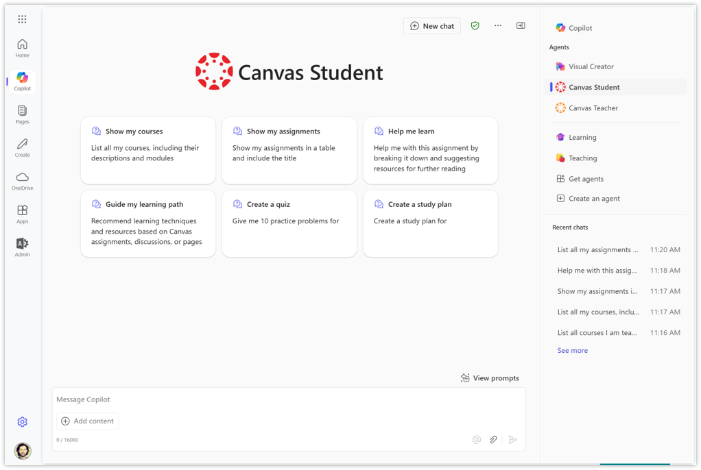

# Canvas Student declarative agent with API Plugin

## Agent samples for Education
This repository contains agent samples for Education to be used with [Microsoft 365 Copilot](https://www.microsoft.com/en-us/microsoft-365/copilot) and Microsoft 365 [Copilot Chat](https://www.microsoft.com/en-us/microsoft-365/copilot/try-copilot-chat). These samples demonstrate how customers can create or customize their own declarative agents for M365 Copilot that connect to their Learning Management Systems (LMS) or other education technology.

## Summary

The Canvas Student agent is an AI-powered assistant integrating Microsoft 365 Copilot or Copilot Chat and the Canvas Learning Management System (LMS). It enables learners to combine information in Canvas with unique M365 apps capabilities. Learners can retrieve courses, modules, assignments, pages, announcements, and discussions from Canvas, and leverage features in M365 apps like BizChat, Word, and PowerPoint. Learners can search through course content, generate ideas for learning, and improve the overall learning experience.

### Version history

| Version | Date | Comments |
| --- | --- | --- |
| 1.0 | May 31st, 2025 | Initial release |

### Features

- List enrolled courses
- View course content and structure, including modules and assignments
- Find activities of a certain type, including discussions, announcements, and pages
- Create study plan and quizzes for courses, modules, and assignments
- Interact with Canvas content in all M365 apps that support agents, including BizChat, Word, and PowerPoint
- Search Course Content, empowering learners to plan their study more effectively, giving them access to information in Canvas
- Content Creation, helping in creating course content, including study plans, quizzes, and other resources

## Prerequisites

The agent requires a working Canvas environment and access to M365 Copilot license or Copilot Chat.
- API Developer Key in Canvas
- Microsoft 365 A1, A3, or A5 license
- Microsoft 365 Copilot license or Copilot Chat consumption plan
- Microsoft 365 Agents Toolkit extension for Visual Studio Code
  - A [Microsoft 365 account for development](https://learn.microsoft.com/en-us/microsoftteams/platform/toolkit/tools-prerequisites#create-a-free-microsoft-365-developer-account)
  - [Microsoft 365 Agents Toolkit Visual Studio Code Extension](https://aka.ms/teams-toolkit) version 5.0.0 and higher or [Microsoft 365 Agents Toolkit CLI](https://learn.microsoft.com/en-us/microsoftteams/platform/toolkit/microsoft-365-agents-toolkit-cli)
  - [Node.js](https://nodejs.org/), supported versions: 18, 20 (optional for running in local dev machine)
- Admin permissions in the Microsoft 365 Admin Center or Teams Admin Center, in order to distribute the agents to other users

## Configuration

### 1. Create API Developer Key in Canvas

- [Canvas Developer Key Directions](https://community.canvaslms.com/t5/Admin-Guide/How-do-I-add-a-developer-API-key-for-an-account/ta-p/259)
  (Note: The key name will show on the user sign in window.)
- Enable the **Enforce Scopes** toggle and select the following scopes for the agent to have GET access:
  - url:GET|/api/v1/courses
  - url:GET|/api/v1/courses/:course_id/modules
  - url:GET|/api/v1/courses/:course_id/modules/:module_id/items
  - url:GET|/api/v1/courses/:course_id/smartsearch
  - url:GET|/api/v1/users/:id
- Add the following Teams url in the **Redirect URIs** field. `https://teams.microsoft.com/api/platform/v1.0/oAuthRedirect`
- Saving will generate the `id` and `key` values that will be used for the Teams oauth registration in Step 5 in the directions

### 2. Setup Microsoft SSO in Canvas (optional)

- An authentication provider can be added in Canvas through Admin > Authentication
- [Configuring Microsoft OAuth for Canvas Authentication](https://community.canvaslms.com/t5/Canvas-Integration-Documents/Configuring-Microsoft-OAuth-for-Canvas-Authentication/ta-p/606219)
- Once a provider has been saved in Canvas, the provider’s authentication login credentials must be added to each Canvas user’s account via either two options:
  - [SIS CSV](https://canvas.instructure.com/doc/api/file.sis_csv.html)
  - [Logins API](https://canvas.instructure.com/doc/api/logins.html)

### 3. Connect the agent to your Canvas environment

- Clone this repository (or download this solution as a .ZIP file then unzip it)
- Open the Canvas Student declarative agent folder in VS Code
- Add the url for your Canvas instance for CANVAS_BASE_URL in /env/env.dev

### 4. Add capabilities and knowledge sources (optional)

- Customize the agent with capabilities and knowledge sources to address your needs, including:
  - Code interpreter
  - Image generator
  - Microsoft Graph connectors
  - SharePoint and OneDrive as knowledge
  - Web and scoped web search
- Add your capabilities and knowledge sources to the [Capabilities object](https://learn.microsoft.com/en-us/microsoft-365-copilot/extensibility/declarative-agent-manifest-1.3#capabilities-object) in the declarativeAgent.json file
- Check the [capabilities and knowledge sources](https://learn.microsoft.com/en-us/microsoft-365-copilot/extensibility/add-agent-capabilities) for the latest capabilities

### 5. Provision and Test the agent in your M365 environment

- In the Teams Admin Center, enable [custom app upload](https://learn.microsoft.com/en-us/microsoftteams/platform/toolkit/tools-prerequisites#enable-custom-app-upload-using-admin-center) if you haven't already
- In VS Code
  - Select the Explorer icon, appPackage, and `instructions.txt` if you'd like to customize instructions (optional)
  - Select the Explorer icon, appPackage, and `declarativeAgent.json` if you'd like to customize conversation starters (optional)
  - Select the Microsoft 365 Agents Toolkit icon on the left toolbar
    - In the Account section, sign in with your [Microsoft 365 account](https://docs.microsoft.com/microsoftteams/platform/toolkit/accounts) if you haven't already
    - In the Lifecycle section, create a Teams app by clicking `Provision`
  - Enter the `id` generated in Step 1 for the `OAuth Client ID`
    - This is securely stored in the [Teams Developer Portal](https://dev.teams.microsoft.com/home) and used by Teams client to access your API in runtime
    - Microsoft 365 Agents Toolkit will not store your Client ID
  - Enter the `key` generated in Step 1 for the `OAuth Client Secret`
    - This is securely stored in the [Teams Developer Portal](https://dev.teams.microsoft.com/home) and used by Teams client to access your API in runtime
    - Microsoft 365 Agents Toolkit will not store your Client Secret
- This step only installs the agent for you, move to the next step to distribute it across your institution

### 6. Distribute the agent in your M365 environment

- Select the Microsoft 365 Agents Toolkit icon on the left in the VS Code toolbar
  
- In the Utility section, click `Zip Teams App Package` to download the apppackage.zip file
  
- From the M365 Admin Center
  
  - Go to `Settings` , select `Integrate apps`, and select `Upload custom apps`
  - Define which users or groups will have access to the agent, accept permissions and deploy
  - Learn more at [Manage Office Add-ins through Integrated Apps](https://learn.microsoft.com/en-us/microsoft-365/admin/manage/test-and-deploy-microsoft-365-apps)
- From the Teams Admin Center
  
  - Go to `Teams apps`, select `Manage apps`, and `Upload A custom app`
  - Learn more at [Manage custom apps in Microsoft Teams admin center](https://learn.microsoft.com/en-us/microsoftteams/teams-custom-app-policies-and-settings)
  
## Known limitations
  
- Limited to M365 apps that support declarative agents
- Limited to English (EN-US)
- Limited to only retrieve information from Canvas (read-only)
- Limited to return only 10 items from each endpoint
- Limited to return only info about the authenticated user, not bringing anything from any other user
- No capabilities or knowledge sources have been enabled in this sample
- OpenAPI limitations for API plugins [listed here](https://learn.microsoft.com/en-us/microsoft-365-copilot/extensibility/known-issues#some-openapi-features-arent-supported)
  
## Resources and customization

The following folders are provided for this agent.

| Folder | Contents |
| --- | --- |
| `.vscode` | VSCode files for debugging |
| `appPackage` | Templates for the Teams application manifest, the plugin manifest and the API specification |
| `env` | Environment files |

The following files can be customized and demonstrate an example implementation to get you started.

| File | Contents |
| --- | --- |
| `appPackage/declarativeCopilot.json` | Define the configuration, instructions, and conversation starters of the declarative agent |
| `appPackage/ai-plugin.json` | Define the configuration and capabilities of the AI plugin |
| `appPackage/manifest.json` | Teams application manifest that defines metadata for your declarative agent |

The following are Microsoft 365 Agents Toolkit specific project files. You can [visit a complete guide on Github](https://github.com/OfficeDev/TeamsFx/wiki/Teams-Toolkit-Visual-Studio-Code-v5-Guide#overview) to understand how Microsoft 365 Agents Toolkit works.

| File | Contents |
| --- | --- |
| `teamsapp.yml` | This is the main Microsoft 365 Agents Toolkit project file. The project file defines two primary things: Properties and configuration Stage definitions. |

## Data access

- This agent can access and retrieve Canvas data about
  - Courses
  - Modules
  - Assignments
  - Announcements
  - Discussions
  - Pages
- This agent requires user authentication and respects user permissions in Canvas
- This agent currently can only retrieve (GET) data from Canvas, not update any data in Canvas
- The agent uses Canvas information as an input to Copilot across M365 apps, for example:
  - Show me the most engaged discussion in Canvas; based on that discussion create a lesson plan in Word
  - Show me the announcement with most questions in Canvas, generate slides in PowerPoint to help address those questions in class

## Evaluation

- All response generation features of this agent were tested, measured, and validated internally
- [How declarative agents are evaluated?](https://learn.microsoft.com/en-us/microsoft-365-copilot/extensibility/transparency-faq-declarative-agent#how-were-declarative-agents-evaluated-what-metrics-are-used-to-measure-performance)
- It's important to keep in mind that the output this agent provides can be inaccurate, incorrect, or out of date

## Additional references

- [Microsoft 365 extensibility overview](https://aka.ms/extend-copilot)
- [Declarative agents for Microsoft 365](https://learn.microsoft.com/en-us/microsoft-365-copilot/extensibility/build-declarative-agents?tabs=ttk)
- [Microsoft 365 Copilot extensibility samples](https://learn.microsoft.com/microsoft-365-copilot/extensibility/samples)
- [Configure authentication for API plugins in agents](https://learn.microsoft.com/en-us/microsoft-365-copilot/extensibility/api-plugin-authentication)
