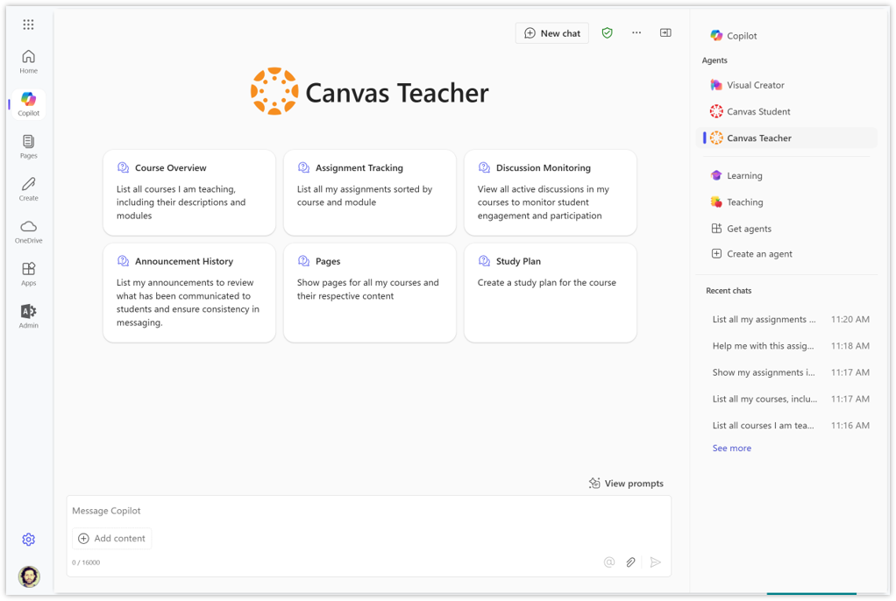

# Canvas Teacher declarative agent with API Plugin

## Agent samples for Education
This repository contains agent samples for Education to be used with [Microsoft 365 Copilot](https://www.microsoft.com/microsoft-365/copilot) and Microsoft 365 [Copilot Chat](https://www.microsoft.com/microsoft-365/copilot/try-copilot-chat). These samples demonstrate how customers can create or customize their own declarative agents for M365 Copilot that connect to their Learning Management Systems (LMS) or other education technology.

## Summary

The Canvas Teacher agent is an AI-powered assistant integrating Microsoft 365 Copilot or Copilot Chat and the Canvas Learning Management System (LMS). It enables educators to combine information in Canvas with unique M365 apps capabilities. Educators can retrieve courses, modules, assignments, pages, announcements, and discussions from Canvas, and leverage features in M365 apps like BizChat, Word, and PowerPoint. Educators can search through course content, generate ideas for teaching, and improve the overall teaching experience.

### Version history

| Version | Date | Comments |
| --- | --- | --- |
| 1.0 | May 31st, 2025 | Initial release |

### Features

- List courses educators are teaching
- View course content and structure, including modules and assignments
- Find activities of a certain type, including discussions, announcements, and pages
- Create study plan for courses, modules, and assignments
- Interact with Canvas content in all M365 apps that support agents, including BizChat, Word, and PowerPoint
- Search Course Content, empowering educators to plan their courses more effectively, giving them access to information in Canvas
- Content Creation, helping in creating course content, including study plans, quizzes, and other resources

### Data access

- This agent can access and retrieve Canvas data about
  - Courses
  - Modules
  - Assignments
  - Announcements
  - Discussions
  - Pages
- This agent requires user authentication and respects user permissions in Canvas
- This agent can only retrieve (GET) data from Canvas, not update any data in Canvas
- The agent uses Canvas information as an input to Copilot across M365 apps, for example:
  - Show me the most engaged discussion in Canvas; based on that discussion create a lesson plan in Word
  - Show me this announcement in Canvas, generate slides in PowerPoint to help address those questions in class

### Evaluation

- All response generation features of this agent were tested, measured, and validated internally
- [How declarative agents are evaluated?](https://learn.microsoft.com/microsoft-365-copilot/extensibility/transparency-faq-declarative-agent#how-were-declarative-agents-evaluated-what-metrics-are-used-to-measure-performance)
- It's important to keep in mind that the output this agent provides can be inaccurate, incorrect, or out of date

## Prerequisites

The agent requires a working Canvas environment and access to Copilot Chat
- API Developer Key in Canvas
- Microsoft 365 A1, A3, or A5 license
- Agents work in Copilot Chat (both metered/no metered usage) and M365 Copilot, [learn more](https://learn.microsoft.com/microsoft-365-copilot/extensibility/prerequisites#agent-capabilities-for-microsoft-365-users)
- Microsoft 365 Agents Toolkit extension for Visual Studio Code
  - A [Microsoft 365 account for development](https://learn.microsoft.com/microsoftteams/platform/toolkit/tools-prerequisites#create-a-free-microsoft-365-developer-account)
  - [Microsoft 365 Agents Toolkit Visual Studio Code Extension](https://aka.ms/teams-toolkit) version 5.0.0 and higher or [Microsoft 365 Agents Toolkit CLI](https://learn.microsoft.com/microsoftteams/platform/toolkit/microsoft-365-agents-toolkit-cli)
  - [Node.js](https://nodejs.org/), supported versions: 18, 20 (optional for running in local dev machine)
- Admin permissions in the Microsoft 365 Admin Center or Teams Admin Center

## Minimal path to awesome

### 1. Create API Developer Key in Canvas

1. [Canvas Developer Key Directions](https://community.canvaslms.com/t5/Admin-Guide/How-do-I-add-a-developer-API-key-for-an-account/ta-p/259)
  (Note: The key name will show on the user sign in window.)
2. Enable the **Enforce Scopes** toggle and select the following scopes for the agent to have GET access:
    - url:GET|/api/v1/courses
    - url:GET|/api/v1/courses/:course_id/modules
    - url:GET|/api/v1/courses/:course_id/modules/:module_id/items
    - url:GET|/api/v1/courses/:course_id/smartsearch
    - url:GET|/api/v1/users/:id
3. Add the following Teams url in the **Redirect URIs** field. `https://teams.microsoft.com/api/platform/v1.0/oAuthRedirect`
4. Saving will generate the `id` and `key` values that will be used for the Teams oauth registration in Step 3 in the directions

### 2. Add Canvas environment to agent

1. Clone this repository (or download this solution as a .ZIP file then unzip it)
2. Open the Canvas Teacher agent sample folder in VS Code
3. Add the url for your Canvas instance for CANVAS_BASE_URL in /env/env.dev

### 3. Provision and test the agent

1. In the Teams Admin Center
    - Enable [custom app upload](https://learn.microsoft.com/microsoftteams/platform/toolkit/tools-prerequisites#enable-custom-app-upload-using-admin-center) if you haven't already
    - This setting can take 24h to be fully enabled and you can check progress in the M365 Agents Toolkit in VS Code (Accounts section)
2. In VS Code
    - Select the Explorer icon, appPackage, and `instructions.txt` if you'd like to customize instructions (optional)
    - Select the Explorer icon, appPackage, and `declarativeAgent.json` if you'd like to customize conversation starters (optional)
    - Select the Microsoft 365 Agents Toolkit icon on the left toolbar
      - In the Accounts section, sign in with your [Microsoft 365 account](https://docs.microsoft.com/microsoftteams/platform/toolkit/accounts) if you haven't already
      - In the Lifecycle section, create a Teams app by clicking `Provision`
    - Enter the `id` generated in Step 1 for the `OAuth Client ID`
      - This is securely stored in the [Teams Developer Portal](https://dev.teams.microsoft.com/home) and used by Teams client to access your API in runtime
      - Microsoft 365 Agents Toolkit will not store your Client ID
    - Enter the `key` generated in Step 1 for the `OAuth Client Secret`
      - This is securely stored in the [Teams Developer Portal](https://dev.teams.microsoft.com/home) and used by Teams client to access your API in runtime
      - Microsoft 365 Agents Toolkit will not store your Client Secret
3. In Copilot
    - The agent is now installed for you and ready to test
    - Press F5 in VS Code and your agent will open in your browser, or open Copilot and select your agent manually
    - Click on any conversation starter or ask about courses, modules, assignments, discussions, or announcements
    - This step only installs the agent for you, move to Optional configuration to distribute it across your institution

## Optional configuration

### 1. Deploy the agent to your organization
This step is only needed if you want to distribute the agent across your institution.
1.  Select the Microsoft 365 Agents Toolkit icon on the left in the VS Code toolbar
2.  In the Utility section, click `Zip Teams App Package` to download the apppackage.zip file
3.  From the M365 Admin Center, go to `Settings` , select `Integrate apps`, and select `Upload custom apps`
4.  Define which users or groups will have access to the agent, accept permissions and deploy
5.  Learn more at [Manage Office Add-ins through Integrated Apps](https://learn.microsoft.com/microsoft-365/admin/manage/test-and-deploy-microsoft-365-apps)

### 2. Add capabilities and knowledge sources
This step is only needed if you want to add other capabilities and knowledge sources to your agent.
- Customize the agent with capabilities and knowledge sources to address your needs, including:
  - Code interpreter
  - Image generator
  - Web search
  - Scoped web search (requires M365 Copilot license)
  - Copilot connectors (requires M365 Copilot license)
  - SharePoint and OneDrive as knowledge (requires M365 Copilot license)
- Add your capabilities and knowledge sources to the [Capabilities object](https://learn.microsoft.com/microsoft-365-copilot/extensibility/declarative-agent-manifest-1.3#capabilities-object) in the declarativeAgent.json file
- Check the [capabilities and knowledge sources](https://learn.microsoft.com/microsoft-365-copilot/extensibility/add-agent-capabilities) for the latest capabilities

### 3. Setup Microsoft SSO in Canvas
This step is only needed if you want to enable your users to be automatically signed-in to Canvas with their Microsoft Entra accounts.
- An authentication provider can be added in Canvas through Admin > Authentication
- [Configuring Microsoft OAuth for Canvas Authentication](https://community.canvaslms.com/t5/Canvas-Integration-Documents/Configuring-Microsoft-OAuth-for-Canvas-Authentication/ta-p/606219)
- Once a provider has been saved in Canvas, the provider’s authentication login credentials must be added to each Canvas user’s account via either two options:
  - [SIS CSV](https://canvas.instructure.com/doc/api/file.sis_csv.html)
  - [Logins API](https://canvas.instructure.com/doc/api/logins.html)

  
  ## Known limitations
  
- Limited to M365 apps that support declarative agents
- Limited to English (EN-US)
- Limited to only retrieve information from Canvas (read-only)
- Limited to return only 10 items from each endpoint
- Limited to return only info about the authenticated user, not bringing anything from any other user. For example, it won’t give teachers visibility on student information
- No capabilities or knowledge sources have been enabled in this sample
- OpenAPI limitations for API plugins [listed here](https://learn.microsoft.com/microsoft-365-copilot/extensibility/known-issues#some-openapi-features-arent-supported)

## Resources and customization

The following folders are provided for this agent.

| Folder | Contents |
| --- | --- |
| `.vscode` | VSCode files for debugging |
| `appPackage` | Templates for the app manifest, the plugin manifest and the API specification |
| `env` | Environment files |

The following files can be customized and demonstrate an example implementation to get you started.

| File | Contents |
| --- | --- |
| `instruction.txt` | Define instructions that will be added to `declarativeCopilot.json` during agent provision
| `appPackage/declarativeCopilot.json` | Define the configuration, instructions, and conversation starters of the declarative agent |
| `appPackage/ai-plugin.json` | Define the configuration and capabilities of the AI plugin |
| `appPackage/manifest.json` | Teams application manifest that defines metadata for your declarative agent |

The following are Microsoft 365 Agents Toolkit specific project files. You can [visit a complete guide on Github](https://github.com/OfficeDev/TeamsFx/wiki/Teams-Toolkit-Visual-Studio-Code-v5-Guide#overview) to understand how Microsoft 365 Agents Toolkit works.

| File | Contents |
| --- | --- |
| `m365agents.yml` | This is the main Microsoft 365 Agents Toolkit project file. The project file defines two primary things: Properties and configuration Stage definitions. |

## Help

We do not support samples, but this community is always willing to help, and we want to improve these samples. We use GitHub to track issues, which makes it easy for  community members to volunteer their time and help resolve issues.

You can try looking at [issues related to this sample](https://github.com/pnp/copilot-pro-dev-samples/issues?q=label%3A%22sample%3A%20da-CanvasTeacher%22) to see if anybody else is having the same issues.

If you encounter any issues using this sample, [create a new issue](https://github.com/pnp/copilot-pro-dev-samples/issues/new).

Finally, if you have an idea for improvement, [make a suggestion](https://github.com/pnp/copilot-pro-dev-samples/issues/new).

## Disclaimer

**THIS CODE IS PROVIDED *AS IS* WITHOUT WARRANTY OF ANY KIND, EITHER EXPRESS OR IMPLIED, INCLUDING ANY IMPLIED WARRANTIES OF FITNESS FOR A PARTICULAR PURPOSE, MERCHANTABILITY, OR NON-INFRINGEMENT.**

