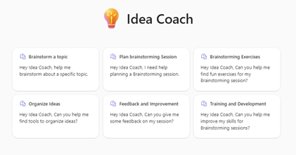
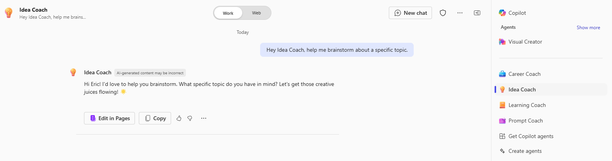

# Overview of the Idea Coach declarative agent sample

The "Idea Coach" Declarative Agent is an open-source AI-driven tool designed to facilitate and enhance brainstorming sessions. This agent acts as a personal assistant, helping users to brainstorm topics, plan sessions, find creative exercises, organize ideas, and improve their brainstorming skills. The Idea Coach uses a fun, collaborative tone to inspire creativity and ensure that interactions are engaging and productive.

Key features of the Idea Coach include:
- **Brainstorm a Topic**: Acts as a session host to help brainstorm about a topic, asking questions one by one to create a multi-turn conversation flow.
- **Planning a Brainstorming Session**: Customizes the agenda to specific objectives by asking sequential questions to gather the right context. Provides detailed, creative suggestions for topics and activities, and formats the agenda in tabular form.
- **Helping Find Creative Exercises**: Proposes at least three exercises based on the user's objectives, number of attendees, and duration.
- **Idea Organization**: Suggests tools and techniques to help prioritize ideas from the brainstorming session without bias.
- **Feedback and Improvement**: Gathers feedback on the session, identifies pain points, and provides structured solutions for improvement.
- **Training and Development**: Assesses the user's skills and provides a training plan to help them grow in brainstorming sessions.
- **Assess My Skills**: Evaluates the user's skills through a series of questions and offers a direct assessment, followed by a training plan if desired.

The Idea Coach integrates with OneDrive, SharePoint, and Graph Connectors to enhance its capabilities. It ensures that conversations are contextual and relevant, asking additional questions where necessary to clarify and confirm understanding. At the end of each interaction, the agent asks for feedback and encourages the use of the thumbs up and down feature in Copilot.

This open-source project aims to empower individuals and teams to achieve their brainstorming goals through structured guidance and support. By providing a customizable and extensible framework, the Idea Coach Declarative Agent can be adapted to various professional contexts and user needs, making it a versatile tool for fostering creativity and innovation.

## Get started with the template

> **Prerequisites**
>
> To run this app template in your local dev machine, you will need:
>
> - [Node.js](https://nodejs.org/), supported versions: 16, 18
> - A [Microsoft 365 account for development](https://docs.microsoft.com/microsoftteams/platform/toolkit/accounts).
> - [Teams Toolkit Visual Studio Code Extension](https://aka.ms/teams-toolkit) version 5.0.0 and higher or [Teams Toolkit CLI](https://aka.ms/teamsfx-toolkit-cli)
> - [Microsoft 365 Copilot license](https://learn.microsoft.com/microsoft-365-copilot/extensibility/prerequisites#prerequisites)

1. First, select the Teams Toolkit icon on the left in the VS Code toolbar.
2. In the Account section, sign in with your [Microsoft 365 account](https://docs.microsoft.com/microsoftteams/platform/toolkit/accounts) if you haven't already.
3. Create Teams app by clicking `Provision` in "Lifecycle" section.
4. Select `Preview in Copilot (Edge)` or `Preview in Copilot (Chrome)` from the launch configuration dropdown.
5. Once the Copilot app is loaded in the browser, click on the "…" menu and select "Copilot chats". You will see your declarative agent on the right rail. Clicking on it will change the experience to showcase the logo and name of your declarative agent.
6. Ask a question to your declarative agent and it should respond based on the instructions provided.

## What's included in the template

| Folder       | Contents                                                                                 |
| ------------ | ---------------------------------------------------------------------------------------- |
| `.vscode`    | VSCode files for debugging                                                               |
| `appPackage` | Templates for the Teams application manifest, the GPT manifest and the API specification |
| `env`        | Environment files                                                                        |

The following files can be customized and demonstrate an example implementation to get you started.

| File                                 | Contents                                                                       |
| ------------------------------------ | ------------------------------------------------------------------------------ |
| `appPackage/declarativeAgent.json` | Define the behaviour and configurations of the declarative agent.            |
| `appPackage/manifest.json`           | Teams application manifest that defines metadata for your declarative agent. |

The following are Teams Toolkit specific project files. You can [visit a complete guide on Github](https://github.com/OfficeDev/TeamsFx/wiki/Teams-Toolkit-Visual-Studio-Code-v5-Guide#overview) to understand how Teams Toolkit works.

| File           | Contents                                                                                                                                  |
| -------------- | ----------------------------------------------------------------------------------------------------------------------------------------- |
| `teamsapp.yml` | This is the main Teams Toolkit project file. The project file defines two primary things: Properties and configuration Stage definitions. |

## Addition information and references

- [Declarative agents for Microsoft 365](https://aka.ms/teams-toolkit-declarative-agent)
