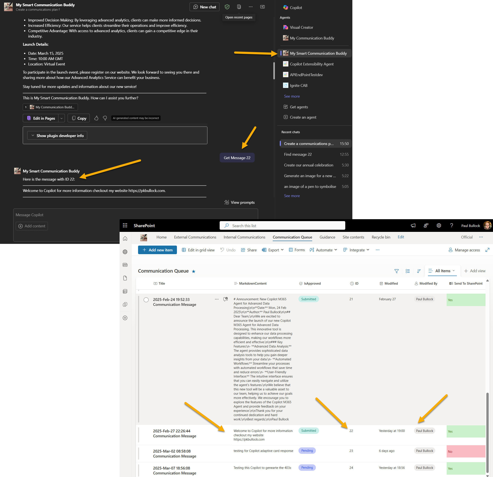

# Overview of the My Advanced Communications Buddy Sample

Declarative agent for the My Advanced Communications Buddy. This agent is designed to assist users in creating Microsoft 365 corporate communications and utilizing APIs to retrieve content for these communications as part of a business process.

This is a technical demonstrating how meeting a business scenario, can be acheived with a declarative agent supported by an API Plugin for actions the user cna perform. 

This sample, include a declarative agent and the web api source code.

For advanced detail check out this blog post: [Using a .Net Web API connected to SharePoint Lists using Delegated Permissions in a Microsoft 365 Declarative Agent with API Plugin with Single Sign On | pkbullock.com](https://pkbullock.com/blog/2025/using-dotnet-webapi-using-delegated-permissions-for-microsoft-365-copilot-declarative-agent-api-plugin-with-sso)

Blog Post Summary (Copilot):

*This blog post provides a detailed walkthrough on building a .NET Web API that connects to SharePoint Lists using the PnP Core SDK. The API is integrated into Microsoft 365 Copilot Declarative Agent with API Plugin, utilising delegated permissions and Single Sign-On (SSO). The author explains the business scenario of a Communications Buddy, a Microsoft 365 Copilot designed to help staff create great communications by adding actions to the agent that write data to a SharePoint list.*





## Version history

Version|Date|Author|Comments
-------|----|----|--------
1.0|March 8th, 2025| Paul Bullock |Initial release

## Disclaimer

**THIS CODE IS PROVIDED *AS IS* WITHOUT WARRANTY OF ANY KIND, EITHER EXPRESS OR IMPLIED, INCLUDING ANY IMPLIED WARRANTIES OF FITNESS FOR A PARTICULAR PURPOSE, MERCHANTABILITY, OR NON-INFRINGEMENT.**

---

## Minimal Path to Awesome

_Include consise instructions to set up and run the sample. These are just an example!_

### Setup the SharePoint Site

- Create a new SharePoint site to host the "Communication Queue" list.
- In PowerShell, run

```powershell
Connect-PnPOnline https://<mytenant>.sharepoint.com/sites/M365CommunicationSite -Interactive -ClientID <AppUsedToConnectToSharePoint>

Invoke-PnPSiteTemplate -Path assets/pnp-provisioning-list.xml
```

### Create an App Registration

- In Entra ID App Registration
    - Create a new App Registration set for single tenant mode, make a note of the client ID
    - Create a secret, make a note of the secret.
    - In API Permissions
        - Set permissions to Microsoft Graph - email, offline_access, openid, profile, Sites.Selected.
    - Remove any other permissions
    - In Expose an API
        - Create an Application ID URI
        - Add a scope 
            - Scope name - "access_as_user"
            - Admin consent display name - Access the API on behalf of a user
            - Admin consent description - Allows the app to access the web API on behalf of the signed-in user
            - User consent display name - Access the API on your behalf
            - User consent description - Allows this app to access the web API on your behalf
        - Add a client application
            - Add ab3be6b7-f5df-413d-ac2d-abf1e3fd9c0b (it's Microsoft's token store)
    - In Token Configuration
        - Add optional claim - idtyp - Signals whether the token is an app-only token
    - In Authentication
        - Add Web platform and set following redirect URLs
            - https://teams.microsoft.com/api/platform/v1.0/oAuthConsentRedirect
            - https://oauth.pstmn.io/v1/browser-callback (optional for Postman testing)
            - https://localhost:7200 (local developement)
        - Ensure Access and ID Tokens are NOT ticked.

If you get stuck refer to this article for setup [Microsoft Entra ID SSO authentication - API Plugins | Microsoft Learn](https://learn.microsoft.com/en-us/microsoft-365-copilot/extensibility/api-plugin-authentication?WT.mc_id=M365-MVP-5003816#microsoft-entra-id-sso-authentication)

### Setup the Web API

In Folder **API**

- Create a resource group
- In Visual Studio, load the project and make these changes:
    - Rename appsettings.sample.json file to appsettings.json
    - Update the appsettings.json file values
        - AzureAd > Domain - found in your Azure Entra ID home page.
        - AzureAd > TenantId - found in your Azure Entra ID home page.
        - AzureAd > ClientId - the one for the created earlier
        - SharePoint > SiteUrl e.g. https://<your-tenant>.sharepoint.com/sites/M365CommunicationSite
- In Visual Studio, hit publish, create a new profile with these settings
    -  Target: Azure
    -  Specific Target: Azure App Service (Windows)
    -  Click Create New
        - Select Subscription
        - Select Resource GRoup
        - Create a hosting plan
            - Choose one most appropriate for you, there is a cost here, you will be charged.
            - For me, I used P0v3 for the Always On feature.
        - Skip API Management and follow dialog to the end and deploy the app.
    - Ensure you make a note of the newly created API Web Url.

### Register the Teams application in Teams Developer Portal

- Navigate to "https://dev.teams.microsoft.com/entra-configuration"
- Click new client registration
    - Create a name - your choice
    - Use the URL of the newly deployed API in Azure
    - Restrict usage by org - My Organization Only
    - Restrict usage by app - Any Teams App
    - Enter the Client ID - the one used for the Web API.
- Save
- On the next screen, take note of 
    - Microsoft Entra SSO registration ID
    - Application ID URI

- Navigate to Entra ID App, and find your client ID for the web application
- Navigate to the manifest 
    - Find identifierUris and add a new one using the Application ID URI from the Teams Developer Portal
- Save the app.

I recommend you use Post Man to validate the connection.

### Setup the Agent

- Clone this repository
- Open the cloned copy of this folder with Visual Studio Code
- Ensure that the Teams Toolkit extension is installed
- Please visit the code tour called "deployment.json", the settings used are:
    - From the Teams Developer Portal, use the Microsoft Entra SSO registration ID in .env file
    - Ensure the Server URL, scopes, endpoints match your environment
- Use Teams Tookkit Provision feature to deploy
- Use the conversation starters to see the results of agent working on the content.

- Consent any diaglogs that occur and use prompt 'Create a new message called "Copilot Test", send to SharePoint' and confirm creation in SharePoint.

-----------------------------------------------------------


## Addition information and references

- [Declarative agents for Microsoft 365](https://aka.ms/teams-toolkit-declarative-agent)
- [Copilot Developer Camp](https://microsoft.github.io/copilot-camp/)
- [Build API plugins from an existing API for Microsoft 365 Copilot](https://learn.microsoft.com/en-us/microsoft-365-copilot/extensibility/build-api-plugins-existing-api?WT.mc_id=M365-MVP-5003816)
- [Configure authentication for API plugins in agents](https://learn.microsoft.com/en-us/microsoft-365-copilot/extensibility/api-plugin-authentication?WT.mc_id=M365-MVP-5003816)

