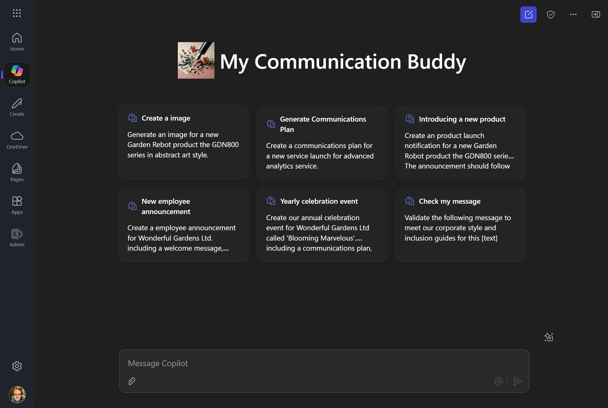

# Overview of the My Communications Buddy Sample

**Introduction**
Welcome to the new Microsoft 365 Copilot agent for Wonderful Gardens Ltd! This innovative tool is designed to assist our staff in crafting high-quality communications for our website, social media, and SharePoint. By leveraging the power of Microsoft 365, our Copilot agent ensures that your messages are not only engaging and informative but also aligned with our corporate style guide.

**Summary**
The Microsoft 365 Copilot agent is a versatile writing assistant tailored for Wonderful Gardens Ltd. It helps staff create communications that adhere to our corporate style guide, which emphasizes a friendly and engaging tone, informative content, and clear structure. The agent supports various types of communications, including internal and external messages, social media posts, and comprehensive communications plans.

**Key features of the Copilot agent include:**

- **Friendly and Engaging Tone:** Ensures your posts are conversational and accessible, making complex topics easy to understand.
- **Informative and Helpful Content:** Provides valuable tips, tricks, and insights to help readers in their work.
- **Clear Structure:** Uses headings, subheadings, short paragraphs, and bullet points to enhance readability.
Personal Experiences and Technical Details: Shares relatable experiences and step-by-step instructions to help readers implement suggestions.
- **Visuals:** Incorporates screenshots, diagrams, and images to complement the text and add visual interest.
- **Inclusive Language:** Promotes gender-neutral terms, respects cultural diversity, and avoids ableist language to ensure accessibility for all readers.

Additionally, the Copilot agent offers guidance on setting up communications plans, including countdowns for announcements and post-communication strategies. It also provides instructions for social media, with allowed hashtags like #WonderfulGardensFloweringExcellance, #WonderfulGardensBlooms, and #WonderfulGardensAdvancedAI to amplify our messages.

With the Microsoft 365 Copilot agent, Wonderful Gardens Ltd staff can confidently create professional and impactful communications that resonate with our audience.

## Example Prompts

### In Teams

- Create an announcement about a product launch for a new Drone product the X1000 series. The announcement should follow our corporate style guide and suggest a communications plan. The product details are: The Drone X1000 series is designed to redefine your aerial adventures. Specifications: state-of-the-art 4k camera, 300 minutes of flight time, 3km range, and a top speed of 60km/h. Intelligent flight modes include Follow Me, Waypoints, and Return to Home.

- Please write a call for speakers message from the engineering and marketing teams for the Drone Launch.

- I would like to create a thank you message to the team for their hard work and dedication to the team in the Drone X1000 series launch event. 

- Generate an image of a drone launching, using abstract art, no people or faces.

### In Word

- "So, there's this guy Bob on the board, right? He's been around for like 20 years or something, doing all sorts of stuff with SharePoint. You know, that thing everyone uses for documents and whatnot. Anyway, Bob's been in the game forever, knows his way around it like nobody's business. He's done a bunch of projects, probably some big ones too. People seem to think he's pretty good at what he does, I guess." - Using the paragraph, rewrite the statement to be include with our corporate style guide and inclusive guidelines.

Include some hobbies, he likes art, walking the dog, mountain climbing and volunteering for charity work. Adjust the tone for a executive chairman.

- Generate a welcome image, professional, clear imagery with photographic quality of a crowd welcoming a new person onboard of a new company. 

- Generate a welcome image, professional, clear imagery with photographic quality of a crowd welcoming a new person onboard of a new company. Use abstract art, no people or faces.

## Screenshot of Agent

## Version history

Version|Date|Author|Comments
-------|----|----|--------
1.0|March 8th, 2025| Paul Bullock |Initial release

## Disclaimer

**THIS CODE IS PROVIDED *AS IS* WITHOUT WARRANTY OF ANY KIND, EITHER EXPRESS OR IMPLIED, INCLUDING ANY IMPLIED WARRANTIES OF FITNESS FOR A PARTICULAR PURPOSE, MERCHANTABILITY, OR NON-INFRINGEMENT.**

---

## Minimal Path to Awesome

### Setup the Agent

- Clone this repository
- Open the cloned copy of this folder with Visual Studio Code
- Ensure that the Teams Toolkit extension is installed
- Use Teams Tookkit Provision feature to provision
- Use the conversation starters to see the results of agent working on the content.

## Addition information and references

- [Declarative agents for Microsoft 365](https://aka.ms/teams-toolkit-declarative-agent)
- [Copilot Developer Camp](https://microsoft.github.io/copilot-camp/)

