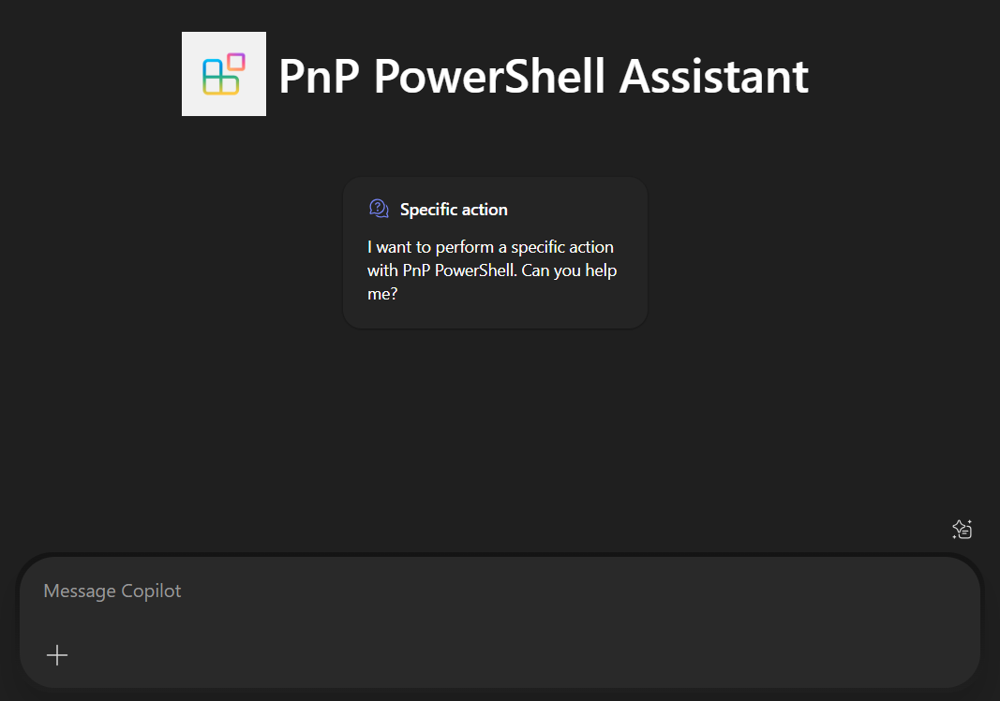

# Overview of the PnP PowerShell Assistant Agent

This declarative agent, named PnP PowerShell Assistant helps users creating PnP PowerShell cmdlets to perform specific actions. The agent is design to provide a PowerShell cmdlet that you can easily copy and paste to your PowerShell console.

## Contributors

* [Aimery Thomas](https://github.com/a1mery)

## Version history

Version|Date|Comments
-------|----|--------
1.0 | May 30, 2025 | Initial release

## Get started with the template

> **Prerequisites**
>
> To run this app template in your local dev machine, you will need:
>
> - [Node.js](https://nodejs.org/), supported versions: 18, 20, 22
> - A [Microsoft 365 account for development](https://docs.microsoft.com/microsoftteams/platform/toolkit/accounts).
> - [Microsoft 365 Agents Toolkit Visual Studio Code Extension](https://aka.ms/teams-toolkit) version 5.0.0 and higher or [Microsoft 365 Agents Toolkit CLI](https://aka.ms/teamsfx-toolkit-cli)
> - [Microsoft 365 Copilot license](https://learn.microsoft.com/microsoft-365-copilot/extensibility/prerequisites#prerequisites)

## Minimal Path to Awesome

### Setup the Agent

- Clone this repository
- Open the cloned copy of this folder with Visual Studio Code
- Ensure that the Microsoft 365 Agents Toolkit extension is installed
- Use Microsoft 365 Agents Toolkit Provision feature to provision
- Start asking questions to the agent

## What's included in the template

| Folder       | Contents                                                                                 |
| ------------ | ---------------------------------------------------------------------------------------- |
| `.vscode`    | VSCode files for debugging                                                               |
| `appPackage` | Templates for the application manifest, the GPT manifest and the API specification |
| `env`        | Environment files                                                                        |

The following files can be customized and demonstrate an example implementation to get you started.

| File                               | Contents                                                                     |
| ---------------------------------- | ---------------------------------------------------------------------------- |
| `appPackage/declarativeAgent.json` | Define the behaviour and configurations of the declarative agent.            |
| `appPackage/manifest.json`         | application manifest that defines metadata for your declarative agent. |

The following are Microsoft 365 Agents Toolkit specific project files. You can [visit a complete guide on Github](https://github.com/OfficeDev/TeamsFx/wiki/Teams-Toolkit-Visual-Studio-Code-v5-Guide#overview) to understand how Microsoft 365 Agents Toolkit works.

| File           | Contents                                                                                                                                  |
| -------------- | ----------------------------------------------------------------------------------------------------------------------------------------- |
| `m365agents.yml` | This is the main Microsoft 365 Agents Toolkit project file. The project file defines two primary things: Properties and configuration Stage definitions. |

## Addition information and references

- [Declarative agents for Microsoft 365](https://aka.ms/teams-toolkit-declarative-agent)
- [Copilot Developer Camp](https://microsoft.github.io/copilot-camp/)

