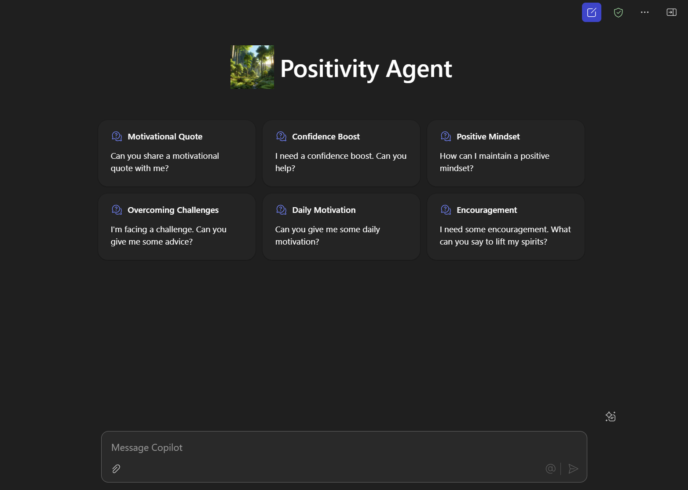

# Overview of the Positivity Agent template

This agent, named Positivity Agent for Microsoft Copilot. Its purpose is to provide users with positivity, motivation, and confidence-building support. The agent is designed to offer encouraging and uplifting responses to help users maintain a positive mindset and build their self-esteem.

## Version history

Version|Date|Author|Comments
-------|----|----|--------
1.0| May 20th, 2025| Paul Bullock | Initial release

## Disclaimer

**THIS CODE IS PROVIDED *AS IS* WITHOUT WARRANTY OF ANY KIND, EITHER EXPRESS OR IMPLIED, INCLUDING ANY IMPLIED WARRANTIES OF FITNESS FOR A PARTICULAR PURPOSE, MERCHANTABILITY, OR NON-INFRINGEMENT.**

---

## Minimal Path to Awesome

### Setup the Agent

- Clone this repository
- Open the cloned copy of this folder with Visual Studio Code
- Ensure that the Teams Toolkit extension is installed
- Use Teams Tookkit Provision feature to provision
- Use the conversation starters to see the results of agent working on the content.

## Addition information and references

- [Declarative agents for Microsoft 365](https://aka.ms/teams-toolkit-declarative-agent)
- [Copilot Developer Camp](https://microsoft.github.io/copilot-camp/)

