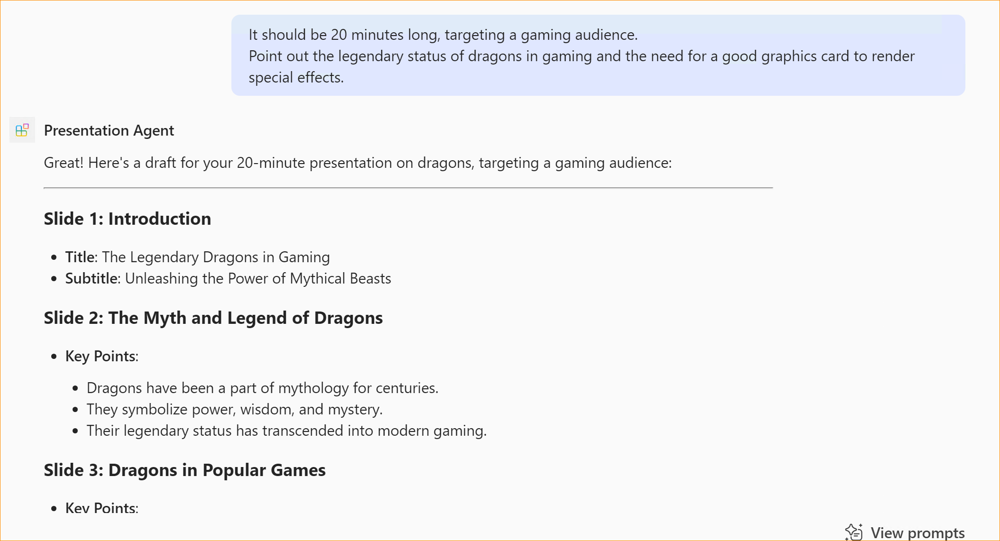

# Overview of the Presentation declarative agent

The Presentation declarative agent demonstrates how Copilot can assist users in creating a presentation based on simple instructions. 
As a agent builder, it illustrates how you can use instructions to steer Copilot to help the user. Take a look at the [instructions file](appPackage/instruction.txt) to see more.

## Minimal path to awesome

> **Prerequisites**
>
> To run this app you will need:
>
> - [Node.js](https://nodejs.org/), supported versions: 18, 20
> - A [Microsoft 365 account](https://docs.microsoft.com/microsoftteams/platform/toolkit/accounts) with permission to sideload Teams applications.
> - [Teams Toolkit Visual Studio Code Extension](https://aka.ms/teams-toolkit) version 5.0.0 and higher
> - [Microsoft 365 Copilot license](https://learn.microsoft.com/microsoft-365-copilot/extensibility/prerequisites#prerequisites)

1. First, select the Teams Toolkit icon on the left in the VS Code toolbar.
2. In the Account section, sign in with your [Microsoft 365 account](https://docs.microsoft.com/microsoftteams/platform/toolkit/accounts) if you haven't already. Ensure that both "Custom App Upload Enabled" and "Copilot Access Enabled" have green checkmarks
3. Create and provision the Teams app by clicking `Provision` in "Lifecycle" section.
4. Select the "Run and Debug" icon in the left sidebar, and then select `Preview in Copilot (Edge)` or `Preview in Copilot (Chrome)` from the launch configuration dropdown.
5. Once the Copilot app is loaded in the browser, click on the "…" menu and select "Copilot agents". You will see your declarative agent on the right rail. Clicking on it will change the experience to showcase the logo and name of the declarative agent.
6. Ask a question to your declarative agent and it should respond based on the instructions provided.

## Addition information and references

- [Declarative agents for Microsoft 365](https://aka.ms/teams-toolkit-declarative-agent)

