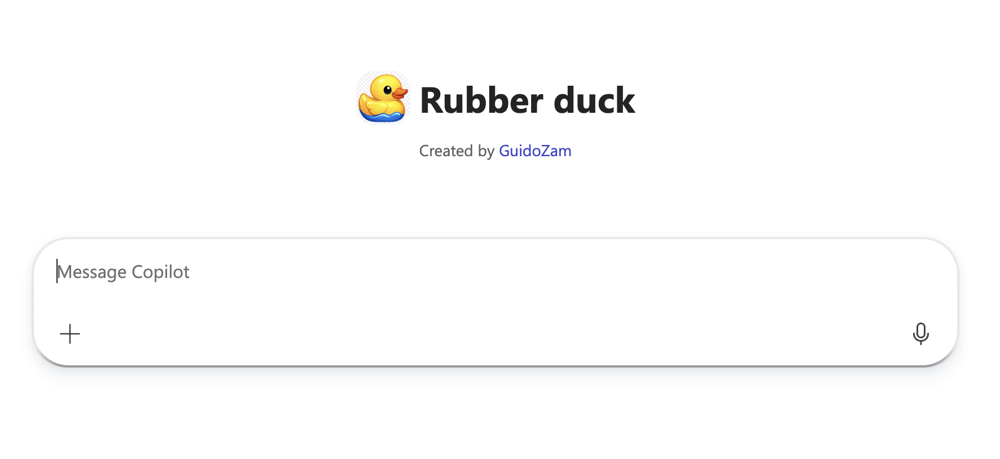

# Rubber Duck Debugging Assistant 🐤

## Summary

Meet your new debugging companion! This declarative agent acts as a "rubber duck" - inspired by the classic programming practice where developers explain their code problems out loud to uncover issues and clarify their thinking. Instead of talking to an actual rubber duck on your desk, you can now interact with an AI-powered debugging assistant that listens patiently and asks thoughtful questions to guide you toward solutions.

### What is Rubber Duck Debugging?

Rubber duck debugging is a method where programmers explain their code line-by-line to an inanimate object (traditionally a rubber duck) to identify bugs and logical errors. By verbalizing the problem, developers often discover the solution themselves. This agent brings that concept to virtual life with intelligent, guided questioning.

### Version history

| Version | Date | Comments |
| --- | --- | --- |
| 1.0 | 16/04/2026 | Initial release |

## Prerequisites

* Microsoft 365 tenant with Microsoft 365 Copilot
* [Node.js](https://nodejs.org/), supported versions: 18, 20, 22
* A [Microsoft 365 account for development](https://docs.microsoft.com/microsoftteams/platform/toolkit/accounts)
* [VSCode](https://code.visualstudio.com/)
* [Microsoft 365 Agents Toolkit Visual Studio Code Extension](https://aka.ms/teams-toolkit) version 5.0.0 and higher or [Microsoft 365 Agents Toolkit CLI](https://aka.ms/teamsfx-toolkit-cli)
* [Microsoft 365 Copilot license](https://learn.microsoft.com/microsoft-365-copilot/extensibility/prerequisites#prerequisites)

## Minimal path to awesome

1. First, select the Teams Toolkit icon on the left in the VS Code toolbar.
2. In the Account section, sign in with your [Microsoft 365 account](https://docs.microsoft.com/microsoftteams/platform/toolkit/accounts) if you haven't already. Ensure that both "Custom App Upload Enabled" and "Copilot Access Enabled" have green checkmarks
3. Create and provision the Teams app by clicking `Provision` in "Lifecycle" section.
4. Select the "Run and Debug" icon in the left sidebar, and then select `Preview in Copilot (Edge)` or `Preview in Copilot (Chrome)` from the launch configuration dropdown.
5. Once the Copilot app is loaded in the browser, click on the "…" menu and select "Copilot agents". You will see your declarative agent on the right rail. Clicking on it will change the experience to showcase the logo and name of the declarative agent.
6. Ask a question to your declarative agent and it should respond based on the instructions provided.

## Contributors

* [Guido Zambarda](https://github.com/guidozam)

## Features

This sample illustrates the following concepts:

Using this sample you can extend Microsoft 365 Copilot with an agent that:

* **Facilitates rubber duck debugging** - Provides a patient virtual companion for explaining code problems
* **Asks guided questions** - Instead of giving direct answers, asks thoughtful questions to guide you toward solutions
* **Encourages systematic thinking** - Helps break down complex problems into manageable parts
* **Creates a judgment-free environment** - Allows developers to think through problems without feeling rushed or judged

## Help

We do not support samples, but this community is always willing to help, and we want to improve these samples. We use GitHub to track issues, which makes it easy for community members to volunteer their time and help resolve issues.

You can try looking at [issues related to this sample](https://github.com/pnp/copilot-pro-dev-samples/issues?q=label%3A%22sample%3A%20da-RubberDuck%22) to see if anybody else is having the same issues.

If you encounter any issues using this sample, [create a new issue](https://github.com/pnp/copilot-pro-dev-samples/issues/new).

Finally, if you have an idea for improvement, [make a suggestion](https://github.com/pnp/copilot-pro-dev-samples/issues/new).

## Disclaimer

**THIS CODE IS PROVIDED *AS IS* WITHOUT WARRANTY OF ANY KIND, EITHER EXPRESS OR IMPLIED, INCLUDING ANY IMPLIED WARRANTIES OF FITNESS FOR A PARTICULAR PURPOSE, MERCHANTABILITY, OR NON-INFRINGEMENT.**

