# Sales Genie Declarative Agent

## Summary

Sales Genie is a Declarative Agent designed to help sales executives get instant, actionable insights from their Salesforce CRM, Microsoft 365, and the web — all via natural language. Whether you're preparing for an upcoming customer meeting, reviewing your opportunity pipeline, or logging call notes into Salesforce, Sales Genie acts as a smart assistant that streamlines your daily sales activities. It showcases complex workflows directly using instructions.

## Features

This sample illustrates the following concepts:

- Provide a 360° view of any customer account, including opportunities, tasks, cases, and past interactions.
- Help prepare for customer meetings by surfacing key insights from:
  - Salesforce CRM
  - Outlook emails & Teams conversations
  - External news
  - Documents and pitch decks in your OneDrive and SharePoint
- Log customer meeting notes or call summaries directly into Salesforce.
- Visualize sales pipeline and task status with charts and tables.

## Contributors

* [Sébastien Levert](https://github.com/sebastienlevert)
* [Akhil Sai Valluri](https://github.com/akhilsaivalluri)

## Version history

Version|Date|Comments
-------|----|--------
1.0|July 10, 2025|Initial release

## Prerequisites

* Microsoft 365 tenant with Microsoft 365 Copilot
* [Visual Studio Code](https://code.visualstudio.com/) with the [Microsoft 365 Agents Toolkit](https://marketplace.visualstudio.com/items?itemName=TeamsDevApp.ms-teams-vscode-extension) extension
* [Node.js v20](https://nodejs.org/en/download/package-manager)
* A Salesforce account with API access

## Example Prompts

1. Help me prepare for customer meeting
   
   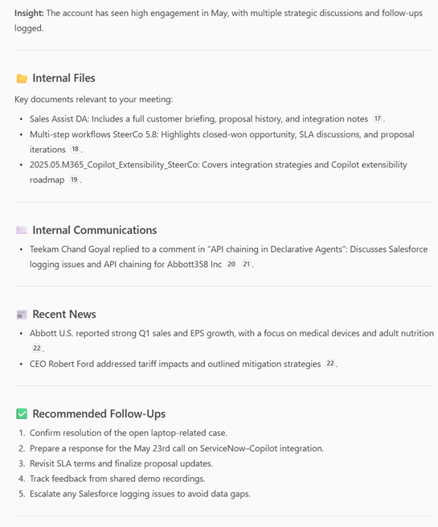
2. Show opportunities pipeline for this month
   
   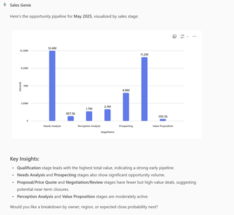
3. Log call for a recent customer conversation
   
   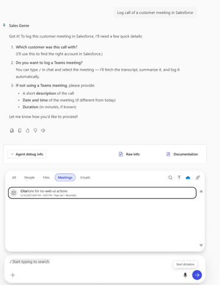
4. Show key deals anticipated to close this week
   
   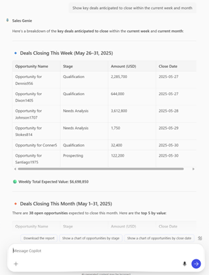

## Minimal path to awesome

* Clone this repository (or [download this solution as a .ZIP file](https://pnp.github.io/download-partial/?url=https://github.com/pnp/copilot-pro-dev-samples/tree/main/samples/da-SalesGenie) then unzip it)
* Open the Agents Toolkit extension and sign in to your Microsoft 365 tenant with Microsoft 365 Copilot
* 
* Select **Preview in Copilot (Edge)** from the launch configuration dropdown

## Configuration

### Salesforce Plugin Configuration

In your OpenAPI spec [`appPackage/apiSpecificationFile/openapi.yaml`](appPackage/apiSpecificationFile/openapi.yaml):

* Update the server URL to point to your Salesforce instance
  
  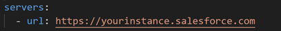

* In your [`ai-plugin.json`](ai-plugin.json) (plugin manifest), go to the `response_semantics` section for each function. This sample comes with basic Adaptive Card views for rich representation. You can further customize the layout and data bindings to create richer, domain-specific views. Ensure all links point to your Salesforce instance.
  
  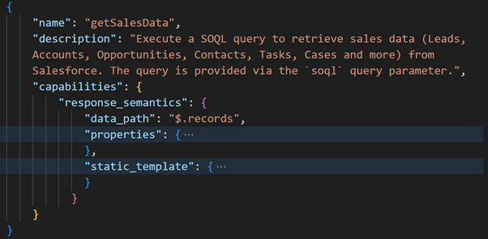
 
### Salesforce Authentication Setup

1. Log into your Salesforce account and open the Setup page.

    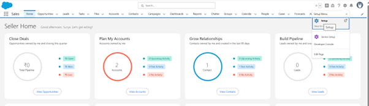

2. Navigate to Platform Tools > Apps > External Client App Manager.

    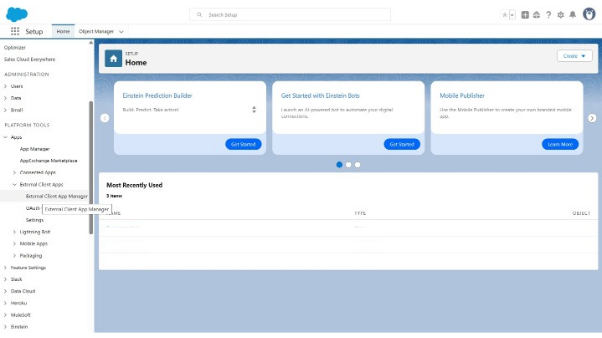

3. Click New External Client App.

    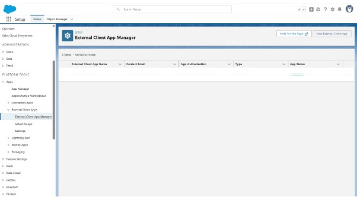

4. In the app configuration:

  - Set Callback URL to: `https://teams.microsoft.com/api/platform/v1.0/oAuthRedirect`
  * Add OAuth Scopes as needed (e.g., full for complete access and Perform request at any time).
  * Only Authorization Code and Client Credentials grant types are supported.
  * More info on supported Auth types in : [Copilot Plugin Auth Guide](https://learn.microsoft.com/en-us/microsoft-365-copilot/extensibility/api-plugin-authentication).

    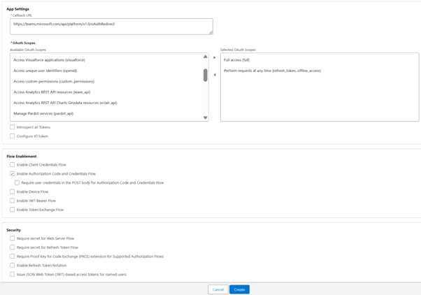

5. After app creation, you'll see Policies, Settings, and Package Details tabs.
  * In the Policies tab: Under OAuth Policies, select "Relax IP Restrictions".
  
    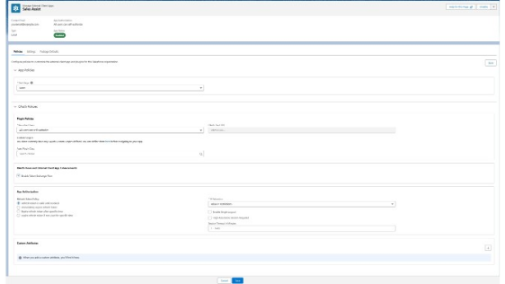
  
  * In the Settings tab: Click Reveal to copy your Consumer Key and Consumer Secret.

    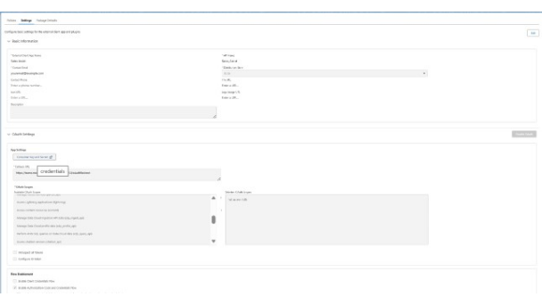

6. Provision Key & Secret in Copilot

    When provisioning the Declarative Agent via the Teams Toolkit, you’ll be prompted to enter the Client ID (Key) and Client Secret. Use the values from the Salesforce OAuth app you created.

## Help

We do not support samples, but this community is always willing to help, and we want to improve these samples. We use GitHub to track issues, which makes it easy for  community members to volunteer their time and help resolve issues.

You can try looking at [issues related to this sample](https://github.com/pnp/copilot-pro-dev-samples/issues?q=label%3A%22sample%3A%20da-SalesGenie%22) to see if anybody else is having the same issues.

If you encounter any issues using this sample, [create a new issue](https://github.com/pnp/copilot-pro-dev-samples/issues/new).

Finally, if you have an idea for improvement, [make a suggestion](https://github.com/pnp/copilot-pro-dev-samples/issues/new).

## Disclaimer

**THIS CODE IS PROVIDED *AS IS* WITHOUT WARRANTY OF ANY KIND, EITHER EXPRESS OR IMPLIED, INCLUDING ANY IMPLIED WARRANTIES OF FITNESS FOR A PARTICULAR PURPOSE, MERCHANTABILITY, OR NON-INFRINGEMENT.**

