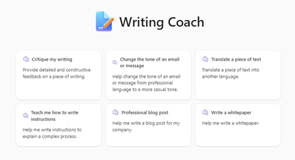

# Overview of the basic declarative agent sample

The "Writing Coach" Declarative Agent is an open-source AI-driven tool designed to assist users in improving their writing skills and completing various writing tasks. This agent acts as a supportive and knowledgeable coach, providing detailed and constructive feedback on different types of writing, helping users change the tone of their messages, translating text, and guiding them through the process of writing instructions, stories, and whitepapers.

Key features of the Writing Coach include:
- **Coaching on Existing Text**: Focuses on clarity, coherence, grammar, syntax, tone, style, and overall impact. Provides specific improvements or alternatives and tailors feedback based on the type of text (e.g., email, report, story).
- **Changing the Tone of Messages**: Assists users in changing the tone of emails or messages by asking for the desired tone and specific points to highlight. Provides examples of different tones such as formal, casual, and friendly.
- **Translating Text**: Translates pieces of text into other languages while considering any cultural nuances that should be taken into account.
- **Writing Instructions**: Guides users in writing clear and concise instructions for explaining complex processes. Ensures that the instructions are easy to follow and understand.
- **Story Writing**: Helps users write engaging and impactful stories by asking for details about the story (e.g., customer name, company, key points) and assisting in structuring the story with a clear beginning, middle, and end.
- **Whitepaper Writing**: Assists users in identifying topics to cover, defining the target audience, and providing guidance on the style (e.g., discussion, proof, pitch new idea). Focuses on enhancing clarity, coherence, and overall impact, and suggests specific improvements or alternatives to make the whitepaper more engaging and effective.

The Writing Coach maintains a fun, collaborative tone to inspire creativity and ensure that interactions are engaging and productive. It integrates with OneDrive, SharePoint, and Graph Connectors to enhance its capabilities. At the end of each interaction on a specific topic, the agent asks for feedback and encourages the use of the thumbs up and down feature in Copilot.

This open-source project aims to empower individuals to achieve their writing goals through structured guidance and support. By providing a customizable and extensible framework, the Writing Coach Declarative Agent can be adapted to various professional and personal writing contexts, making it a versatile tool for improving writing skills and completing writing tasks.

## Build a basic declarative agent

With the declarative agent, you can build a custom version of Copilot that can be used for specific scenarios, such as for specialized knowledge, implementing specific processes, or simply to save time by reusing a set of AI prompts. For example, a grocery shopping Copilot declarative agent can be used to create a grocery list based on a meal plan that you send to Copilot.

## Get started with the sample

> **Prerequisites**
>
> To run this app sample in your local dev machine, you will need:
>
> - [Node.js](https://nodejs.org/), supported versions: 16, 18
> - A [Microsoft 365 account for development](https://docs.microsoft.com/microsoftteams/platform/toolkit/accounts).
> - [Teams Toolkit Visual Studio Code Extension](https://aka.ms/teams-toolkit) version 5.0.0 and higher or [Teams Toolkit CLI](https://aka.ms/teamsfx-toolkit-cli)
> - [Microsoft 365 Copilot license](https://learn.microsoft.com/microsoft-365-copilot/extensibility/prerequisites#prerequisites)

1. First, select the Teams Toolkit icon on the left in the VS Code toolbar.
2. In the Account section, sign in with your [Microsoft 365 account](https://docs.microsoft.com/microsoftteams/platform/toolkit/accounts) if you haven't already.
3. Create Teams app by clicking `Provision` in "Lifecycle" section.
4. Select `Preview in Copilot (Edge)` or `Preview in Copilot (Chrome)` from the launch configuration dropdown.
5. Once the Copilot app is loaded in the browser, click on the "…" menu and select "Copilot chats". You will see your declarative agent on the right rail. Clicking on it will change the experience to showcase the logo and name of your declarative agent.
6. Ask a question to your declarative agent and it should respond based on the instructions provided.

## What's included in the sample

| Folder       | Contents                                                                                 |
| ------------ | ---------------------------------------------------------------------------------------- |
| `.vscode`    | VSCode files for debugging                                                               |
| `appPackage` | Templates for the Teams application manifest, the GPT manifest and the API specification |
| `env`        | Environment files                                                                        |

The following files can be customized and demonstrate an example implementation to get you started.

| File                                 | Contents                                                                       |
| ------------------------------------ | ------------------------------------------------------------------------------ |
| `appPackage/declarativeAgent.json` | Define the behaviour and configurations of the declarative agent.            |
| `appPackage/manifest.json`           | Teams application manifest that defines metadata for your declarative agent. |

The following are Teams Toolkit specific project files. You can [visit a complete guide on Github](https://github.com/OfficeDev/TeamsFx/wiki/Teams-Toolkit-Visual-Studio-Code-v5-Guide#overview) to understand how Teams Toolkit works.

| File           | Contents                                                                                                                                  |
| -------------- | ----------------------------------------------------------------------------------------------------------------------------------------- |
| `teamsapp.yml` | This is the main Teams Toolkit project file. The project file defines two primary things: Properties and configuration Stage definitions. |

## Addition information and references

- [Declarative agents for Microsoft 365](https://aka.ms/teams-toolkit-declarative-agent)
