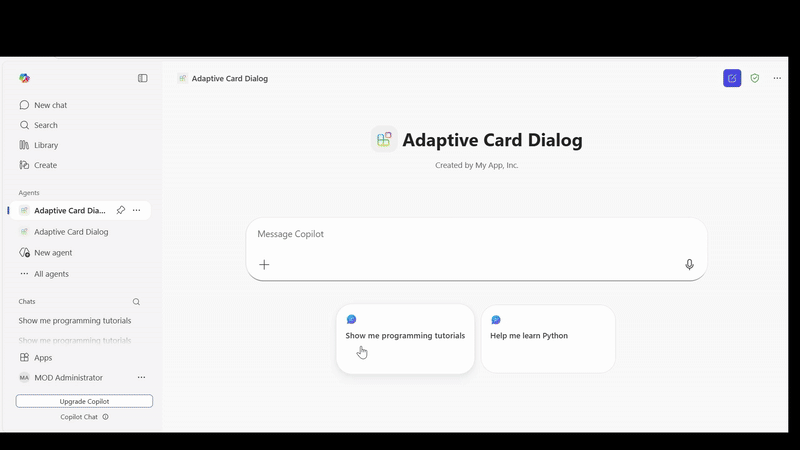

# Adaptive Card Dialog (C#)

## Summary

This sample demonstrates how to open dialog boxes from Adaptive Cards in a Microsoft 365 Copilot declarative agent. Users can browse programming tutorials for Node.js, JavaScript, and Git, watch official Microsoft video tutorials embedded in dialog boxes, and take interactive quizzes with instant feedback—all within the Copilot interface.

The sample showcases Action.OpenUrlDialog from Adaptive Cards v1.5, an Azure Functions backend written in C# (.NET 10), and API Plugin integration.



## Version history

Version|Date|Author|Comments
-------|----|----|--------
1.0|April 15, 2026|[YugalPradhan31](https://github.com/YugalPradhan31)|Initial release

## Prerequisites

* [Microsoft 365 account with Copilot access](https://www.microsoft.com/microsoft-365/enterprise/copilot-for-microsoft-365)
* [.NET 10 SDK](https://dotnet.microsoft.com/download/dotnet/10.0)
* [Azure Functions Core Tools v4](https://learn.microsoft.com/azure/azure-functions/functions-run-tools)
* [Visual Studio 2022](https://aka.ms/vs) 17.11 or higher
* [Microsoft 365 Agents Toolkit for Visual Studio](https://aka.ms/install-teams-toolkit-vs)

## Minimal Path to Awesome

* Clone this repository (or download this solution as a .ZIP file then unzip it)
    ```bash
    git clone https://github.com/pnp/copilot-pro-dev-samples.git
    cd copilot-pro-dev-samples/samples/da-adaptive-card-dialog-csharp
    ```
* Open **AdaptiveCardDialog.slnx** in Visual Studio 2022
* In the debug dropdown menu, select **Dev Tunnels > Create a Tunnel** (set authentication type to Public) or select an existing public dev tunnel
* Right-click the **M365Agent** project in Solution Explorer and select **Microsoft 365 Agents Toolkit > Select Microsoft 365 Account**
* Sign in to Microsoft 365 Agents Toolkit with a **Microsoft 365 work or school account**
* Press **F5**, or select **Debug > Start Debugging** in Visual Studio to start your app
* When the browser launches, open the **Copilot** app, select the agent, and start asking questions like:
    - "Show me programming tutorials"
    - "I want to learn JavaScript"
    - "Git tutorials for beginners"
* The agent will respond with programming tutorials and you can interact with action buttons:
    - **Watch Video** - Opens YouTube embed in a large dialog
    - **Interactive Quiz** - Opens custom HTML quiz with instant feedback

> **Note:** Please make sure to switch to New Teams when Teams web client has launched.

## Features

This sample illustrates the following concepts for Microsoft 365 Copilot declarative agents:

* **Action.OpenUrlDialog** - Opens URLs in modal dialogs within Microsoft 365 Copilot without leaving the chat interface

### What is Action.OpenUrlDialog?

`Action.OpenUrlDialog` is a new Adaptive Card action (v1.5+) that opens a URL in a modal dialog within Microsoft 365 Copilot, providing an integrated experience without leaving the chat interface.

**Key Characteristics:**
- Opens URLs in modal dialogs within Copilot
- Supports custom dialog sizes (width/height in px or predefined: small, medium, large)
- Requires URLs to be whitelisted in `validDomains` in manifest.json
- Works with YouTube embeds, custom HTML pages, and other web content

### Interaction Flow

**Step 1: Ask for tutorials**
```
User: "Show me programming tutorials"
```

**Step 2: Browse learning resources**
The agent returns adaptive cards showing:
- Topic name (Node.js, JavaScript, Git)
- Difficulty level and duration
- Description
- Two action buttons

**Step 3: Watch Video**
Click "Watch Video" button:
- Opens YouTube embed in a large dialog
- Shows official Microsoft tutorial videos
- Supports fullscreen playback

**Step 4: Take Interactive Quiz**
Click "Interactive Quiz" button:
- Opens custom HTML quiz in dialog
- 3 questions with multiple choice options
- Instant feedback with explanations
- Progress bar showing completion
- Final score and key takeaways
- Option to retake quiz

## Help

We do not support samples, but this community is always willing to help, and we want to improve these samples. We use GitHub to track issues, which makes it easy for community members to volunteer their time and help resolve issues.

You can try looking at [issues related to this sample](https://github.com/pnp/copilot-pro-dev-samples/issues?q=label%3A%22sample%3A%20da-adaptive-card-dialog-csharp%22) to see if anybody else is having the same issues.

If you encounter any issues using this sample, [create a new issue](https://github.com/pnp/copilot-pro-dev-samples/issues/new).

Finally, if you have an idea for improvement, [make a suggestion](https://github.com/pnp/copilot-pro-dev-samples/issues/new).

## Disclaimer

**THIS CODE IS PROVIDED *AS IS* WITHOUT WARRANTY OF ANY KIND, EITHER EXPRESS OR IMPLIED, INCLUDING ANY IMPLIED WARRANTIES OF FITNESS FOR A PARTICULAR PURPOSE, MERCHANTABILITY, OR NON-INFRINGEMENT.**

## Further reading

- [Action.OpenUrlDialog Documentation](https://learn.microsoft.com/en-us/microsoft-365-copilot/extensibility/adaptive-card-dialog-box)
- [Build declarative agents for Microsoft 365 Copilot](https://learn.microsoft.com/microsoft-365-copilot/extensibility/overview-declarative-agent)
- [Adaptive Cards Schema Explorer](https://adaptivecards.io/explorer/)
- [API Plugins for Microsoft 365 Copilot](https://learn.microsoft.com/microsoft-365-copilot/extensibility/overview-api-plugins)
- [Declarative agents for Microsoft 365](https://aka.ms/teams-toolkit-declarative-agent)


---
