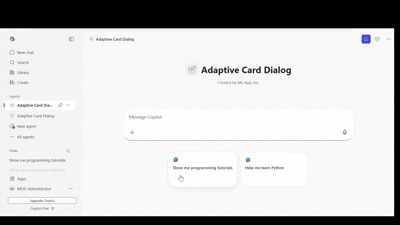

# Adaptive Card Dialog

## Summary

This sample demonstrates how to open dialog boxes from Adaptive Cards in a Microsoft 365 Copilot declarative agent. Users can browse programming tutorials for Node.js, JavaScript, and Git, watch official Microsoft video tutorials embedded in dialog boxes, and take interactive quizzes with instant feedback—all within the Copilot interface.

The sample showcases Action.OpenUrlDialog from Adaptive Cards v1.5, Azure Functions backend, and API Plugin integration.




## Prerequisites

* [Microsoft 365 account with Copilot access](https://www.microsoft.com/microsoft-365/enterprise/copilot-for-microsoft-365)
* [Node.js](https://nodejs.org) version 18.x, 20.x, or 22.x
* [Visual Studio Code](https://code.visualstudio.com/)
* [Microsoft 365 Agents Toolkit for VS Code](https://marketplace.visualstudio.com/items?itemName=TeamsDevApp.ms-teams-vscode-extension)
* [Dev tunnels CLI](https://learn.microsoft.com/azure/developer/dev-tunnels/get-started) for local development

## Version history

Version|Date|Author|Comments
-------|----|----|--------
1.0|January 6, 2026|Microsoft|Initial release

## Disclaimer

**THIS CODE IS PROVIDED *AS IS* WITHOUT WARRANTY OF ANY KIND, EITHER EXPRESS OR IMPLIED, INCLUDING ANY IMPLIED WARRANTIES OF FITNESS FOR A PARTICULAR PURPOSE, MERCHANTABILITY, OR NON-INFRINGEMENT.**

---

## Minimal Path to Awesome

* Clone this repository (or download this solution as a .ZIP file then unzip it)
    ```bash
    git clone https://github.com/pnp/copilot-pro-dev-samples.git
    cd copilot-pro-dev-samples/samples/da-adaptive-card-dialog
    ```
* Open the project in Visual Studio Code
* Select the **Microsoft 365 Agents Toolkit** icon on the left in the VS Code toolbar
* In the **Account** section, sign in with your Microsoft 365 account if you haven't already
* Create Teams app by selecting **Provision** in the **Lifecycle** section
* Select **Preview in Copilot (Edge)** or **Preview in Copilot (Chrome)** from the launch configuration dropdown, or use **Debug in Microsoft 365 Agents Playground** for local testing
* Once the agent is loaded, you can ask questions like:
    - "Show me programming tutorials"
    - "I want to learn JavaScript"
    - "Git tutorials for beginners"
* The agent will respond with programming tutorials and you can interact with action buttons:
    - **Watch Video** - Opens YouTube embed in a large dialog
    - **Interactive Quiz** - Opens custom HTML quiz with instant feedback

## Features

This sample illustrates the following concepts for Microsoft 365 Copilot declarative agents:

* **Action.OpenUrlDialog** - Opens URLs in modal dialogs within Microsoft 365 Copilot without leaving the chat interface

### What is Action.OpenUrlDialog?

`Action.OpenUrlDialog` is a new Adaptive Card action (v1.5+) that opens a URL in a modal dialog within Microsoft 365 Copilot, providing an integrated experience without leaving the chat interface.

**Key Characteristics:**
- Opens URLs in modal dialogs within Copilot
- Supports custom dialog sizes (width/height in px or predefined: small, medium, large)
- Requires URLs to be whitelisted in `validDomains` in manifest.json
- Works with YouTube embeds, custom HTML pages, and other web content

### Interaction Flow

**Step 1: Ask for tutorials**
```
User: "Show me programming tutorials"
```

**Step 2: Browse learning resources**
The agent returns adaptive cards showing:
- Topic name (Node.js, JavaScript, Git)
- Difficulty level and duration
- Description
- Two action buttons

**Step 3: Watch Video**
Click "Watch Video" button:
- Opens YouTube embed in a large dialog
- Shows official Microsoft tutorial videos
- Supports fullscreen playback

**Step 4: Take Interactive Quiz**
Click "Interactive Quiz" button:
- Opens custom HTML quiz in dialog (700px height)
- 3 questions with multiple choice options
- Instant feedback with explanations
- Progress bar showing completion
- Final score and key takeaways
- Option to retake quiz

## Further reading

- [Action.OpenUrlDialog Documentation](https://learn.microsoft.com/en-us/microsoft-365-copilot/extensibility/adaptive-card-dialog-box)
- [Build declarative agents for Microsoft 365 Copilot](https://learn.microsoft.com/microsoft-365-copilot/extensibility/overview-declarative-agent)
- [Adaptive Cards Schema Explorer](https://adaptivecards.io/explorer/)
- [API Plugins for Microsoft 365 Copilot](https://learn.microsoft.com/microsoft-365-copilot/extensibility/overview-api-plugins)

