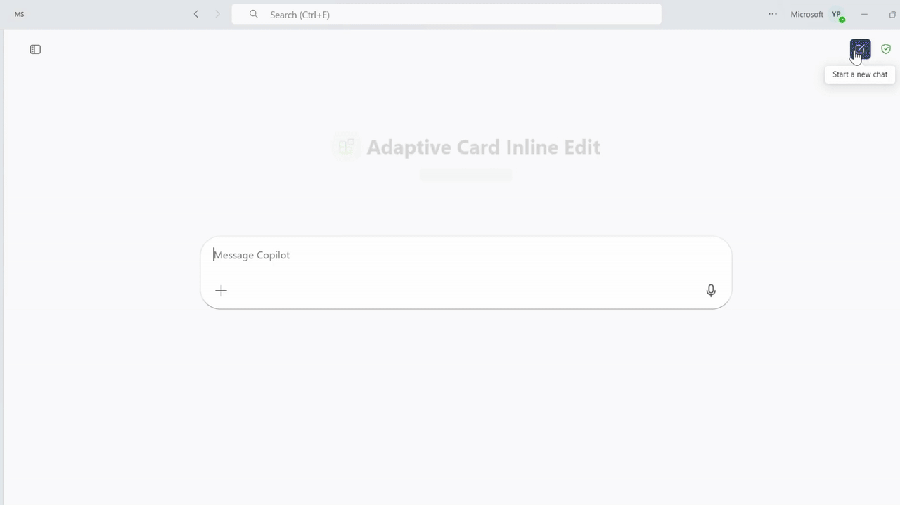

# Adaptive Card Inline Edit

## Summary

This sample demonstrates how to allow inline editing of Adaptive Card responses in a Microsoft 365 Copilot declarative agent. Users can view car repair records, edit fields directly within the card (title, assigned technician), and submit updates—all without leaving the Copilot interface.

The sample showcases Action.Execute from Adaptive Cards v1.5, stateful card updates, Azure Functions backend, and API Plugin integration.



## Prerequisites

* [Microsoft 365 account with Copilot access](https://www.microsoft.com/microsoft-365/enterprise/copilot-for-microsoft-365)
* [.NET 10 SDK](https://dotnet.microsoft.com/download/dotnet/10.0)
* [Azure Functions Core Tools v4](https://learn.microsoft.com/azure/azure-functions/functions-run-tools)
* [Visual Studio 2022](https://aka.ms/vs) 17.11 or higher
* [Microsoft 365 Agents Toolkit for Visual Studio](https://aka.ms/install-teams-toolkit-vs)

## Minimal Path to Awesome

* Clone this repository (or download this solution as a .ZIP file then unzip it)
* Open **AdaptiveCardInlineEdit.slnx** in Visual Studio

### How to add your own API Key

1. Open PowerShell, change the current working directory to this project root, and run:
    ```powershell
    ./M365Agent/GenerateApiKey.ps1
    ```
2. The above command will output something like "Generated a new API Key: xxx..."
3. Fill in API Key into `M365Agent/env/.env.*.user`:
    ```
    SECRET_API_KEY=<your-api-key>
    ```

### Start the app

1. If you haven't added your own API Key, please follow the above steps to add your own API Key.
2. In the debug dropdown menu, select **Dev Tunnels > Create a Tunnel** (set authentication type to Public) or select an existing public dev tunnel
3. Right-click the **M365Agent** project in Solution Explorer and select **Microsoft 365 Agents Toolkit > Select Microsoft 365 Account**
4. Sign in to Microsoft 365 Agents Toolkit with a **Microsoft 365 work or school account**
5. Press **F5**, or select **Debug > Start Debugging** in Visual Studio to start your app
6. When Teams launches in the browser, click the **Apps** icon from the Teams client left rail to open the Teams app store and search for **Copilot**
7. Open the **Copilot** app, select **Plugins**, and from the list of plugins, turn on the toggle for your plugin
8. Once the agent is loaded, you can ask questions like:
    - "Show repair records assigned to Issac Fielder"
    - "Show me all car repair records"
    - "List repairs assigned to Karin Blair"
9. The agent will respond with repair records in Adaptive Cards. You can:
    - View repair details (ID, title, assignee, date)
    - Edit the **Title** and **Assigned To** fields directly in the card
    - Click the **Update** button to save changes
    - See a success confirmation with the updated values

> **Note:** Please make sure to switch to New Teams when Teams web client has launched.

## Features

This sample illustrates the following concepts for Microsoft 365 Copilot declarative agents:

* **Action.Execute** - Enables inline editing and stateful updates of Adaptive Cards within Microsoft 365 Copilot
* **Input Controls** - Uses Input.Text fields within Adaptive Cards to collect user edits
* **Dynamic Card Updates** - Returns updated Adaptive Cards based on API responses, creating seamless interactions

### What is Action.Execute?

`Action.Execute` is an Adaptive Card action (v1.5+) that sends structured data payloads to your API and dynamically updates the card based on the response, enabling stateful, interactive experiences within Microsoft 365 Copilot.

**Key Characteristics:**
- Sends collected input data from card fields to your API endpoint
- Receives and renders an updated Adaptive Card in response
- Enables inline editing without leaving the chat interface
- Supports complex interactions like form submissions, record updates, and multi-step workflows
- Identified by a `verb` property that maps to your API operation

### Interaction Flow

**Step 1: Ask for repair records**
```
User: "Show repair records assigned to Issac Fielder"
```

**Step 2: View repair records**
The agent returns Adaptive Cards showing:
- Repair ID
- Editable title field (Input.Text)
- Editable assignee field (Input.Text)
- Repair date
- **Update** action button

**Step 3: Edit fields inline**
User can:
- Click on the Title field and modify the repair description
- Click on the Assigned To field and change the technician name
- Make multiple edits before submitting

**Step 4: Submit update**
Click the "Update" button:
- Action.Execute sends the form data to the `updateRepair` API endpoint
- The verb `updateRepair` maps to the PATCH `/repairs/{id}` operation
- Backend updates the repair record in the data store

**Step 5: See confirmation**
The card refreshes with:
- Success message: "Repair updated successfully"
- Updated repair details displayed in the card
- Same edit fields available for further changes
- The Update button remains available for additional edits

## Further reading

- [Action.Execute Documentation](https://learn.microsoft.com/microsoft-365-copilot/extensibility/adaptive-card-edits)
- [Build declarative agents for Microsoft 365 Copilot](https://learn.microsoft.com/microsoft-365-copilot/extensibility/overview-declarative-agent)
- [Adaptive Cards Schema Explorer](https://adaptivecards.io/explorer/)
- [API Plugins for Microsoft 365 Copilot](https://learn.microsoft.com/microsoft-365-copilot/extensibility/overview-api-plugins)
- [Declarative agents for Microsoft 365](https://aka.ms/teams-toolkit-declarative-agent)
