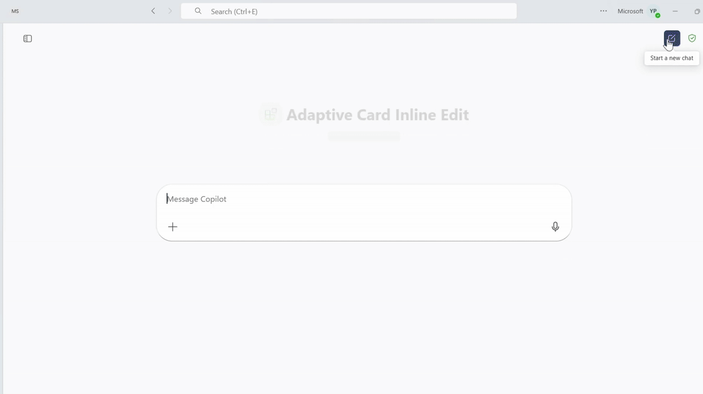

# Adaptive Card Inline Edit

## Summary

This sample demonstrates how to allow inline editing of Adaptive Card responses in a Microsoft 365 Copilot declarative agent. Users can view car repair records, edit fields directly within the card (title, assigned technician), and submit updates—all without leaving the Copilot interface.

The sample showcases Action.Execute from Adaptive Cards v1.5, stateful card updates, Azure Functions backend, and API Plugin integration.




## Version history

Version|Date|Author|Comments
-------|----|----|--------
1.0|January 20, 2026|Microsoft|Initial release

## Prerequisites

* [Microsoft 365 account with Copilot access](https://www.microsoft.com/microsoft-365/enterprise/copilot-for-microsoft-365)
* [Node.js](https://nodejs.org) version 18.x, 20.x, or 22.x
* [Visual Studio Code](https://code.visualstudio.com/)
* [Microsoft 365 Agents Toolkit for VS Code](https://marketplace.visualstudio.com/items?itemName=TeamsDevApp.ms-teams-vscode-extension)
* [Dev tunnels CLI](https://learn.microsoft.com/azure/developer/dev-tunnels/get-started) for local development

## Minimal Path to Awesome

* Clone this repository (or download this solution as a .ZIP file then unzip it)
    ```bash
    git clone https://github.com/pnp/copilot-pro-dev-samples.git
    cd copilot-pro-dev-samples/samples/da-adaptive-card-inline-edit
    ```
* Open the project in Visual Studio Code
* Select the **Microsoft 365 Agents Toolkit** icon on the left in the VS Code toolbar
* In the **Account** section, sign in with your Microsoft 365 account if you haven't already
* Create Teams app by selecting **Provision** in the **Lifecycle** section
* Select **Preview in Copilot (Edge)** or **Preview in Copilot (Chrome)** from the launch configuration dropdown, or use **Debug in Microsoft 365 Agents Playground** for local testing
* Once the agent is loaded, you can ask questions like:
    - "Show repair records assigned to Issac Fielder"
    - "Show me all car repair records"
    - "List repairs assigned to Karin Blair"
* The agent will respond with repair records in Adaptive Cards. You can:
    - View repair details (ID, title, assignee, date)
    - Edit the **Title** and **Assigned To** fields directly in the card
    - Click the **Update** button to save changes
    - See a success confirmation with the updated values

### How to add your own API Key

1. Open terminal and run command `npm install` to install all dependency packages

   ```bash
   npm install
   ```

2. After `npm install` completed, run command `npm run keygen`
   ```bash
   npm run keygen
   ```
3. The above command will output something like "Generated a new API Key: xxx..."
4. Fill in API Key into `env/.env.*.user`
   ```
   SECRET_API_KEY=<your-api-key>
   ```

## Features

This sample illustrates the following concepts for Microsoft 365 Copilot declarative agents:

* **Action.Execute** - Enables inline editing and stateful updates of Adaptive Cards within Microsoft 365 Copilot
* **Input Controls** - Uses Input.Text fields within Adaptive Cards to collect user edits
* **Dynamic Card Updates** - Returns updated Adaptive Cards based on API responses, creating seamless interactions

### What is Action.Execute?

`Action.Execute` is an Adaptive Card action (v1.5+) that sends structured data payloads to your API and dynamically updates the card based on the response, enabling stateful, interactive experiences within Microsoft 365 Copilot.

**Key Characteristics:**
- Sends collected input data from card fields to your API endpoint
- Receives and renders an updated Adaptive Card in response
- Enables inline editing without leaving the chat interface
- Supports complex interactions like form submissions, record updates, and multi-step workflows
- Identified by a `verb` property that maps to your API operation

### Interaction Flow

**Step 1: Ask for repair records**
```
User: "Show repair records assigned to Issac Fielder"
```

**Step 2: View repair records**
The agent returns Adaptive Cards showing:
- Repair ID
- Editable title field (Input.Text)
- Editable assignee field (Input.Text)
- Repair date
- **Update** action button

**Step 3: Edit fields inline**
User can:
- Click on the Title field and modify the repair description
- Click on the Assigned To field and change the technician name
- Make multiple edits before submitting

**Step 4: Submit update**
Click the "Update" button:
- Action.Execute sends the form data to the `updateRepair` API endpoint
- The verb `updateRepair` maps to the PATCH `/repairs/{id}` operation
- Backend updates the repair record in the data store

**Step 5: See confirmation**
The card refreshes with:
- ✅ Success message: "Repair updated successfully"
- Updated repair details displayed in the card
- Same edit fields available for further changes
- The Update button remains available for additional edits


## Help

We do not support samples, but this community is always willing to help, and we want to improve these samples. We use GitHub to track issues, which makes it easy for community members to volunteer their time and help resolve issues.

You can try looking at [issues related to this sample](https://github.com/pnp/copilot-pro-dev-samples/issues?q=label%3A%22sample%3A%20da-adaptive-card-inline-edit%22) to see if anybody else is having the same issues.

If you encounter any issues using this sample, [create a new issue](https://github.com/pnp/copilot-pro-dev-samples/issues/new).

Finally, if you have an idea for improvement, [make a suggestion](https://github.com/pnp/copilot-pro-dev-samples/issues/new).


## Disclaimer

**THIS CODE IS PROVIDED *AS IS* WITHOUT WARRANTY OF ANY KIND, EITHER EXPRESS OR IMPLIED, INCLUDING ANY IMPLIED WARRANTIES OF FITNESS FOR A PARTICULAR PURPOSE, MERCHANTABILITY, OR NON-INFRINGEMENT.**


## Further reading

- [Action.OpenUrlDialog Documentation](https://learn.microsoft.com/en-us/microsoft-365-copilot/extensibility/adaptive-card-dialog-box)
- [Build declarative agents for Microsoft 365 Copilot](https://learn.microsoft.com/microsoft-365-copilot/extensibility/overview-declarative-agent)
- [Adaptive Cards Schema Explorer](https://adaptivecards.io/explorer/)
- [API Plugins for Microsoft 365 Copilot](https://learn.microsoft.com/microsoft-365-copilot/extensibility/overview-api-plugins)


---