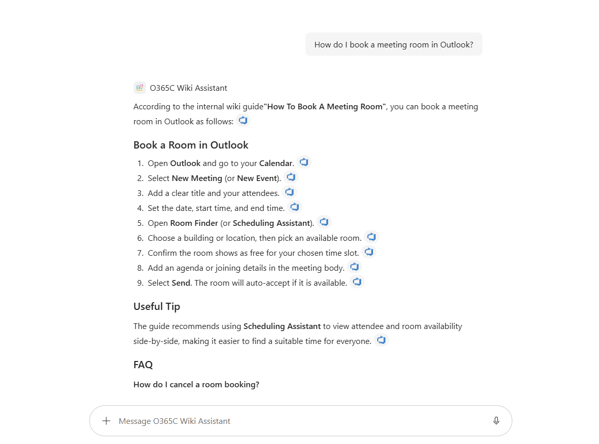

# Azure DevOps Wiki Assistant

## Summary

A read-only Microsoft 365 Copilot **declarative agent** grounded **strictly** on the [Azure DevOps Wiki Copilot connector](https://learn.microsoft.com/microsoft-365/copilot/connectors/azure-devops-wiki-deployment). It searches your organization's indexed project and code wikis, answers how-to questions, preserves the guide's numbered steps and reference tables, **cites the source page**, and clearly says when an answer isn't in the wiki instead of guessing.

The key idea this sample demonstrates: a Copilot connector makes your wiki *searchable*, but it does not make an agent *trustworthy*. The agent's **instruction block** is what keeps it grounded — it answers only from retrieved wiki content, never from general knowledge, and admits when it doesn't know.

Built with **TypeSpec** and the **Microsoft 365 Agents Toolkit**, so the agent definition lives in source control and retargets to any tenant by changing a single environment variable — no code change.



## Contributors

* [Ejaz Hussain](https://github.com/ejazhussain)

## Version history

Version|Date|Comments
-------|----|--------
1.0|August 22, 2026|Initial release

## Prerequisites

* A Microsoft 365 tenant with **Microsoft 365 Copilot** licensing.
* The **Azure DevOps Wiki** Copilot connector deployed and in the **Ready** state. See [Deploy the Azure DevOps Wiki connector](https://learn.microsoft.com/microsoft-365/copilot/connectors/azure-devops-wiki-deployment). The crawl account needs at least **Basic** access to the Azure DevOps projects (Stakeholder is not sufficient).
* [Node.js](https://nodejs.org/) 18+ (built and tested on Node 22 / npm 10).
* [Microsoft 365 Agents Toolkit](https://aka.ms/m365atk) — the Visual Studio Code extension, or the `atk` CLI (`npm i -g @microsoft/m365agentstoolkit-cli`).

## Minimal path to awesome

* Clone this repository (or [download this solution as a .ZIP file](https://pnp.github.io/download-partial/?url=https://github.com/pnp/copilot-pro-dev-samples/tree/main/samples/da-azure-devops-wiki) then unzip it).
* From a terminal, change to the `samples/da-azure-devops-wiki` folder.
* **Find your connector's connection id.** The agent binds to the connector by its Microsoft Graph connection `id`, which can differ from the display name shown in the admin center. As a tenant admin, in [Graph Explorer](https://developer.microsoft.com/graph/graph-explorer) (scope `ExternalConnection.Read.All`), run:

  ```http
  GET https://graph.microsoft.com/v1.0/external/connections?$select=id,name
  ```

  Copy the `id` of your Azure DevOps Wiki connection.
* **Set your environment values.** Open `env/.env.dev` and set `ADO_WIKI_CONNECTION_ID` to the connection `id` from the previous step. Leave the toolkit-generated values (such as `TEAMS_APP_ID`) blank — they are filled in during provisioning.
* **Install and compile** to verify the agent definition builds:

  ```bash
  npm install
  npm run generate:env -- dev
  npm run compile
  ```

  > `generate:env` must run before `compile` on a fresh clone, because `src/agent/env.tsp` is generated (git-ignored) and `main.tsp` imports it. The Agents Toolkit pipeline does this automatically during provisioning.
* **Provision and preview:**
  * **Visual Studio Code:** open the folder, sign in to Microsoft 365 in the Agents Toolkit pane, then use **Provision** (dev), or run **Preview Local in Copilot** to sideload the agent.
  * **CLI:** `atk provision --env dev`.
* Open Microsoft 365 Copilot at [m365.cloud.microsoft/chat](https://m365.cloud.microsoft/chat), open the agents drawer, and select **Azure DevOps Wiki Assistant**.
* **Test the grounding** with one of the conversation starters (a topic your wiki covers) and confirm the answer includes a citation to the correct wiki page. Then ask something the wiki does not cover and confirm the agent replies that it could not find the answer — rather than answering from general knowledge.

## Features

Using this sample you can extend Microsoft 365 Copilot with an agent that:

* Searches, summarizes, and answers from the Azure DevOps Wiki connector, **with citations** back to the source pages.
* Is **strictly grounded** — it never uses general world knowledge or web content, and states plainly when an answer is not in the wiki.
* Preserves the wiki guide's structure — numbered steps in order and reference tables (for example access levels or ticket priorities) reproduced when relevant.
* Is **permission-aware** — because the connector is permission-trimmed, users only see wiki content they already have access to.
* Is **read-only** by design — it does not create, edit, or delete content, and has no other knowledge sources.

This sample illustrates:

* Defining a declarative agent in **TypeSpec** with the Microsoft 365 Agents Toolkit.
* Binding an agent to a **Copilot connector** as its only knowledge source (`AgentCapabilities.CopilotConnectors`).
* Retargeting tenants through an environment variable (`ADO_WIKI_CONNECTION_ID`) instead of editing the agent definition.
* Authoring a strict-grounding **instruction block** and validating it with sample evaluation prompts (`evals/prompts.json`).

## Help

We do not support samples, but this community is always willing to help, and we want to improve these samples. We use GitHub to track issues, which makes it easy for community members to volunteer their time and help resolve issues.

You can try looking at [issues related to this sample](https://github.com/pnp/copilot-pro-dev-samples/issues?q=label%3A%22sample%3A%20da-azure-devops-wiki%22) to see if anybody else is having the same issues.

If you encounter any issues using this sample, [create a new issue](https://github.com/pnp/copilot-pro-dev-samples/issues/new).

Finally, if you have an idea for improvement, [make a suggestion](https://github.com/pnp/copilot-pro-dev-samples/issues/new).

## Disclaimer

**THIS CODE IS PROVIDED *AS IS* WITHOUT WARRANTY OF ANY KIND, EITHER EXPRESS OR IMPLIED, INCLUDING ANY IMPLIED WARRANTIES OF FITNESS FOR A PARTICULAR PURPOSE, MERCHANTABILITY, OR NON-INFRINGEMENT.**


