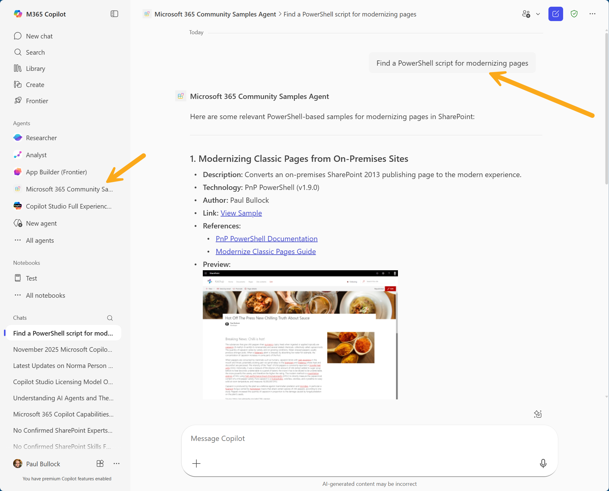

# Community Samples Assistant — Introduction

This assistant helps you find Microsoft 365 community samples and example projects. Where available it uses the "MCP Community Samples" server to discover, filter and surface relevant samples (repositories, code snippets, authors, and metadata).

> Note: The MCP Server Tool, search_samples, requires an input object for search which is beyond the ability for the agent to query. This feature is still preview so, this may change.

## Basic instructions

- Ask naturally. The agent will translate your request into MCP queries and return matching samples.
- Search by keyword, author, tool, feature, or scenario:
  - Examples:
    - "Find a Copilot sample for Trey"
    - "Show me samples by Paul Bullock"
    - "Find Outlook add-in samples that call Microsoft Graph"
    - "Give me 3 samples demonstrating adaptive cards"
- Request details for a sample:
  - "Show repo link, short description, and main files for [sample name]."
  - "How do I run this sample locally? List the setup steps."
- Ask for comparisons or recommendations:
  - "Compare two samples that implement SSO — pros and cons."
  - "Recommend a starter sample for building a Teams message extension."

## Tips & behavior

- The agent will indicate when it queries the MCP server (e.g., "Fetching samples…").
- If no matches are found, try broader keywords or alternate author spellings.
- For code or setup questions, include the sample name or repo link when possible.

## Privacy & security

- The agent will ask you permission to connect to the MCP Server
- The agent returns public sample metadata and links; follow the repository license and contributor guidance when reusing code.

## Get started with the Sample

> **Prerequisites**
>
> To run this app template in your local dev machine, you will need:
>
> - [Node.js](https://nodejs.org/), supported versions: 18, 20, 22
> - A [Microsoft 365 account for development](https://docs.microsoft.com/microsoftteams/platform/toolkit/accounts).
> - [Microsoft 365 Agents Toolkit Visual Studio Code Extension](https://aka.ms/teams-toolkit) version 5.0.0 and higher or [Microsoft 365 Agents Toolkit CLI](https://aka.ms/teamsfx-toolkit-cli)
> - [Microsoft 365 Copilot license](https://learn.microsoft.com/microsoft-365-copilot/extensibility/prerequisites#prerequisites)

1. Open ATK in VS Code

    Click the Microsoft 365 Agents Toolkit icon in the Activity Bar. 

2. Sign in

    Open the Agents Toolkit by click on the toolkit icon in the VS Code sidebar. Under Account, authenticate with your dev M365 account.

3. Scaffold a new DA

    In the Agents Toolkit menu, click 'Create new Agent/app', select 'Declarative Agent', choose a folder and name (e.g. my-mcp-agent).

4. Add your MCP Server

    In the ATK sidebar click Add Action → Start with an MCP server, then enter your MCP discovery URL (e.g. https://mcp.contoso.com/discover).

5. Start your MCP Server 

    After the DA project generated, click the "Start" button in the mcp.json file to start your MCP server, when prompt, enter the user ID and password for authentication.

6. Fetch and select tools 

    When prompted, Click ATK:Fetch Action from MCP" in the mcp.json file choose Pre‑fetch tools (for offline IntelliSense) or Dynamic. ATK will list all available MCP actions—check the ones you want in your agent.

7. Configure Auth

    ATK will retrieve the authentication information for your MCP server and store these values are in env/.env.development and a secure reference is injected into appPackage/ai-plugin.json. If the inputted MCP server authentication information is not configure correctly according to the MCP protocol, ATK will prompt errors.

8. Review generated files

    - `appPackage/ai-plugin.json` (function definitions, runtime spec + auth) - This file defines the the action or operations that Copilot can interact with.
    - `appPackage/declarativeAgent.json` (agent configuration & sample prompts) - This file is the definition of your declarative agent
    - `appPackage/manifest.json` (Teams/Outlook integration)

9. Provision & debug

    Use the Provision button in ATK to create resources. ATK will detect if your MCP server requires OAuth2 or API‐Key. Provide your Client ID/Secret or Key when prompted. Then Start Debugging to Preview agent in Copilot in Edge/Chrome. Your DA will appear under Copilot chats.

10. Test your MCP‑powered agent 

    Open the Copilot pane, select your agent and invoke any of the MCP tools with natural‑language prompts. 

## Project Structure

| Folder       | Description                                                                                 |
| ------------ | ---------------------------------------------------------------------------------------- |
| `.vscode`    | ATK debug & .vscode/mcp.json for MCP server config                                                               |
| `appPackage` | - `appPackage/ai-plugin.json` (function definitions, runtime spec + auth) - This file defines the the action or operations that Copilot can interact with - `appPackage/declarativeAgent.json` (agent configuration & sample prompts) - This file is the definition of your declarative agent - `appPackage/manifest.json` (Teams/Outlook integration)   |
| `env`        | Local environment files (.env.development, .env.local)                                                                         |
| `m365agents.yml` | Defines your DA stages & lifecycle for ATK  |

## MCP‑specific tips

- **Discovery URL**: your MCP server’s /discover endpoint must expose JSON‑Schema for every action.
- **Tool selection**: the run_for_functions array in ai-plugin.json limits which MCP tools your agent can call.  

- **Auth flows**: ATK supports both OAuth2.1 and API‑Key; you don’t need to hand‑edit auth blocks.  

- **Versioning**: when your MCP server schema changes, simply rerun ATK: Fetch Action from MCP to refresh your plugin file.  

- **Error logging**: basic request/response logs appear in the ATK console; errors bubble up in your Copilot chat. 

## Learn More

- [Build Declarative Agents (official docs)](https://learn.microsoft.com/microsoft-365-copilot/extensibility/build-declarative-agents)

- [Model Context Protocol (MCP)](https://modelcontextprotocol.io/)

- [Agents Toolkit guide on GitHub](https://github.com/OfficeDev/TeamsFx/wiki/Teams-Toolkit-Visual-Studio-Code-v5-Guide#overview)

Happy building! 

With MCP + Declarative Agents, you’ll have a turnkey path from your existing APIs to a fully operational Copilot‑powered experience. 
