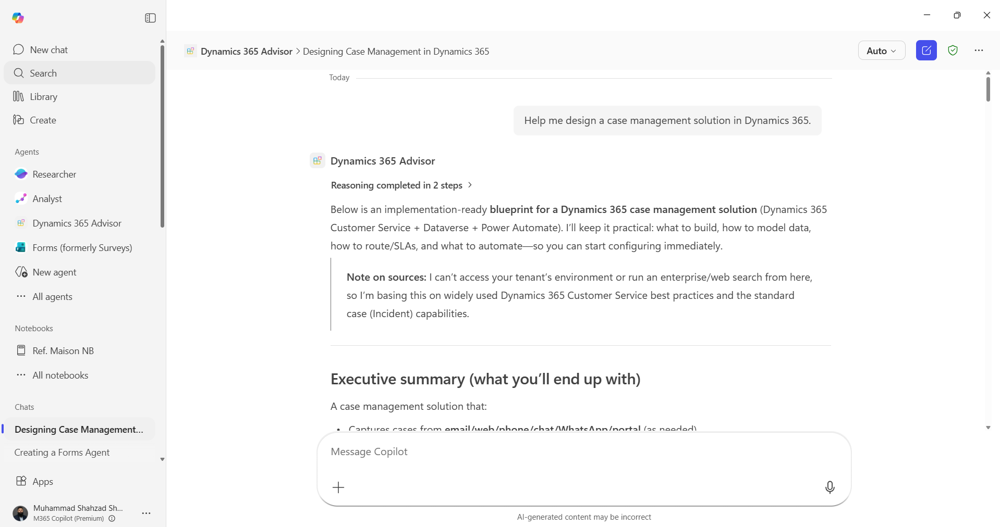

# Dynamics 365 Advisor Agent

## Summary

An expert declarative agent for Microsoft 365 Copilot that provides guidance on Dynamics 365 CRM, Power Platform, and Copilot solutions. This agent helps users with CRM architecture decisions, entity design, security models, Power Automate workflows, and business process automation.



## Tools and Frameworks


## Prerequisites

* [Microsoft 365 Developer Account](https://developer.microsoft.com/microsoft-365/dev-program)
* [Teams Toolkit for Visual Studio Code](https://learn.microsoft.com/microsoftteams/platform/toolkit/install-teams-toolkit?tabs=vscode)
* [Node.js LTS](https://nodejs.org/)
* [Visual Studio Code](https://code.visualstudio.com/)

## Version history

Version|Date|Author|Comments
-------|----|----|--------
1.0|April 28, 2026|Muhammad Shahzad Shafique|Initial release

## Disclaimer

**THIS CODE IS PROVIDED *AS IS* WITHOUT WARRANTY OF ANY KIND, EITHER EXPRESS OR IMPLIED, INCLUDING ANY IMPLIED WARRANTIES OF FITNESS FOR A PARTICULAR PURPOSE, MERCHANTABILITY, OR NON-INFRINGEMENT.**

---

## Minimal Path to Awesome

* Clone this repository
* Navigate to the `samples/da-dynamics365-advisor` folder
* Open the folder with Visual Studio Code
* Press F5 to run the application with Teams Toolkit
* Follow the prompts to add the declarative agent to Microsoft 365 Copilot

## Features

This Declarative Agent demonstrates:

* **CRM Architecture Guidance** - Expert advice on Dynamics 365 CRM design and implementation
* **Entity & Table Design** - Best practices for data model design in Dynamics 365
* **Security Model Design** - Help with security roles, access levels, and multi-region deployments
* **Power Automate Integration** - Workflow recommendations and automation patterns
* **Copilot Studio Use Cases** - Chatbot scenarios for customer service automation
* **Business Process Optimization** - Sales pipeline and customer service process improvements
* **Plugin & Custom Code** - Development recommendations and best practices

## Conversation Starters

The agent includes several conversation starters:

* **CRM Design** - "Help me design a case management solution in Dynamics 365."
* **Power Automate** - "Suggest a Power Automate flow for lead qualification."
* **Copilot Studio** - "Give me chatbot use cases for customer service."
* **Security Model** - "How should I design security roles for a 3-country CRM deployment?"

## File Structure

```
da-dynamics365-advisor/
├── src/
│   ├── declarativeAgent.json    # Agent configuration
│   ├── instruction.txt           # Agent instructions and behavior
│   ├── manifest.json             # Teams app manifest
│   ├── color.png                 # App icon (color)
│   └── outline.png               # App icon (outline)
├── assets/
│   ├── screenshot.png            # Demo screenshot
│   └── sample.json               # Sample metadata
├── .env.local.sample             # Environment variables template
├── .gitignore
└── README.md
```

## Setup Instructions

1. **Open in VS Code**
   - Open the `da-dynamics365-advisor` folder in Visual Studio Code
   - Ensure Teams Toolkit extension is installed

2. **Review the Configuration**
   - Check `src/declarativeAgent.json` for agent settings
   - Review `src/instruction.txt` for agent behavior

3. **Run the Agent**
   - Press F5 or use Teams Toolkit to start debugging
   - Sign in with your Microsoft 365 account
   - The agent will be deployed to your Copilot environment

4. **Test the Agent**
   - Open Microsoft 365 Copilot
   - Find "Dynamics 365 Advisor" in your agents
   - Try the conversation starters or ask your own questions about:
     - Dynamics 365 CRM architecture
     - Power Platform solutions
     - Security and access control
     - Business process automation

## Contributing

This project welcomes contributions and suggestions. Most contributions require you to agree to a Contributor License Agreement (CLA).

## Author

* **Muhammad Shahzad Shafique** - [GitHub Profile](https://github.com/MrShahzadShafique)


