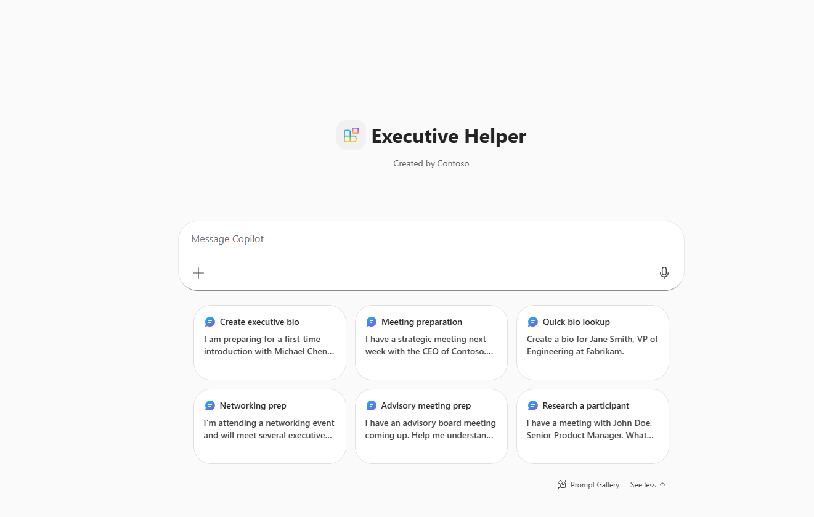
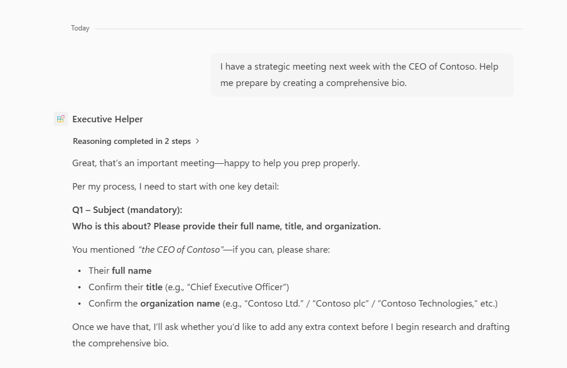

# Executive Helper - Meeting preparation with executive bios

## Summary

Executive Helper is a declarative agent for Microsoft 365 Copilot that automates meeting preparation by researching public information about meeting participants and generating comprehensive executive bios with career insights and context-specific rapport-building questions.

Executives spend significant time preparing for meetings by researching participants' backgrounds, roles, and expertise. This agent reduces meeting-prep time by up to 90% through a structured 5-phase workflow: adaptive interview, comprehensive research, bio generation, optional summarization, and human-in-the-loop review.

## Version history

Version|Date|Comments
-------|----|--------
1.0|March 2, 2026|Initial release

## Prerequisites

* [Microsoft 365 Copilot license](https://learn.microsoft.com/microsoft-365-copilot/extensibility/prerequisites#prerequisites)
* [Node.js](https://nodejs.org/), supported versions: 16, 18
* A [Microsoft 365 account for development](https://docs.microsoft.com/microsoftteams/platform/toolkit/accounts)
* [Teams Toolkit Visual Studio Code Extension](https://aka.ms/teams-toolkit) version 5.0.0 and higher or [Teams Toolkit CLI](https://aka.ms/teamsfx-toolkit-cli)

## Minimal path to awesome

* Clone this repository (or [download this solution as a .ZIP file](https://pnp.github.io/download-partial/?url=https://github.com/pnp/copilot-pro-dev-samples/tree/main/samples/da-executive-helper) then unzip it)
* Open the `samples/da-executive-helper` folder in Visual Studio Code
* Select the Teams Toolkit icon on the left in the VS Code toolbar
* In the Account section, sign in with your [Microsoft 365 account](https://docs.microsoft.com/microsoftteams/platform/toolkit/accounts) if you haven't already
* Create the Teams app by selecting **Provision** in the "Lifecycle" section
* Select `Preview in Copilot (Edge)` or `Preview in Copilot (Chrome)` from the launch configuration dropdown
* Once the Copilot app is loaded in the browser, select the "..." menu and select **Copilot chats**. You will see the Executive Helper agent on the right rail. Selecting it will change the experience to showcase the agent
* Ask a question to the agent and it will respond following the structured workflow

## Features

Using this sample you can extend Microsoft 365 Copilot with an agent that:

* Guides users through a structured interview to understand meeting context (mandatory subject info plus 10 optional context questions)
* Researches public information about meeting participants using web search with a tiered source hierarchy (authoritative, verified secondary, contextual)
* Generates comprehensive 11-section executive bios with tone calibration based on meeting category (Strategic, Advisory, Networking, Ceremonial, Informal)
* Marks uncertain or sensitive facts with verification tags for human review
* Provides optional 2-page summarized versions and rapport-building questions
* Supports a human-in-the-loop review process with fact tables and source maps

### Agent workflow

The agent follows a strict 5-phase workflow:

| Phase | Description |
|-------|-------------|
| **Phase 1: Adaptive Interview** | Collects subject info (mandatory) and optional meeting context through Q1-Q11 |
| **Phase 2: Comprehensive Research** | Searches authoritative sources with multi-source validation |
| **Phase 3: Bio Generation** | Creates 11-section executive bio with category-based tone calibration |
| **Phase 4: Summarization** | Optional condensed 2-page version |
| **Phase 5: HITL Review** | Human reviewer resolves verification tags and approves delivery |

### Agent capabilities

| Capability | Description |
|------------|-------------|
| **WebSearch** | Searches public web for executive information from authoritative sources |
| **GraphConnectors** | Accesses organizational context for enhanced participant research |

### Project structure

| Folder/File | Contents |
|-------------|----------|
| `.vscode` | VSCode files for debugging |
| `appPackage` | Templates for the Teams application manifest and the declarative agent definition |
| `appPackage/declarativeAgent.json` | Defines the behavior and configurations of the declarative agent |
| `appPackage/instruction.txt` | Agent instructions defining the 5-phase workflow |
| `appPackage/manifest.json` | Teams application manifest that defines metadata for the declarative agent |
| `env` | Environment files |
| `teamsapp.yml` | Main Teams Toolkit project file with provision and publish lifecycle definitions |

## Help

We do not support samples, but this community is always willing to help, and we want to improve these samples. We use GitHub to track issues, which makes it easy for  community members to volunteer their time and help resolve issues.

You can try looking at [issues related to this sample](https://github.com/pnp/copilot-pro-dev-samples/issues?q=label%3A%22sample%3A%20da-executive-helper%22) to see if anybody else is having the same issues.

If you encounter any issues using this sample, [create a new issue](https://github.com/pnp/copilot-pro-dev-samples/issues/new).

Finally, if you have an idea for improvement, [make a suggestion](https://github.com/pnp/copilot-pro-dev-samples/issues/new).

## Disclaimer

**THIS CODE IS PROVIDED *AS IS* WITHOUT WARRANTY OF ANY KIND, EITHER EXPRESS OR IMPLIED, INCLUDING ANY IMPLIED WARRANTIES OF FITNESS FOR A PARTICULAR PURPOSE, MERCHANTABILITY, OR NON-INFRINGEMENT.**

