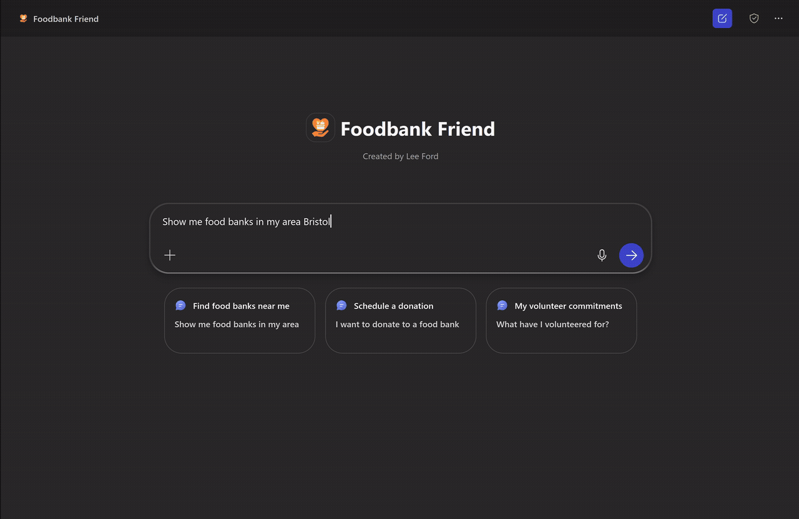
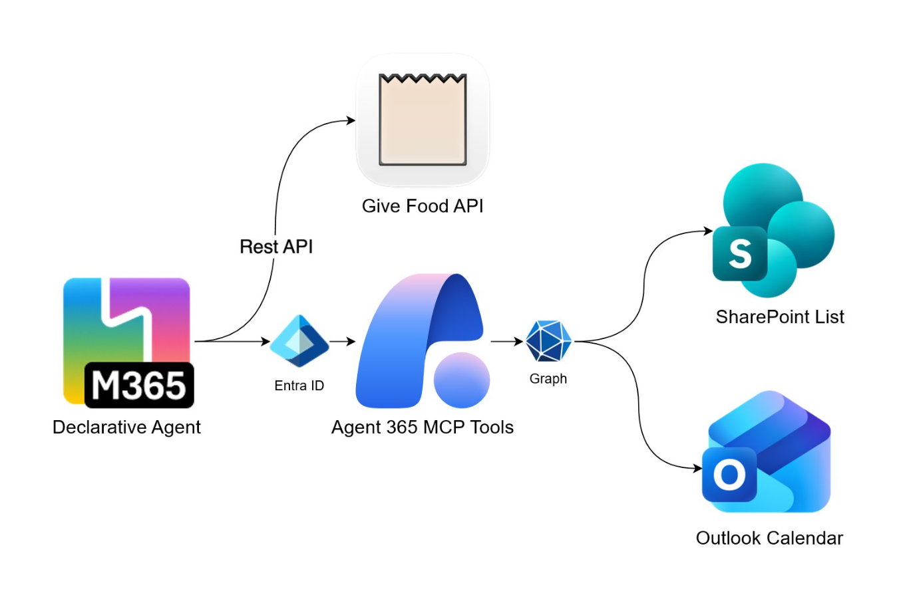

# Declarative Agent - Foodbank Friend



## Summary

This repository contains a declarative agent that helps users in the UK find local food banks, see what items they need, and schedule volunteer donation visits. The agent connects to the [GiveFood API](https://www.givefood.org.uk/api/) to search for nearby food banks and their current needs, then coordinates the scheduling process by creating Outlook calendar appointments and tracking volunteer commitments in SharePoint. A key point of emphasis on this agent was combining multiple action types - **Remote MCP Servers** for Microsoft 365 services (Outlook Calendar and SharePoint Lists) alongside a traditional **OpenAPI** connector for the external GiveFood API. The agent is built using the Microsoft 365 Agents Toolkit.



## Contributors

* [Lee Ford](https://github.com/leeford) - M365 Development MVP

## Version history

Version|Date|Comments
-------|----|--------
1.0 | March 25, 2026 | Initial solution

> **Prerequisites**
>
> To run this app template from your local dev machine, you will need:
>
> * A [Microsoft 365 account for development](https://docs.microsoft.com/microsoftteams/platform/toolkit/accounts)
> * [Microsoft 365 Agents Toolkit Visual Studio Code Extension](https://aka.ms/teams-toolkit)
> * [Microsoft 365 Copilot license](https://learn.microsoft.com/microsoft-365-copilot/extensibility/prerequisites#prerequisites)
> * A SharePoint site with a custom list for tracking volunteer commitments (see setup instructions below)

## Minimal path to awesome

1. Clone this repository

2. Register an Entra ID application in Azure:

    1. Go to [Azure portal](https://portal.azure.com/)
    2. Select **Microsoft Entra ID** > **Manage** > **App registrations** > **New registration**
    3. Enter a name for the app (e.g., Foodbank Friend)
    4. Select **Accounts in this organizational directory only**
    5. Under **Redirect URI**, select **Web** and enter `https://teams.microsoft.com/api/platform/v1.0/oAuthRedirect`
    6. Select **Register**
    7. In the app registration, go to **Certificates & secrets** and create a new client secret
    8. Copy the client secret value
    9. In the app registration, go to **API permissions** and add the following permissions:
        * **agent365.svc.cloud.microsoft** > **Delegated permissions** > `McpServers.Calendar.All`, `McpServers.SharepointLists.All`
    10. Select **Grant admin consent for <your organization>** to grant the permissions

3. Create a SharePoint list for tracking volunteer commitments:

    1. Go to your SharePoint site
    2. Create a new list named **Volunteer Commitments** with the following columns:
        * **Title** (Single line of text) - Default column
        * **VolunteerName** (Single line of text)
        * **FoodBankName** (Single line of text)
        * **FoodBankAddress** (Multiple lines of text)
        * **AppointmentDate** (Date and Time)
        * **ItemsCommitted** (Multiple lines of text)
        * **Status** (Choice: Scheduled, Completed, Cancelled)
        * **CreatedDate** (Date and Time)
    3. Note down the **Site ID** and **List ID** (you can find these in the list settings URL or via Graph Explorer)

4. In the [Teams developer portal](https://dev.teams.microsoft.com/) under **Tools**, create a new **OAuth client registration** with the following information (replace `<your-tenant-id>` with your own tenant ID):

    **App settings**

    * **Registration name**: Foodbank Friend
    * **Base URL**: `https://agent365.svc.cloud.microsoft`
    * **Restrict usage by org**: My organization only
    * **Restrict usage by app**: Any Teams app (when agent is deployed, use the Teams app ID)

    **OAuth settings**
    * **Client ID**: &lt;Entra ID App registration client ID&gt;
    * **Client secret**: &lt;Entra ID App registration client secret&gt;
    * **Authorization endpoint**: `https://login.microsoftonline.com/<your-tenant-id>/oauth2/v2.0/authorize`
    * **Token endpoint**: `https://login.microsoftonline.com/<your-tenant-id>/oauth2/v2.0/token`
    * **Refresh endpoint**: `https://login.microsoftonline.com/<your-tenant-id>/oauth2/v2.0/token`
    * **Scope**: `ea9ffc3e-8a23-4a7d-836d-234d7c7565c1/.default`

    Save the information. A new **OAuth client registration key** will be generated. Copy the key.

5. Copy `env/.env.dev.example` to `env/.env.dev` and fill in the following values:

    ```bash
    # Generated during provision by Microsoft 365 Agents Toolkit
    TEAMS_APP_ID=<your-teams-app-id>
    TEAMS_APP_TENANT_ID=<your-tenant-id>

    # SharePoint Configuration
    # Format: hostname,siteCollectionId,siteId (e.g., contoso.sharepoint.com,12345678-...,abcdef...)
    SHAREPOINT_SITE_ID=<your-sharepoint-site-id>
    SHAREPOINT_LIST_ID=<your-sharepoint-list-id>

    # OAuth Plugin Vault Reference ID - from Teams Developer Portal OAuth client registration
    OAUTH_REFERENCE_ID=<oauth-client-registration-id-from-teams-developer-portal>
    ```

6. From Microsoft 365 Agents Toolkit, sign-in to your Microsoft 365 account.
7. From Microsoft 365 Agents Toolkit, provision the solution to create the Teams app.
8. Go to [https://www.office.com/chat?auth=2](https://www.office.com/chat?auth=2) URL and enable the developer mode by using the `-developer on` prompt.
9. Use one of the conversation starters to start the agent.

## Features

The following sample demonstrates the following concepts:

* **Find Local Food Banks** - Query the GiveFood UK API to search for food banks near any UK location, displaying distance, address, and current needs
* **View Donation Needs** - Show detailed information about what items each food bank currently needs and what they have excess of
* **Schedule Volunteer Visits** - Create Outlook calendar appointments with full details including location, items to bring, and other needed items
* **Track Commitments** - Store volunteer commitments in a SharePoint list for record-keeping and history
* **View History** - Query SharePoint to show the user their past and upcoming volunteer commitments

### APIs & Services Used

| Service | Type | Purpose |
|---------|------|---------|
| [GiveFood UK API](https://www.givefood.org.uk/api/) | OpenAPI | Search for UK food banks and retrieve current donation needs |
| Outlook Calendar | Remote MCP Server | Create calendar appointments for volunteer visits |
| SharePoint Lists | Remote MCP Server | Track and query volunteer commitment records |

## Help

We do not support samples, but this community is always willing to help, and we want to improve these samples. We use GitHub to track issues, which makes it easy for community members to volunteer their time and help resolve issues.

You can try looking at [issues related to this sample](https://github.com/pnp/copilot-pro-dev-samples/issues?q=label%3A%22sample%3A%20da-foodbank-friend%22) to see if anybody else is having the same issues.

If you encounter any issues using this sample, [create a new issue](https://github.com/pnp/copilot-pro-dev-samples/issues/new).

Finally, if you have an idea for improvement, [make a suggestion](https://github.com/pnp/copilot-pro-dev-samples/issues/new).

## Disclaimer

**THIS CODE IS PROVIDED *AS IS* WITHOUT WARRANTY OF ANY KIND, EITHER EXPRESS OR IMPLIED, INCLUDING ANY IMPLIED WARRANTIES OF FITNESS FOR A PARTICULAR PURPOSE, MERCHANTABILITY, OR NON-INFRINGEMENT.**


