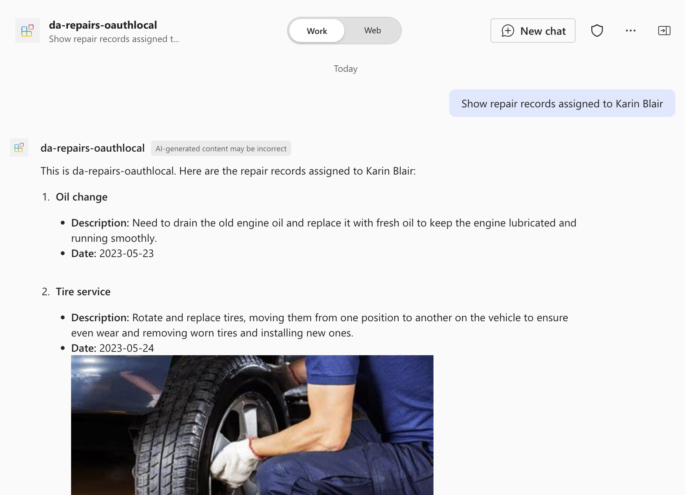

# Declarative for Microsoft 365 Copilot with an API plugin connected to an API secured with OAuth (C#)

## Summary

This sample demonstrates how to build a declarative agent for Microsoft 365 Copilot that answers questions about repairs. The agent uses an API plugin to connect to an API secured with OAuth. The project contains an Azure Function written in C# (.NET isolated worker) that serves as the API and uses the built-in Azure App Service authentication and authorization capabilities (Easy Auth) to secure access to APIs.

## Contributors

* [Yugal Pradhan](https://github.com/YugalPradhan31)

## Version history

Version|Date|Comments
-------|----|--------
1.0|May 21, 2026|C# conversion of da-repairs-oauth-js sample

## Prerequisites

* Microsoft 365 tenant with Microsoft 365 Copilot
* [Visual Studio 2022](https://aka.ms/vs) 17.11 or higher with .NET workload
* [.NET 10 SDK](https://dotnet.microsoft.com/download/dotnet/10.0)
* [Azure Functions Core Tools](https://learn.microsoft.com/azure/azure-functions/functions-run-local#install-the-azure-functions-core-tools)
* [Microsoft 365 Agents Toolkit for Visual Studio](https://aka.ms/install-teams-toolkit-vs)

## Minimal path to awesome

* Clone this repository (or [download this solution as a .ZIP file](https://pnp.github.io/download-partial/?url=https://github.com/pnp/copilot-pro-dev-samples/tree/main/samples/da-repairs-oauth-csharp) then unzip it)
* Open `DaRepairsOAuth.slnx` in Visual Studio 2022
* In the debug dropdown menu, select **Dev Tunnels > Create a Tunnel** (set authentication type to Public) or select an existing public dev tunnel
* Right-click the **M365Agent** project in Solution Explorer and select **Microsoft 365 Agents Toolkit > Select Microsoft 365 Account**
* Sign in to Microsoft 365 Agents Toolkit with a Microsoft 365 work or school account
* Press **F5**, or select **Debug > Start Debugging** in Visual Studio to start your app
* In Copilot, ask for example prompts:
  * "List all repairs"
  * "Show repair records assigned to Karin Blair"

## Features

This sample illustrates the following concepts:

* Building a declarative agent for Microsoft 365 Copilot with an API plugin
* Connecting an API plugin to an API secured with OAuth
* Using Azure Functions (.NET isolated, C#) to build an API secured with Azure App Service authentication and authorization (Easy Auth)
* Using [dev tunnels](https://learn.microsoft.com/azure/developer/dev-tunnels/overview) to test the API plugin locally

## Help

We do not support samples, but this community is always willing to help, and we want to improve these samples. We use GitHub to track issues, which makes it easy for community members to volunteer their time and help resolve issues.

You can try looking at [issues related to this sample](https://github.com/pnp/copilot-pro-dev-samples/issues?q=label%3A%22sample%3A%20da-repairs-oauth-csharp%22) to see if anybody else is having the same issues.

If you encounter any issues using this sample, [create a new issue](https://github.com/pnp/copilot-pro-dev-samples/issues/new).

Finally, if you have an idea for improvement, [make a suggestion](https://github.com/pnp/copilot-pro-dev-samples/issues/new).

## Disclaimer

**THIS CODE IS PROVIDED *AS IS* WITHOUT WARRANTY OF ANY KIND, EITHER EXPRESS OR IMPLIED, INCLUDING ANY IMPLIED WARRANTIES OF FITNESS FOR A PARTICULAR PURPOSE, MERCHANTABILITY, OR NON-INFRINGEMENT.**

