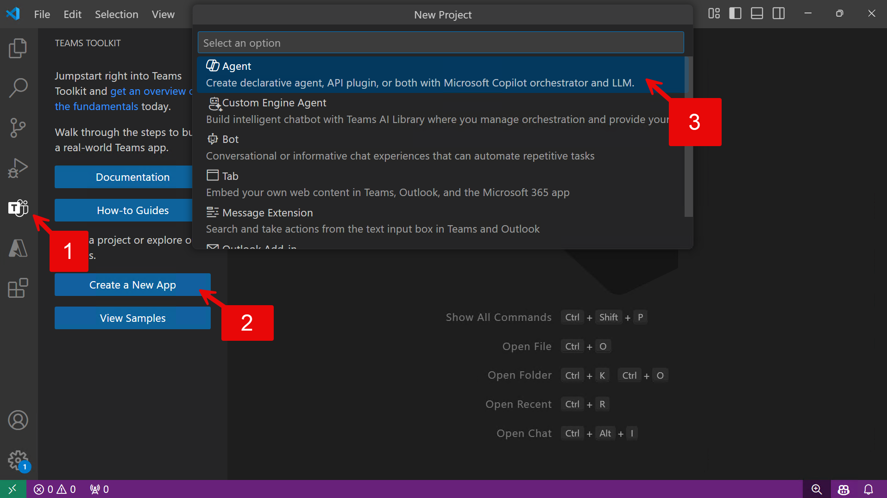

# Declarative Agent with an API plugin connected to an API secured with OAuth with validation

## Summary

This sample has been removed because you can get the same results by just creating a new project with Teams Toolkit. 

At the time of this sample, Teams Toolkit generated different plugin files for local vs. dev environments, and did not protect the local tunnel at all. This was fixed in Teams Toolkit v5.12.0, rendering this sample unnecessary.

## Prerequisites

 * Microsoft 365 tenant with Microsoft 365 Copilot
 * [Visual Studio Code](https://code.visualstudio.com/) with [Teams Toolkit](https://marketplace.visualstudio.com/items?itemName=TeamsDevApp.ms-teams-vscode-extension) v5.10 or greater
 * [NodeJS v18](https://nodejs.org/en/download/package-manager)
 * [Azure Functions core tools](https://learn.microsoft.com/azure/azure-functions/functions-run-local#install-the-azure-functions-core-tools)

## Version history

Version|Date|Author|Comments
-------|----|----|--------
1.2|January 16, 2025|Removed sample code as the same can be achieved with Teams Toolkit out of the box
1.1|October 11, 2024|Waldek Mastykarz|Updated OAuth configuration and project setup
1.0|October 9, 2024|Bob German|Initial release

## Disclaimer

**THIS CODE IS PROVIDED *AS IS* WITHOUT WARRANTY OF ANY KIND, EITHER EXPRESS OR IMPLIED, INCLUDING ANY IMPLIED WARRANTIES OF FITNESS FOR A PARTICULAR PURPOSE, MERCHANTABILITY, OR NON-INFRINGEMENT.**

---

## Minimal Path to Awesome

Here's how to create the Repairs agent without using a sample.

* Open Teams Toolkit 1️⃣ and select "Create a New App" 2️⃣. Then choose "Declarative Agent" 3️⃣.
* In the prompts that follow, select "Add plugin", then "Start with a new API", then "OAuth".
* Then select your language (JavaScript or TypeScript) and choose a folder and application name
* Press F5 to provision the Entra ID app registration, and build, deploy, and run the agent

## Features

This sample illustrates the following concepts:

- Building a declarative agent for Microsoft 365 Copilot with an API plugin
- Connecting an API plugin to an API secured with OAuth
- Using Azure Functions to build an API secured with Azure App
- Service authentication and authorization without Easy Auth
- Using dev tunnels to test the API plugin locally

