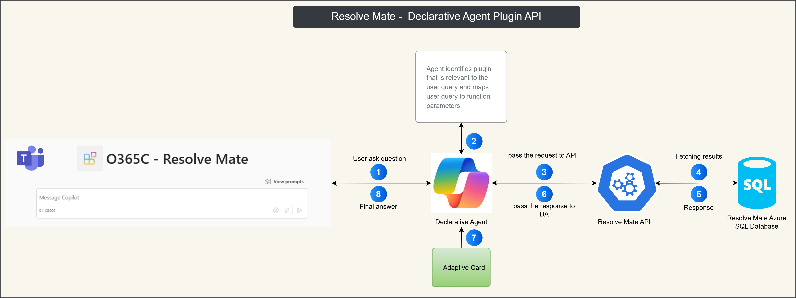
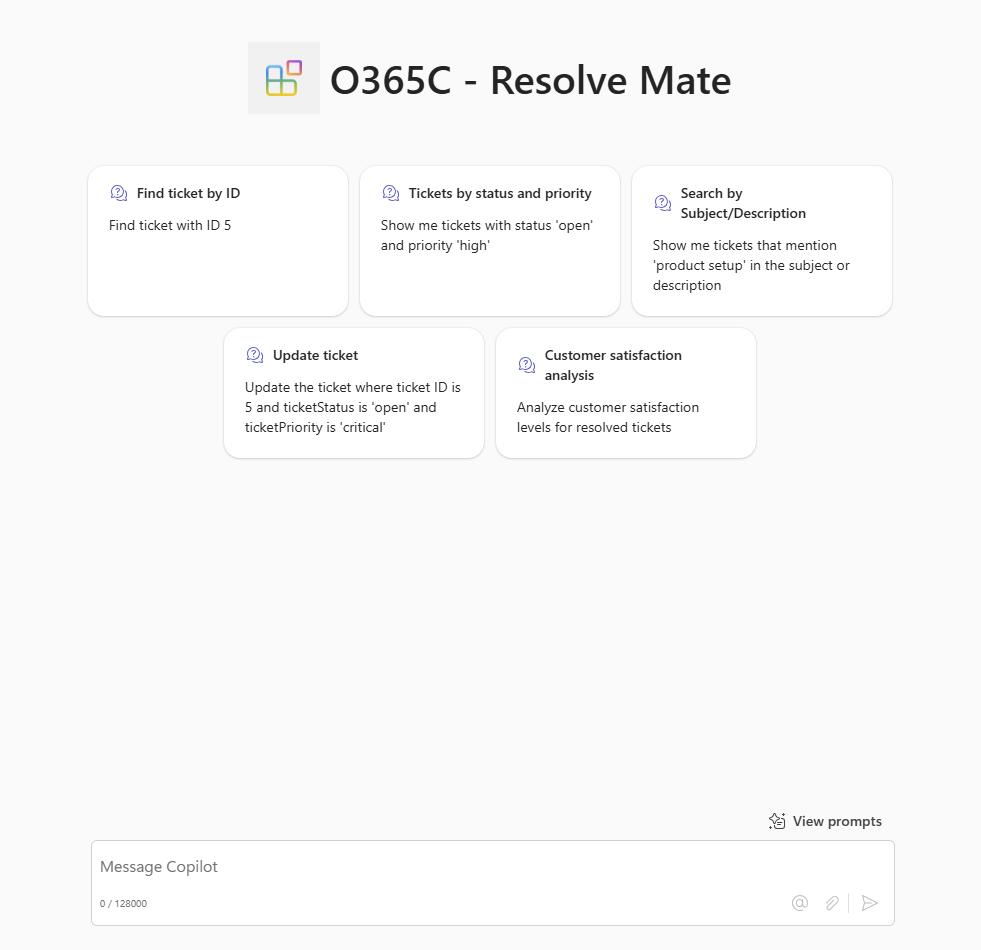
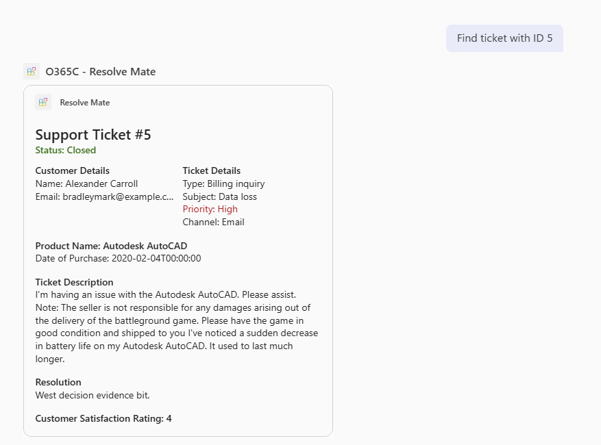

# Resolve Mate

## Summary

Resolve Mate streamlines support by analyzing and retrieving tickets based on various criteria. This sample demonstrates how to build a declarative agent for Microsoft 365 Copilot that allows you to manage customer support tickets efficiently. The agent uses an API plugin to connect to an anonymous API. The project contains an Azure Function that serves as the API.







## Features

This sample illustrates the following concepts:

* Building a declarative agent for Microsoft 365 Copilot with an API plugin
* Connecting an API plugin to an anonymous API
* Using [ngrok](https://ngrok.com/) to test the API plugin locally

## Functions

The following functions are available in Resolve Mate:

1. **getTicketById**: Find a ticket by its ID. This feature allows you to retrieve a specific customer support ticket using its unique identifier. For example, you can find a ticket with ID 5.
2. **getTicketsByStatusAndPriority**: Find tickets by status and priority. This feature allows you to retrieve customer support tickets based on their status and priority. For example, you can find all tickets with status 'Open' and priority 'High'.
3. **searchTickets**: Search for tickets by subject or description. This feature allows you to search for customer support tickets based on specific keywords in the ticket subject or description. For example, you can find all tickets that mention 'product setup' in the subject or description.
4. **updateTicket**: Update ticket details. This feature allows you to update the details of a customer support ticket. For example, you can update the status, priority, or resolution of a ticket.
5. **getResolvedTicketsWithSatisfaction**: Find resolved tickets with satisfaction rating. This feature allows you to retrieve customer support tickets that have been resolved along with the customer satisfaction rating. For example, you can find all resolved tickets with a satisfaction rating of '5'.

## Contributors

* [Ejaz Hussain](https://github.com/ejazhussain)
* [Linktree Profile](https://linktr.ee/ehussain)

## Version history

Version|Date|Comments
-------|----|--------
1.0|Feb 22, 2025|Initial release

## Prerequisites

* Microsoft 365 tenant with Microsoft 365 Copilot
* [Visual Studio Code](https://code.visualstudio.com/) with the [Teams Toolkit](https://marketplace.visualstudio.com/items?itemName=TeamsDevApp.ms-teams-vscode-extension) extension
* [Node.js v18](https://nodejs.org/en/download/package-manager)

* Create the ResolveMate Azure SQL database using the provided SQL script (dbSchema.sql). The schema files are located in the database folder.

* After creating the database, update the database connection string in the `appsettings.json` file located at `/da-resolvemate-api/src/api/O365C.WebAPI.ResolveMate/ResolveMate.API`.

```json
 "AppSettings": {
    "ConnectionString": "your Azure SQL database connection string goes here"
  },
```

* Up and running the web API under `src/api` folder either to Azure or use Ngrok for public URL for the API.


## Minimal path to awesome

1. Clone this repository (or [download this solution as a .ZIP file](https://pnp.github.io/download-partial/?url=https://github.com/pnp/copilot-pro-dev-samples/tree/main/samples/da-resolvemate-api) then unzip it).

2. Get the public URL of the web API either using ngrok or Azure Web App and add that web API URL under `.env.dev` file, something like below:
   ```cmd
   OPENAPI_SERVER_URL=https://49de-195-188-1-107.ngrok-free.app
   ```

3. Provide the URL of the document library. This document library contains documentation related to your API, which can help users understand and utilize the API effectively.
   
    ```cmd
    SHAREPOINT_DOCS_URL=https://yourtenant.sharepoint.com/sites/resolve-mate/Shared%20Documents
    ```

4. Open the Teams Toolkit extension and sign in to your Microsoft 365 tenant with Microsoft 365 Copilot

5. Select **Debug in Copilot (Edge)** from the launch configuration dropdown

## Help

We do not support samples, but this community is always willing to help, and we want to improve these samples. We use GitHub to track issues, which makes it easy for community members to volunteer their time and help resolve issues.

You can try looking at [issues related to this sample](https://github.com/pnp/copilot-pro-dev-samples/issues?q=label%3A%22sample%3A%20da-ristorante-api%22) to see if anybody else is having the same issues.

If you encounter any issues using this sample, [create a new issue](https://github.com/pnp/copilot-pro-dev-samples/issues/new).

Finally, if you have an idea for improvement, [make a suggestion](https://github.com/pnp/copilot-pro-dev-samples/issues/new).

## Disclaimer

**THIS CODE IS PROVIDED *AS IS* WITHOUT WARRANTY OF ANY KIND, EITHER EXPRESS OR IMPLIED, INCLUDING ANY IMPLIED WARRANTIES OF FITNESS FOR A PARTICULAR PURPOSE, MERCHANTABILITY, OR NON-INFRINGEMENT.**

