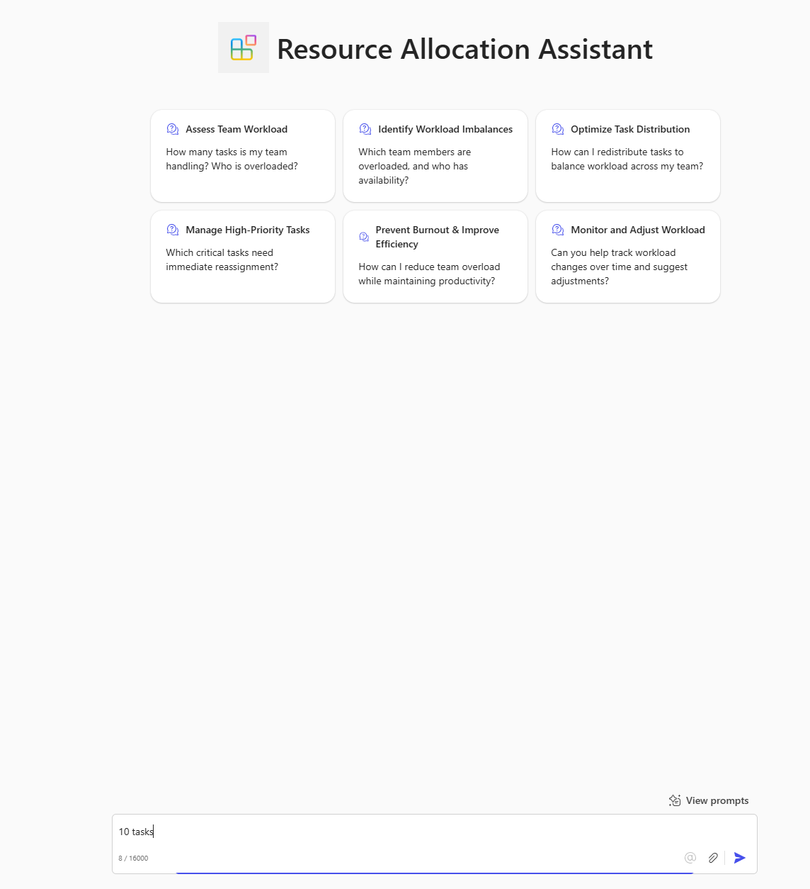

# Overview of the Resource Assistant agent sample

🚀 Resource Allocation Assistant is a Microsoft Teams Declarative AI Agent designed to help managers and project leads assess workloads, identify resource bottlenecks, and optimize task distribution within their teams. This AI-powered agent provides smart workload insights and recommendations based on user input, ensuring balanced work allocation and preventing burnout.

## 🛠 **Features**
✅ **Workload Assessment** – Helps managers evaluate ongoing tasks and resource availability.  
✅ **Task Redistribution** – Suggests optimal ways to balance workloads across team members.  
✅ **Bottleneck Detection** – Identifies overworked employees and underutilized resources. 

## Get started with the template

> **Prerequisites**
>
> To run this app template in your local dev machine, you will need:
>
> - [Node.js](https://nodejs.org/), supported versions: 18, 20
> - A [Microsoft 365 account for development](https://docs.microsoft.com/microsoftteams/platform/toolkit/accounts).
> - [Teams Toolkit Visual Studio Code Extension](https://aka.ms/teams-toolkit) version 5.0.0 and higher or [Teams Toolkit CLI](https://aka.ms/teamsfx-toolkit-cli)
> - [Microsoft 365 Copilot license](https://learn.microsoft.com/microsoft-365-copilot/extensibility/prerequisites#prerequisites)

1. First, select the Teams Toolkit icon on the left in the VS Code toolbar.
2. In the Account section, sign in with your [Microsoft 365 account](https://docs.microsoft.com/microsoftteams/platform/toolkit/accounts) if you haven't already.
3. Create Teams app by clicking `Provision` in "Lifecycle" section.
4. Select `Preview in Copilot (Edge)` or `Preview in Copilot (Chrome)` from the launch configuration dropdown.
5. Once the Copilot app is loaded in the browser, click on the "…" menu and select "Copilot chats". You will see your declarative agent on the right rail. Clicking on it will change the experience to showcase the logo and name of your declarative agent.
6. Ask a question to your declarative agent and it should respond based on the instructions provided.

## What's included in the template

| Folder       | Contents                                                                                 |
| ------------ | ---------------------------------------------------------------------------------------- |
| `.vscode`    | VSCode files for debugging                                                               |
| `appPackage` | Templates for the Teams application manifest, the GPT manifest and the API specification |
| `env`        | Environment files                                                                        |

The following files can be customized and demonstrate an example implementation to get you started.

| File                               | Contents                                                                     |
| ---------------------------------- | ---------------------------------------------------------------------------- |
| `appPackage/declarativeAgent.json` | Define the behaviour and configurations of the declarative agent.            |
| `appPackage/manifest.json`         | Teams application manifest that defines metadata for your declarative agent. |

The following are Teams Toolkit specific project files. You can [visit a complete guide on Github](https://github.com/OfficeDev/TeamsFx/wiki/Teams-Toolkit-Visual-Studio-Code-v5-Guide#overview) to understand how Teams Toolkit works.

| File           | Contents                                                                                                                                  |
| -------------- | ----------------------------------------------------------------------------------------------------------------------------------------- |
| `teamsapp.yml` | This is the main Teams Toolkit project file. The project file defines two primary things: Properties and configuration Stage definitions. |

## Extend the template

- [Add conversation starters](https://learn.microsoft.com/microsoft-365-copilot/extensibility/build-declarative-agents?tabs=ttk&tutorial-step=3): Conversation starters are hints that are displayed to the user to demonstrate how they can get started using the declarative agent.
- [Add web content](https://learn.microsoft.com/microsoft-365-copilot/extensibility/build-declarative-agents?tabs=ttk&tutorial-step=4) for the ability to search web information.
- [Add OneDrive and SharePoint content](https://learn.microsoft.com/microsoft-365-copilot/extensibility/build-declarative-agents?tabs=ttk&tutorial-step=5) as grounding knowledge for the agent.
- [Add Microsoft Graph connectors content](https://learn.microsoft.com/microsoft-365-copilot/extensibility/build-declarative-agents?tabs=ttk&tutorial-step=6) to ground agent with enterprise knowledge.
- [Add API plugins](https://learn.microsoft.com/microsoft-365-copilot/extensibility/build-declarative-agents?tabs=ttk&tutorial-step=7) for agent to interact with REST APIs.

## Addition information and references

- [Declarative agents for Microsoft 365](https://aka.ms/teams-toolkit-declarative-agent)

