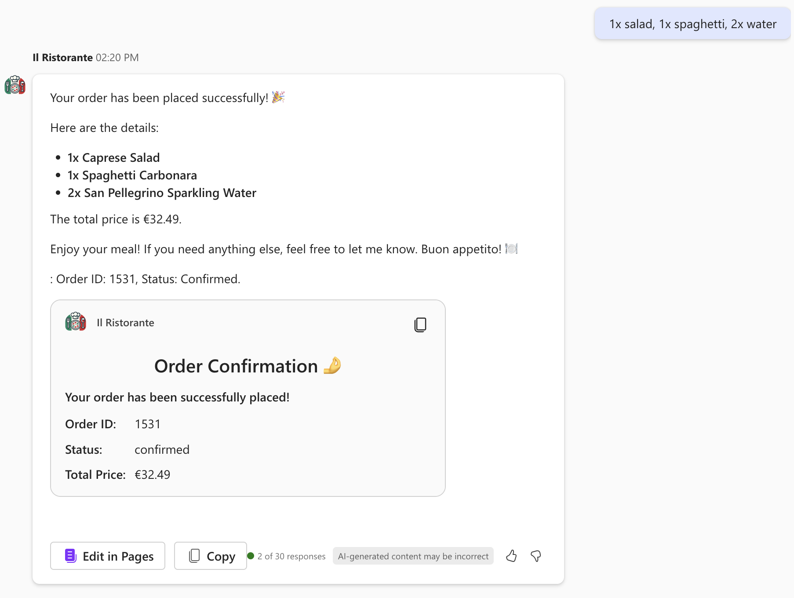

# Browse the menu and place an order at a local Italian restaurant using Microsoft 365 Copilot (C#)

## Summary

This sample demonstrates how to build a declarative agent for Microsoft 365 Copilot that allows you to browse a menu of a local Italian restaurant and place an order. The agent uses an API plugin to connect to an anonymous API. The project contains a C# Azure Function (.NET 10) that serves as the API.

This is the C# port of the [da-ristorante-api](https://github.com/pnp/copilot-pro-dev-samples/tree/main/samples/da-ristorante-api) TypeScript sample.




## Features

This sample illustrates the following concepts:

* Building a declarative agent for Microsoft 365 Copilot with an API plugin
* Connecting an API plugin to an anonymous API
* Using C# Azure Functions (.NET 10 isolated worker) as the API backend
* Using [dev tunnels](https://learn.microsoft.com/azure/developer/dev-tunnels/overview) to test the API plugin locally

## Contributors

* [Yugal Pradhan](https://github.com/YugalPradhan31)

## Version history

Version|Date|Comments
-------|----|--------
1.0|May 5, 2026|Initial release

## Prerequisites

* Microsoft 365 tenant with Microsoft 365 Copilot
* [.NET 10 SDK](https://dotnet.microsoft.com/download/dotnet/10.0)
* [Azure Functions Core Tools v4](https://learn.microsoft.com/azure/azure-functions/functions-run-local#install-the-azure-functions-core-tools)
* [Visual Studio 2022](https://aka.ms/vs) 17.11 or higher
* [Microsoft 365 Agents Toolkit for Visual Studio](https://aka.ms/install-teams-toolkit-vs)

## Minimal Path to Awesome

* Clone this repository (or [download this solution as a .ZIP file](https://pnp.github.io/download-partial/?url=https://github.com/pnp/copilot-pro-dev-samples/tree/main/samples/da-ristorante-api-csharp) then unzip it)
    ```bash
    git clone https://github.com/pnp/copilot-pro-dev-samples.git
    cd copilot-pro-dev-samples/samples/da-ristorante-api-csharp
    ```
* Open **DaRistoranteApi.slnx** in Visual Studio 2022
* In the debug dropdown menu, select **Dev Tunnels > Create a Tunnel** (set authentication type to Public) or select an existing public dev tunnel
* Right-click the **M365Agent** project in Solution Explorer and select **Microsoft 365 Agents Toolkit > Select Microsoft 365 Account**
* Sign in to Microsoft 365 Agents Toolkit with a **Microsoft 365 work or school account**
* Press **F5**, or select **Debug > Start Debugging** in Visual Studio to start your app
* When the browser launches, open the **Copilot** app, select the agent, and start asking questions like:
    - "What's for lunch today?"
    - "What can I order for dinner that is gluten-free?"

> **Note:** Please make sure to switch to New Teams when Teams web client has launched.

## Help

We do not support samples, but this community is always willing to help, and we want to improve these samples. We use GitHub to track issues, which makes it easy for community members to volunteer their time and help resolve issues.

You can try looking at [issues related to this sample](https://github.com/pnp/copilot-pro-dev-samples/issues?q=label%3A%22sample%3A%20da-ristorante-api-csharp%22) to see if anybody else is having the same issues.

If you encounter any issues using this sample, [create a new issue](https://github.com/pnp/copilot-pro-dev-samples/issues/new).

Finally, if you have an idea for improvement, [make a suggestion](https://github.com/pnp/copilot-pro-dev-samples/issues/new).

## Disclaimer

**THIS CODE IS PROVIDED *AS IS* WITHOUT WARRANTY OF ANY KIND, EITHER EXPRESS OR IMPLIED, INCLUDING ANY IMPLIED WARRANTIES OF FITNESS FOR A PARTICULAR PURPOSE, MERCHANTABILITY, OR NON-INFRINGEMENT.**


