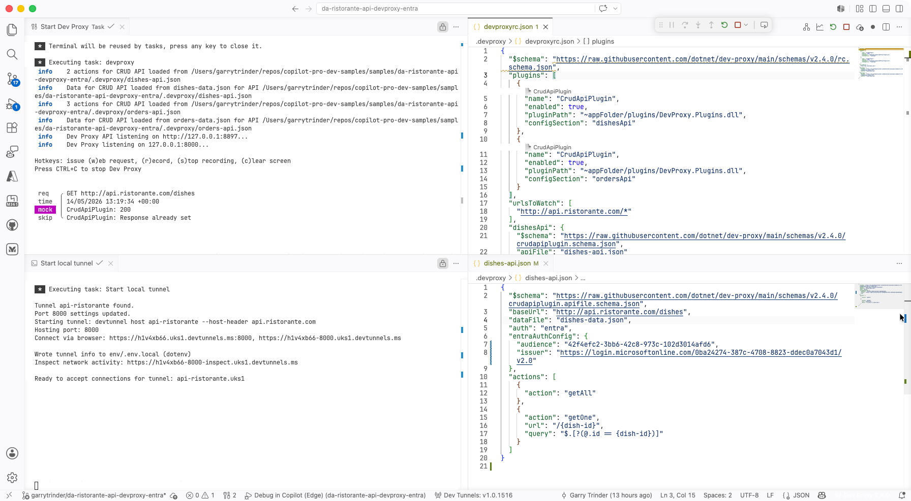
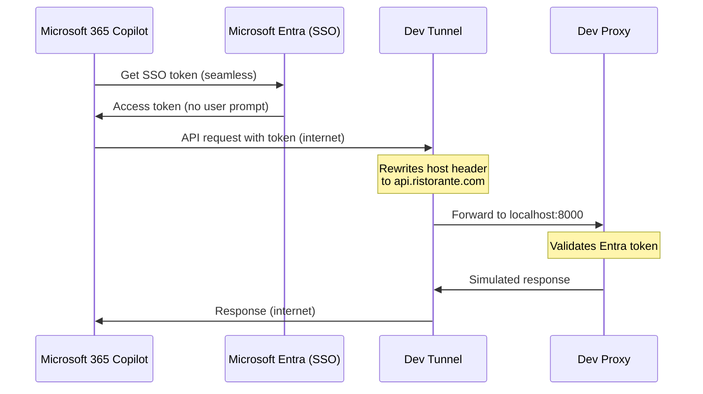

# Browse the menu and place an order at a local Italian restaurant using Microsoft 365 Copilot, Dev Proxy and Entra ID SSO authentication

## Summary

This sample demonstrates how to build a declarative agent for Microsoft 365 Copilot that allows you to browse a menu of a local Italian restaurant and place an order. The agent uses an API plugin to connect to an API secured with Microsoft Entra ID SSO (single sign-on) authentication. [Dev Proxy](https://learn.microsoft.com/microsoft-cloud/dev/dev-proxy/overview) is used to simulate the API, so you don't need to build or maintain a real backend.




## How it works

Microsoft 365 Copilot runs in the cloud and needs a publicly accessible API endpoint. Dev Proxy simulates the API on your machine, and a dev tunnel exposes it over the internet so Copilot can reach it. No API infrastructure is deployed — the simulated API runs entirely on your local machine.

### SSO authentication

This sample uses Microsoft Entra ID SSO authentication. Unlike the OAuth authorization code flow (which prompts users to sign in), SSO authentication allows Microsoft 365 Copilot to seamlessly obtain a token on behalf of the user without any additional sign-in prompts. The token is acquired transparently using the user's existing Microsoft 365 session.

The SSO registration is done in the Teams Developer Portal, which generates an Application ID URI that the Entra app registration must trust. The enterprise token store client (`ab3be6b7-f5df-413d-ac2d-abf1e3fd9c0b`) is pre-authorized in the Entra app manifest to allow token exchange.

Dev Proxy validates the real Entra token on the API side by checking the audience and issuer configured in the CRUD API files.



## Features

This sample illustrates the following concepts:

* Building a declarative agent for Microsoft 365 Copilot with an API plugin
* Connecting an API plugin to an API secured with Microsoft Entra ID SSO
* Registering a Microsoft Entra SSO client in the Teams Developer Portal
* Pre-authorizing the Microsoft enterprise token store in the Entra app registration
* Using [Dev Proxy](https://learn.microsoft.com/microsoft-cloud/dev/dev-proxy/overview) to simulate a CRUD API secured with Entra token validation locally
* Using [dev tunnels](https://learn.microsoft.com/azure/developer/dev-tunnels/overview) to expose the local API over the internet for use with Microsoft 365 Copilot

## Contributors

* [Garry Trinder](https://github.com/garrytrinder)
* [Waldek Mastykarz](https://github.com/waldekmastykarz)

## Version history

Version|Date|Comments
-------|----|--------
1.0|June 16, 2026|Initial release

## Prerequisites

* Microsoft 365 tenant with Microsoft 365 Copilot
* [Node.js](https://nodejs.org/)
* [Visual Studio Code](https://code.visualstudio.com/) with the following extensions:
  * [Microsoft 365 Agents Toolkit](https://marketplace.visualstudio.com/items?itemName=TeamsDevApp.ms-teams-vscode-extension)
  * [Dev Proxy Toolkit](https://marketplace.visualstudio.com/items?itemName=garrytrinder.dev-proxy-toolkit)
  * [Dev Tunnels](https://marketplace.visualstudio.com/items?itemName=ms-devtunnels.ms-devtunnels)

## Minimal path to awesome

* Clone this repository (or [download this solution as a .ZIP file](https://pnp.github.io/download-partial/?url=https://github.com/pnp/copilot-pro-dev-samples/tree/main/samples/da-ristorante-api-devproxy-entra-sso) then unzip it)
* Open the Microsoft 365 Agents Toolkit extension and sign in to your Microsoft 365 tenant with Microsoft 365 Copilot
* Select **Debug in Copilot (Edge)** from the launch configuration dropdown

The provisioning step automatically registers the Entra SSO client in the Teams Developer Portal — no manual portal steps are required.

## Testing the API

You can test the API directly using the `api.http` file included in the project root. This requires the [REST Client](https://marketplace.visualstudio.com/items?itemName=humao.rest-client) extension. With the debug session running, open the file and use the **Send Request** links above each request to test the API endpoints through the dev tunnel.

To generate a test token for use with the `api.http` file, run the following command:

```bash
devproxy token new --name "Dev Proxy" --audience {ENTRA_APP_CLIENT_ID} --issuer https://login.microsoftonline.com/{ENTRA_APP_TENANT_ID}/v2.0 --scopes "api://{ENTRA_APP_CLIENT_ID}/Dishes.Read api://{ENTRA_APP_CLIENT_ID}/Orders.Write"
```

Replace `{ENTRA_APP_CLIENT_ID}` and `{ENTRA_APP_TENANT_ID}` with the values from your `env/.env.local` file. Copy the generated token and paste it as the `@token` value in `api.http`.

> **Note:** The `api.http` file uses a `.env` symlink in the project root that points to `env/.env.local`. This symlink is created automatically when you start a debug session.

## Comparing SSO vs OAuth authentication

This sample uses **Entra ID SSO**, which differs from the [OAuth sample](../da-ristorante-api-devproxy-oauth/):

| Aspect | SSO (this sample) | OAuth |
|--------|-------------------|-------|
| User experience | Seamless — no sign-in prompt | User prompted to sign in |
| Token acquisition | Transparent via existing M365 session | Authorization code flow |
| Client secret | Not required | Required |
| Portal registration | Automated via `oauth/register` with `identityProvider: MicrosoftEntra` | Automated via `oauth/register` |

## Help

We do not support samples, but this community is always willing to help, and we want to improve these samples. We use GitHub to track issues, which makes it easy for  community members to volunteer their time and help resolve issues.

You can try looking at [issues related to this sample](https://github.com/pnp/copilot-pro-dev-samples/issues?q=label%3A%22sample%3A%20da-ristorante-api-devproxy-entra-sso%22) to see if anybody else is having the same issues.

If you encounter any issues using this sample, [create a new issue](https://github.com/pnp/copilot-pro-dev-samples/issues/new).

Finally, if you have an idea for improvement, [make a suggestion](https://github.com/pnp/copilot-pro-dev-samples/issues/new).

## Disclaimer

**THIS CODE IS PROVIDED *AS IS* WITHOUT WARRANTY OF ANY KIND, EITHER EXPRESS OR IMPLIED, INCLUDING ANY IMPLIED WARRANTIES OF FITNESS FOR A PARTICULAR PURPOSE, MERCHANTABILITY, OR NON-INFRINGEMENT.**


