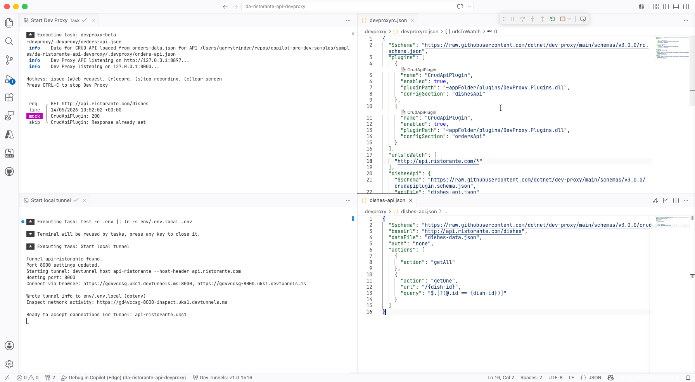
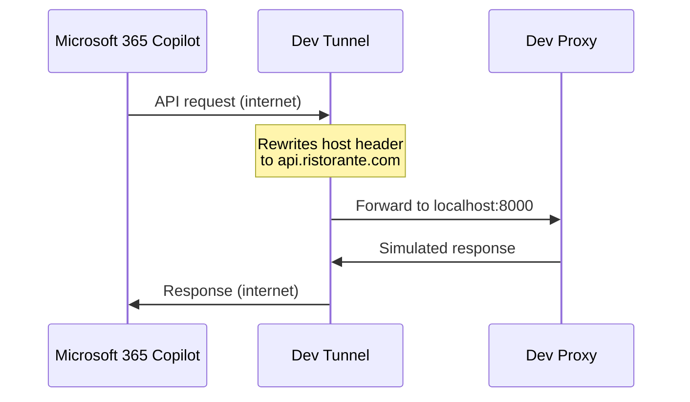

# Browse the menu and place an order at a local Italian restaurant using Microsoft 365 Copilot and Dev Proxy

## Summary

This sample demonstrates how to build a declarative agent for Microsoft 365 Copilot that allows you to browse a menu of a local Italian restaurant and place an order. The agent uses an API plugin to connect to an anonymous API. [Dev Proxy](https://learn.microsoft.com/microsoft-cloud/dev/dev-proxy/overview) is used to simulate the API, so you don't need to build or maintain a real backend. This is useful when the API doesn't exist yet, is owned by a third party, or you want to avoid writing code that won't ship.

## How it works

Microsoft 365 Copilot runs in the cloud and needs a publicly accessible API endpoint. Dev Proxy simulates the API on your machine, and a dev tunnel exposes it over the internet so Copilot can reach it. No API infrastructure is deployed — the simulated API runs entirely on your local machine.

## Features

This sample illustrates the following concepts:

* Building a declarative agent for Microsoft 365 Copilot with an API plugin
* Connecting an API plugin to an anonymous API
* Using [Dev Proxy](https://learn.microsoft.com/microsoft-cloud/dev/dev-proxy/overview) to simulate a non-authenticated CRUD API locally
* Using [dev tunnels](https://learn.microsoft.com/azure/developer/dev-tunnels/overview) to expose the local API over the internet for use with Microsoft 365 Copilot

## Contributors

* [Garry Trinder](https://github.com/garrytrinder)
* [Waldek Mastykarz](https://github.com/waldekmastykarz)

## Version history

Version|Date|Comments
-------|----|--------
1.0|May 14, 2026|Initial release

## Prerequisites

* Microsoft 365 tenant with Microsoft 365 Copilot
* [Node.js](https://nodejs.org/)
* [Visual Studio Code](https://code.visualstudio.com/) with the following extensions:
  * [Microsoft 365 Agents Toolkit](https://marketplace.visualstudio.com/items?itemName=TeamsDevApp.ms-teams-vscode-extension)
  * [Dev Proxy Toolkit](https://marketplace.visualstudio.com/items?itemName=garrytrinder.dev-proxy-toolkit)
  * [Dev Tunnels](https://marketplace.visualstudio.com/items?itemName=ms-devtunnels.ms-devtunnels)

## Minimal path to awesome

* Clone this repository (or [download this solution as a .ZIP file](https://pnp.github.io/download-partial/?url=https://github.com/pnp/copilot-pro-dev-samples/tree/main/samples/da-ristorante-api-devproxy) then unzip it)
* Open the Microsoft 365 Agents Toolkit extension and sign in to your Microsoft 365 tenant with Microsoft 365 Copilot
* Select **Debug in Copilot (Edge)** from the launch configuration dropdown

## Testing the API

You can test the API directly using the `api.http` file included in the project root. This requires the [REST Client](https://marketplace.visualstudio.com/items?itemName=humao.rest-client) extension. With the debug session running, open the file and use the **Send Request** links above each request to test the API endpoints through the dev tunnel.

> **Note:** The `api.http` file uses a `.env` symlink in the project root that points to `env/.env.local`. This symlink is created automatically when you start a debug session.

## Help

We do not support samples, but this community is always willing to help, and we want to improve these samples. We use GitHub to track issues, which makes it easy for  community members to volunteer their time and help resolve issues.

You can try looking at [issues related to this sample](https://github.com/pnp/copilot-pro-dev-samples/issues?q=label%3A%22sample%3A%20da-ristorante-api-devproxy%22) to see if anybody else is having the same issues.

If you encounter any issues using this sample, [create a new issue](https://github.com/pnp/copilot-pro-dev-samples/issues/new).

Finally, if you have an idea for improvement, [make a suggestion](https://github.com/pnp/copilot-pro-dev-samples/issues/new).

## Disclaimer

**THIS CODE IS PROVIDED *AS IS* WITHOUT WARRANTY OF ANY KIND, EITHER EXPRESS OR IMPLIED, INCLUDING ANY IMPLIED WARRANTIES OF FITNESS FOR A PARTICULAR PURPOSE, MERCHANTABILITY, OR NON-INFRINGEMENT.**

