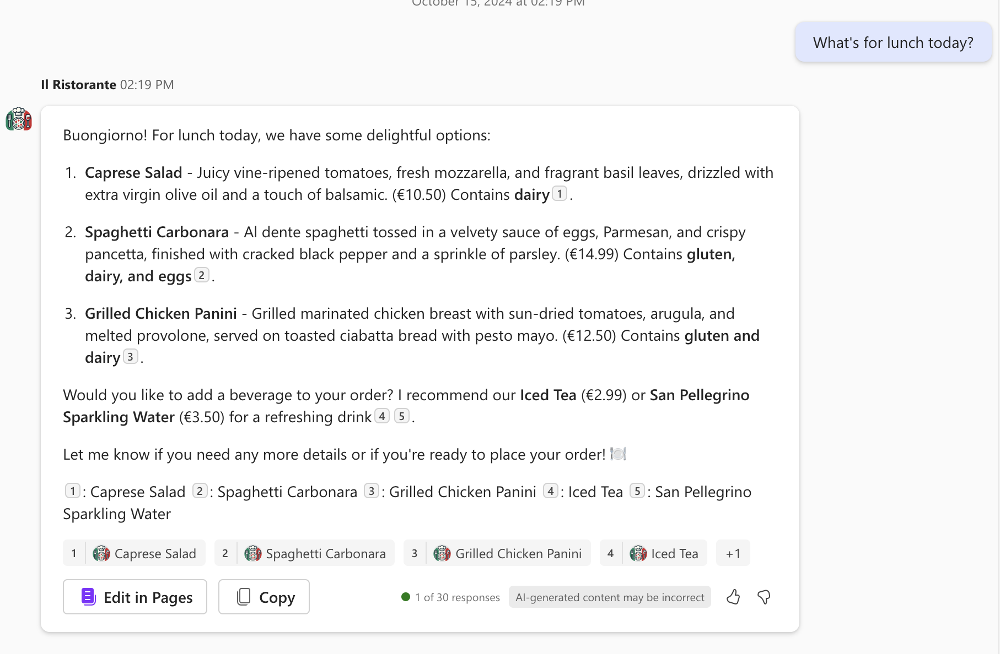

# Browse the menu and place an order at a local Italian restaurant using Microsoft 365 Copilot (Python)

## Summary

This sample demonstrates how to build a declarative agent for Microsoft 365 Copilot that allows you to browse a menu of a local Italian restaurant and place an order. The agent uses an API plugin to connect to an anonymous API. The project contains a Python Azure Function that serves as the API.

This is the Python port of the [da-ristorante-api](https://github.com/pnp/copilot-pro-dev-samples/tree/main/samples/da-ristorante-api) TypeScript sample.




## Features

This sample illustrates the following concepts:

* Building a declarative agent for Microsoft 365 Copilot with an API plugin
* Connecting an API plugin to an anonymous API
* Using Python Azure Functions as the API backend
* Using [dev tunnels](https://learn.microsoft.com/azure/developer/dev-tunnels/overview) to test the API plugin locally

## Contributors

* [Yugal Pradhan](https://github.com/YugalPradhan31)

## Version history

Version|Date|Comments
-------|----|--------
1.0|April 30, 2026|Initial release (Python port)

## Prerequisites

* Microsoft 365 tenant with Microsoft 365 Copilot
* [Visual Studio Code](https://code.visualstudio.com/) with the [Microsoft 365 Agents Toolkit](https://marketplace.visualstudio.com/items?itemName=TeamsDevApp.ms-teams-vscode-extension) extension
* [Python](https://www.python.org/downloads/) version 3.10 or later
* [Azure Functions Core Tools](https://learn.microsoft.com/azure/azure-functions/functions-run-local#install-the-azure-functions-core-tools) v4

## Minimal path to awesome

* Clone this repository (or [download this solution as a .ZIP file](https://pnp.github.io/download-partial/?url=https://github.com/pnp/copilot-pro-dev-samples/tree/main/samples/da-ristorante-api-python) then unzip it)
* Open the project in Visual Studio Code
* Install Python dependencies:
    ```bash
    pip install -r requirements.txt
    ```
* Open the Microsoft 365 Agents Toolkit extension and sign in to your Microsoft 365 tenant with Microsoft 365 Copilot
* Select **Debug in Copilot (Edge)** from the launch configuration dropdown

## Help

We do not support samples, but this community is always willing to help, and we want to improve these samples. We use GitHub to track issues, which makes it easy for community members to volunteer their time and help resolve issues.

You can try looking at [issues related to this sample](https://github.com/pnp/copilot-pro-dev-samples/issues?q=label%3A%22sample%3A%20da-ristorante-api-python%22) to see if anybody else is having the same issues.

If you encounter any issues using this sample, [create a new issue](https://github.com/pnp/copilot-pro-dev-samples/issues/new).

Finally, if you have an idea for improvement, [make a suggestion](https://github.com/pnp/copilot-pro-dev-samples/issues/new).

## Disclaimer

**THIS CODE IS PROVIDED *AS IS* WITHOUT WARRANTY OF ANY KIND, EITHER EXPRESS OR IMPLIED, INCLUDING ANY IMPLIED WARRANTIES OF FITNESS FOR A PARTICULAR PURPOSE, MERCHANTABILITY, OR NON-INFRINGEMENT.**

