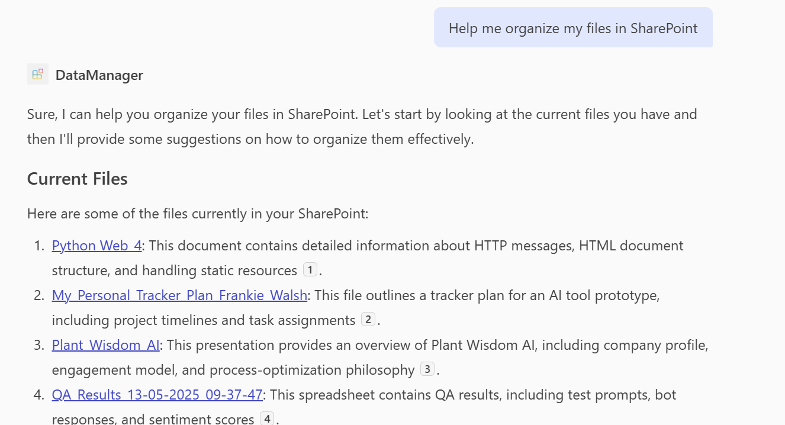

# Data Manager

## Summary

A declarative agent for Microsoft 365 Copilot that helps users manage and organize their SharePoint sites and OneDrive content. The agent leverages OneDrive and SharePoint access, Microsoft Learn MCP integration for official documentation, and GraphicArt for visual diagrams to provide document search, organization guidance, and best practices for content management.

## Contributors

* [Kateryna Turuntseva](https://github.com/KatT-AI)

## Version history

Version|Date|Author|Comments
-------|----|----|--------
1.0|May 19, 2025|Kateryna Turuntseva|Initial release

## Prerequisites

* [Microsoft 365 tenant with Microsoft 365 Copilot](https://learn.microsoft.com/microsoft-365-copilot/extensibility/prerequisites#prerequisites)
* [Node.js](https://nodejs.org/), supported versions: 18, 20, 22
* [Microsoft 365 Agents Toolkit for VS Code](https://marketplace.visualstudio.com/items?itemName=TeamsDevApp.ms-teams-vscode-extension)

## Minimal path to awesome

* Clone this repository (or [download this solution as a .ZIP file](https://pnp.github.io/download-partial/?url=https://github.com/pnp/copilot-pro-dev-samples/tree/main/samples/da-sharepoint-data-manager) then unzip it)
* Open the `samples/da-sharepoint-data-manager` folder with Visual Studio Code
* Select the **Microsoft 365 Agents Toolkit** icon on the left in the VS Code toolbar
* In the **Account** section, sign in with your [Microsoft 365 account](https://docs.microsoft.com/microsoftteams/platform/toolkit/accounts) if you haven't already
* Create Teams app by selecting **Provision** in the **Lifecycle** section
* Select **Preview in Copilot (Edge)** or **Preview in Copilot (Chrome)** from the launch configuration dropdown
* Once the Copilot app is loaded in the browser, select the "..." menu and select **Copilot chats**. You will see your Data Manager agent on the right rail. Selecting it will change the experience to showcase the logo and name of your data management agent
* Ask questions about your SharePoint content, and the agent will help you manage and organize your data

## Features

This declarative agent illustrates the following concepts:

* **Document Search** - Search across SharePoint sites and libraries, filter by content and metadata, discover relevant documents
* **File Organization** - Smart folder structure suggestions, metadata tagging and classification advice, content type recommendations
* **Document Management Guidance** - Best practices for document organization, SharePoint organization strategies, content classification recommendations
* **Microsoft Learn MCP Integration** - Search and fetch official Microsoft documentation via the Model Context Protocol (MCP) for accurate, up-to-date SharePoint and Microsoft 365 guidance with source citations
* **Visual Diagrams** - Generate diagrams and visual representations of site structures, folder hierarchies, and information architecture using GraphicArt
* **Grounded Responses** - Uses `discourage_model_knowledge` behavior override to prioritize user data and official documentation over general model knowledge

## Help

We do not support samples, but this community is always willing to help, and we want to improve these samples. We use GitHub to track issues, which makes it easy for community members to volunteer their time and help resolve issues.

You can try looking at [issues related to this sample](https://github.com/pnp/copilot-pro-dev-samples/issues?q=label%3A%22sample%3A%20da-sharepoint-data-manager%22) to see if anybody else is having the same issues.

If you encounter any issues using this sample, [create a new issue](https://github.com/pnp/copilot-pro-dev-samples/issues/new).

Finally, if you have an idea for improvement, [make a suggestion](https://github.com/pnp/copilot-pro-dev-samples/issues/new).

## Disclaimer

**THIS CODE IS PROVIDED *AS IS* WITHOUT WARRANTY OF ANY KIND, EITHER EXPRESS OR IMPLIED, INCLUDING ANY IMPLIED WARRANTIES OF FITNESS FOR A PARTICULAR PURPOSE, MERCHANTABILITY, OR NON-INFRINGEMENT.**

