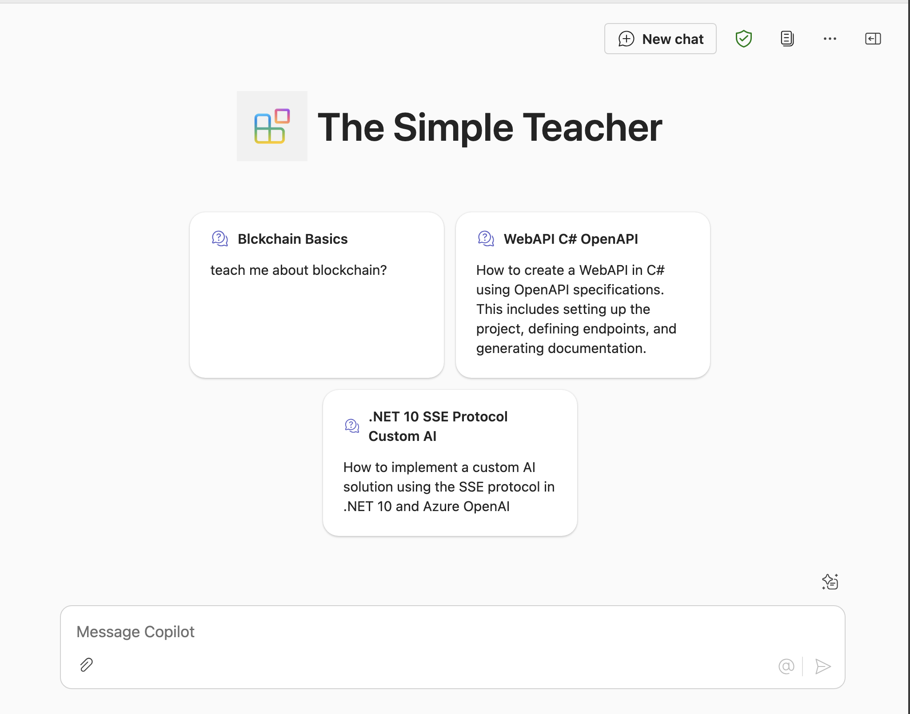
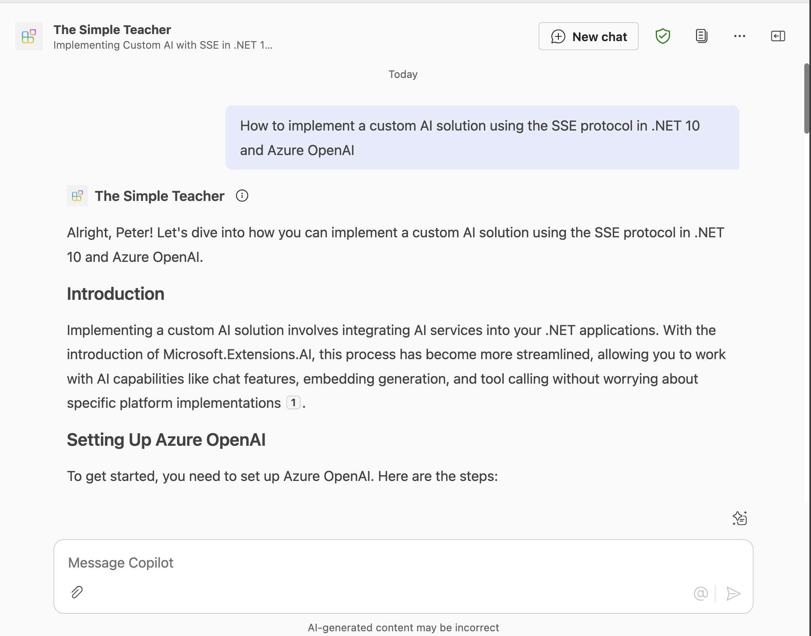
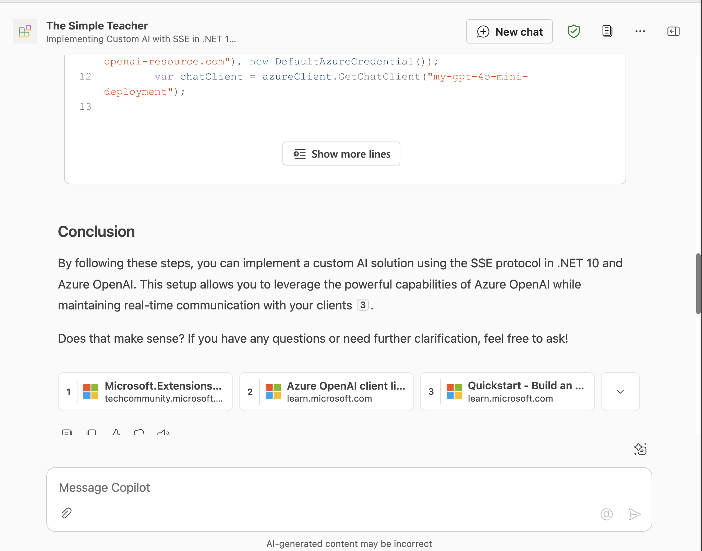
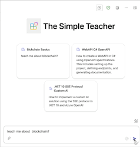

# Overview of the Declarative Agent The Simple Teacher

The declarative agent "The Simple Teacher" acts as a friendly, patient, and humorous mentor for students aged 16–20, explaining technical concepts in simple, relatable language. The agent always uses real-world analogies—especially from movies, pop culture, or daily life—and follows a clear structure: introducing the topic, providing a hook or analogy, explaining step by step, sharing a story or example, posing a student challenge, and summarizing the main points. The tone is casual and respectful, avoiding jargon unless explained, and never uses dry, academic, or negative language. The goal is to make learning engaging, memorable, and easy to understand.

## Minimal path to awesome

> **Prerequisites**
>
> To run this app template in your local dev machine, you will need:
>
> - [Node.js](https://nodejs.org/), supported versions: 18, 20, 22
> - A [Microsoft 365 account for development](https://docs.microsoft.com/microsoftteams/platform/toolkit/accounts).
> - [Teams Toolkit Visual Studio Code Extension](https://aka.ms/teams-toolkit) version 5.0.0 and higher or [Teams Toolkit CLI](https://aka.ms/teamsfx-toolkit-cli)
> - [Microsoft 365 Copilot license](https://learn.microsoft.com/microsoft-365-copilot/extensibility/prerequisites#prerequisites)

1. First, select the Teams Toolkit icon on the left in the VS Code toolbar.
2. In the Account section, sign in with your [Microsoft 365 account](https://docs.microsoft.com/microsoftteams/platform/toolkit/accounts) if you haven't already.
3. Create Teams app by clicking `Provision` in "Lifecycle" section.
4. Select `Preview in Copilot (Edge)` or `Preview in Copilot (Chrome)` from the launch configuration dropdown.
5. Once the Copilot app is loaded in the browser, click on the "…" menu and select "Copilot chats". You will see your declarative agent on the right rail. Clicking on it will change the experience to showcase the logo and name of your declarative agent.
6. Ask a question to your declarative agent and it should respond based on the instructions provided.

## Addition information and references

- [Declarative agents for Microsoft 365](https://aka.ms/teams-toolkit-declarative-agent)

## Screenshots

*Copilot agent conversation starters*

*Question to Copilot agent and beginning response*

*Copilot agent response with reference*

## Animations

*Copilot agent blockchain question*

*Copilot agent .net SSE question*