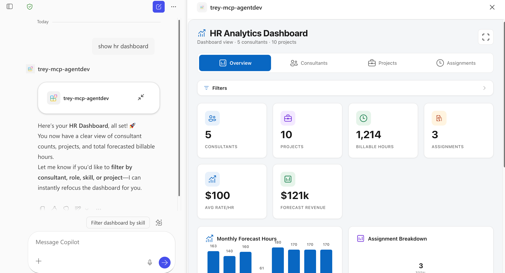

# Trey Research — Declarative Agent with MCP Server & Rich UI

A Microsoft 365 Copilot Declarative Agent that connects to the **Trey Research MCP Server**, enabling HR consultant management through natural language. The MCP server uses the **OpenAI App SDK** to render rich, interactive widgets directly inside the Copilot chat — including an HR dashboard, consultant profile cards, a bulk editor, and project detail views.



Built with the [Agents Toolkit (ATK)](https://aka.ms/teams-toolkit) in VS Code. Instead of hand-authoring an OpenAPI spec, ATK points at the MCP discovery URL and generates all manifests, wiring in tools and function definitions automatically.

## What This Agent Can Do

### Rich UI Tools (render interactive widgets in chat)

| Tool | Description |
|------|-------------|
| `show-hr-dashboard` | KPI dashboard of consultants and assignments with filters for name, project, skill, role, and billable status |
| `show-consultant-profile` | Detailed profile card for a consultant including contact info, skills, certifications, roles, and current assignments |
| `show-bulk-editor` | Editable grid view of consultant records with optional skill/name filters |
| `show-project-details` | Detailed project view with assigned consultants and forecasted hours |

### Data Tools

| Tool | Description |
|------|-------------|
| `search-consultants` | Search consultants by skill or name, results displayed in the bulk editor widget |
| `update-consultant` | Update a single consultant's name, email, phone, skills, or roles |
| `bulk-update-consultants` | Batch-update multiple consultant records at once |
| `assign-consultant-to-project` | Assign a consultant to a project with a role, optional billing rate, and forecast hours |
| `bulk-assign-consultants` | Assign multiple consultants to a project at once |
| `remove-assignment` | Remove a consultant's assignment from a project |

## Sample Prompts

| Prompt | What it does |
|--------|-------------|
| *Show the HR dashboard* | Opens the HR consultant dashboard widget |
| *Show consultants with React skills* | Dashboard filtered to React consultants |
| *Show me the profile for consultant 1* | Opens the consultant profile card |
| *Search for consultants named Avery* | Opens the bulk editor with matching consultants |
| *Open the bulk editor* | Opens the full consultant editor grid |
| *Show me project details for project 1* | Opens the project detail view |
| *Assign consultant 2 to project 3 as Architect* | Creates a new project assignment |
| *Update consultant 1's email to newemail@trey.com* | Updates consultant info |
| *Remove consultant 4 from project 2* | Removes the assignment |
| *Bulk assign consultants 1, 2, and 3 to project 5 as Developers* | Assigns multiple consultants at once |

## Prerequisites

- [Node.js](https://nodejs.org/) 18, 20, or 22
- [Microsoft 365 Agents Toolkit](https://aka.ms/teams-toolkit) VS Code extension (v5.0.0+)
- [Microsoft 365 Copilot license](https://learn.microsoft.com/microsoft-365-copilot/extensibility/prerequisites#prerequisites)
- A [Microsoft 365 developer account](https://docs.microsoft.com/microsoftteams/platform/toolkit/accounts)

## Getting Started

Run all scripts from `src/mcpserver/`

1. **Install dependencies** — run `npm run install:all`
2. **Start Azurite** (local storage emulator) — `npm run start:azurite` in a separate terminal
3. **Seed the database** — `npm run seed`
4. **Build widgets** — `npm run build:widgets`
5. **Start the MCP server** — `npm run dev:server` (runs on `http://localhost:3001/mcp`)
6. **Create a dev tunnel** — Use [Dev Tunnels](https://learn.microsoft.com/azure/developer/dev-tunnels/) to expose your local MCP server publicly:
   ```bash
   devtunnel host -p 3001 --allow-anonymous
   ```
   Copy the forwarded URL (e.g. `https://<tunnel-id>.devtunnels.ms`) and update the `url` field under the `RemoteMCPServer` runtime in `appPackage/ai-plugin.json`:
   ```json
   "runtimes": [
       {
           "type": "RemoteMCPServer",
           "spec": {
               "url": "https://<your-tunnel-url>/mcp"
           }
       }
   ]
   ```
7. **Provision & debug** — Use the ATK Provision button, then Start Debugging to preview the agent in Copilot

## Project Structure

| Folder | Description |
|--------|-------------|
| `appPackage/` | Agent manifests — `ai-plugin.json` (tool definitions & auth), `declarativeAgent.json` (agent config), `manifest.json` (Teams/Outlook integration) |
| `src/mcpserver/server/` | MCP server — Express + StreamableHTTP transport, Azure Table Storage data layer |
| `src/mcpserver/widgets/` | React 18 + Fluent UI v9 widgets built as single-file HTML via OpenAI App SDK (HR dashboard, consultant profile, bulk editor) |
| `src/mcpserver/assets/` | Pre-built widget HTML files served by the MCP server |
| `src/mcpserver/db/` | Seed data (JSON) — Consultants, Projects, Assignments |
| `env/` | Local environment files |
| `m365agents.yml` | ATK lifecycle configuration |

## Learn More

- [Build Declarative Agents](https://learn.microsoft.com/microsoft-365-copilot/extensibility/build-declarative-agents)
- [Build Declarative Agents for Microsoft 365 Copilot with MCP](https://devblogs.microsoft.com/microsoft365dev/build-declarative-agents-for-microsoft-365-copilot-with-mcp/)
- [Model Context Protocol (MCP)](https://modelcontextprotocol.io/)


