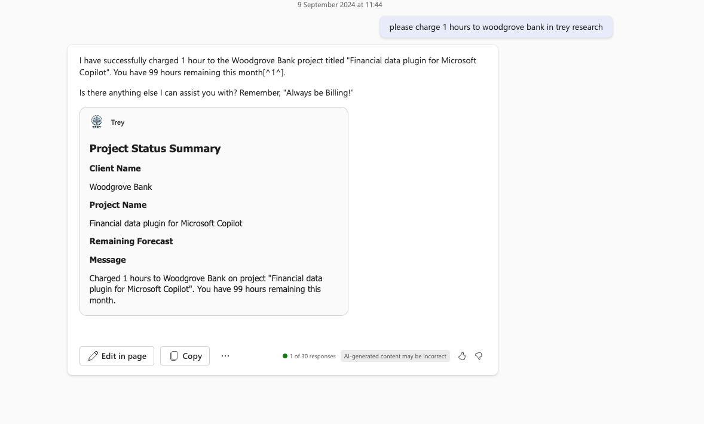

# Trey Research (Python)

## Summary

Trey Research is a fictitious consulting company that supplies talent in the software and pharmaceuticals industries.

This sample contains a declarative agent and an API plugin backed by Python Azure Functions. The API stores consulting data in Azure Table Storage and uses the Azurite storage emulator when running locally.

The declarative agent can converse with users, reference documents in OneDrive or SharePoint, and call the API plugin.

The API uses a demo-only default consultant identity, Avery Howard, for unauthenticated testing. It is not a production authentication implementation.



## Contributors

* [Jegadeesh-MSFT](https://github.com/Jegadeesh-MSFT)
* [Bob German](https://github.com/BobGerman)
* [Ajay Jadhav](https://github.com/AjayJ12-MSFT)

## Version history

Version|Date|Comments
-------|----|--------
1.1|July 20, 2026|Retired the legacy duplicate and aligned the declarative-agent sample with current repository conventions
1.0|April 16, 2025|Initial release

## Prerequisites

* A Microsoft 365 tenant with Microsoft 365 Copilot
* [Visual Studio Code](https://code.visualstudio.com/)
* [Microsoft 365 Agents Toolkit](https://aka.ms/teams-toolkit) for Visual Studio Code
* [Python](https://www.python.org/downloads/) 3.10 or later
* [Node.js](https://nodejs.org/) 18 or later
* [Azure Functions Core Tools](https://learn.microsoft.com/azure/azure-functions/functions-run-local) v4
* [Azurite](https://learn.microsoft.com/azure/storage/common/storage-use-azurite) for local Azure Table Storage

## Minimal path to awesome

1. Clone this repository (or [download this sample as a ZIP file](https://pnp.github.io/download-partial/?url=https://github.com/pnp/copilot-pro-dev-samples/tree/main/samples/da-trey-research-python)) and open `samples/da-trey-research-python` in Visual Studio Code.
2. Install the Python dependencies:

   ```bash
   python -m pip install -r requirements.txt
   ```

3. Copy the documents in `sampleDocs` to a **Legal** folder in OneDrive or a SharePoint document library. Copy the folder URL and set it as `DOCUMENTS_URL` in the active Agents Toolkit environment file, such as `env/.env.local`.
4. Open the Microsoft 365 Agents Toolkit extension and sign in to a Microsoft 365 tenant with Microsoft 365 Copilot.
5. Select **Debug in Copilot (Edge)** or **Debug in Copilot (Chrome)** from the Visual Studio Code launch configuration dropdown. The toolkit prepares the app package, starts the local API and Azurite, and opens the declarative agent in Microsoft 365 Copilot.

Microsoft 365 Copilot can cache the agent definition. After changing the agent, use a hard refresh (`Ctrl+Shift+R`) in the browser.

### Prompts to try

For the demo-only identity, the current consultant is Avery Howard. If a prompt is resolved using the signed-in user's real name instead, the request will not match that local demo identity.

* What projects am I assigned to?
* What projects are we doing for Relecloud?
* Which consultants are working with Woodgrove Bank?
* How many hours has Avery delivered this month?
* Find a consultant with Python skills who is available immediately.
* Are any consultants available who are AWS certified?
* Does Trey Research have any architects with JavaScript skills?
* What designers are working at Woodgrove Bank?
* Charge 10 hours to Woodgrove Bank.
* Add Sanjay to the Contoso project.
* Find my hours spreadsheet and get the hours for Woodgrove, then bill the client.
* Make a list of my projects, then write a summary of each based on the statement of work.

## Features

This sample illustrates the following concepts:

* Declarative agent with branding, instructions, document access, and an API plugin
* GET requests that query consultants and projects
* POST requests that charge time and assign consultants
* Multi-parameter filtering of consultant and project data
* Confirmation cards for POST requests and prompts for missing parameters
* Rich Adaptive Card responses

## API summary

The included [Postman collection](./http/TreyResearch%20API.postman_collection.json) contains the API operations. The API is also described in [`appPackage/apiSpecificationFile/trey-definition.yml`](./appPackage/apiSpecificationFile/trey-definition.yml).

### GET requests

```text
GET /api/me                                      Get the current consultant profile and projects
GET /api/consultants/                            Get all consultants
GET /api/consultants/?consultantName=Avery       Filter consultants by name
GET /api/consultants/?projectName=Foo            Filter consultants by project
GET /api/consultants/?skill=Foo                  Filter consultants by skill
GET /api/consultants/?certification=Foo          Filter consultants by certification
GET /api/consultants/?role=Foo                   Filter consultants by role
GET /api/consultants/?hoursAvailable=20          Filter by available hours
GET /api/projects/                               Get all projects
GET /api/projects/?projectName=Foo               Filter projects by project or client name
GET /api/projects/?consultantName=Avery          Filter projects by assigned consultant
```

### POST requests

```text
POST /api/me/chargeTime                          Charge hours to a project
POST /api/projects/assignConsultant              Assign a consultant to a project
```

Example request bodies:

```json
{
  "projectName": "foo",
  "hours": 5
}
```

```json
{
  "projectName": "foo",
  "consultantName": "avery",
  "role": "architect",
  "forecast": 100
}
```

The POST request bodies contain the project and consultant names plus the hours, role, or forecast required by the operation. See the OpenAPI definition for the complete request and response shapes. When testing `localhost` URLs, use Postman Desktop or replace `http://localhost:7071` with the API tunnel or host URL.

The API is designed around the sample prompts: it accepts partial, human-readable names; returns related data needed for a response; uses resource-oriented GET requests; uses command-style POST requests; and performs filtering server-side.

## Help

We do not support samples, but this community is always willing to help, and we want to improve these samples. We use GitHub to track issues, which makes it easy for community members to volunteer their time and help resolve issues.

You can try looking at [issues related to this sample](https://github.com/pnp/copilot-pro-dev-samples/issues?q=label%3A%22sample%3A%20da-trey-research-python%22) to see if anybody else is having the same issues.

If you encounter an issue using this sample, [create a new issue](https://github.com/pnp/copilot-pro-dev-samples/issues/new).

Finally, if you have an idea for improvement, [make a suggestion](https://github.com/pnp/copilot-pro-dev-samples/issues/new).

## Disclaimer

**THIS CODE IS PROVIDED *AS IS* WITHOUT WARRANTY OF ANY KIND, EITHER EXPRESS OR IMPLIED, INCLUDING ANY IMPLIED WARRANTIES OF FITNESS FOR A PARTICULAR PURPOSE, MERCHANTABILITY, OR NON-INFRINGEMENT.**


