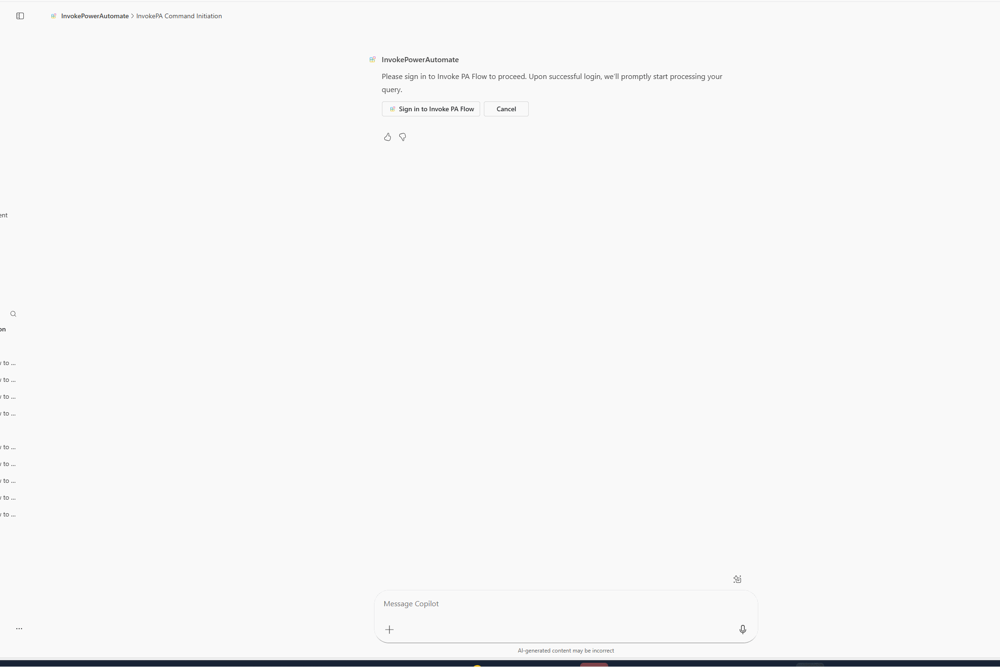
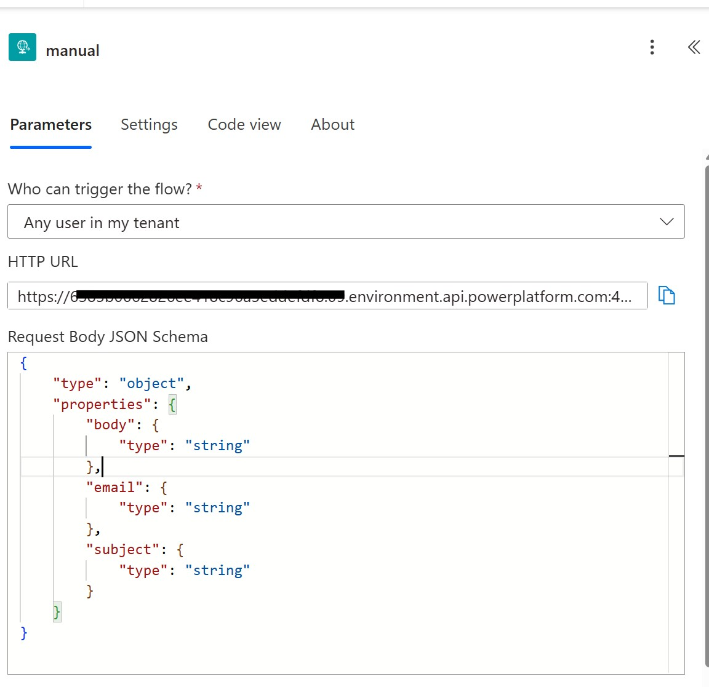
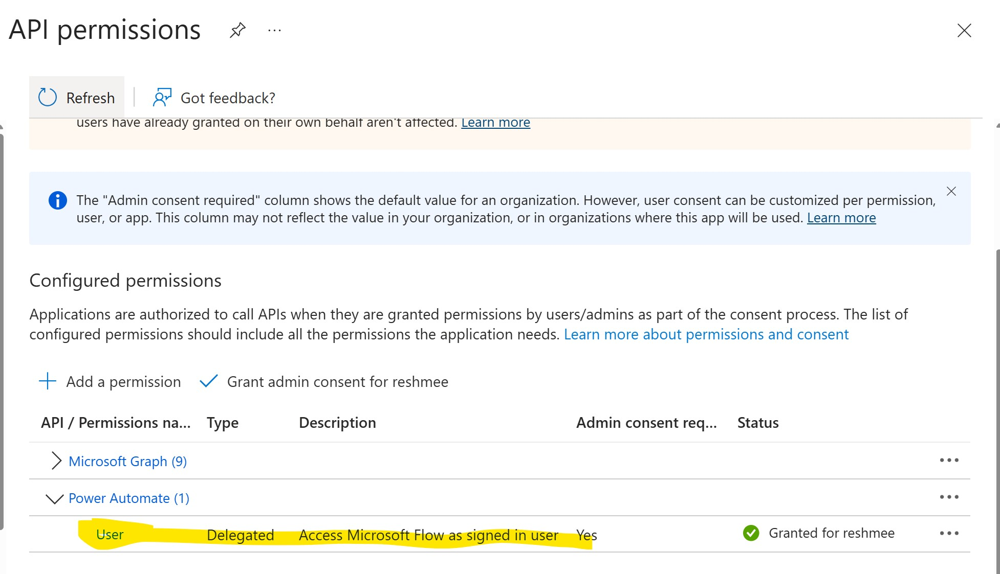
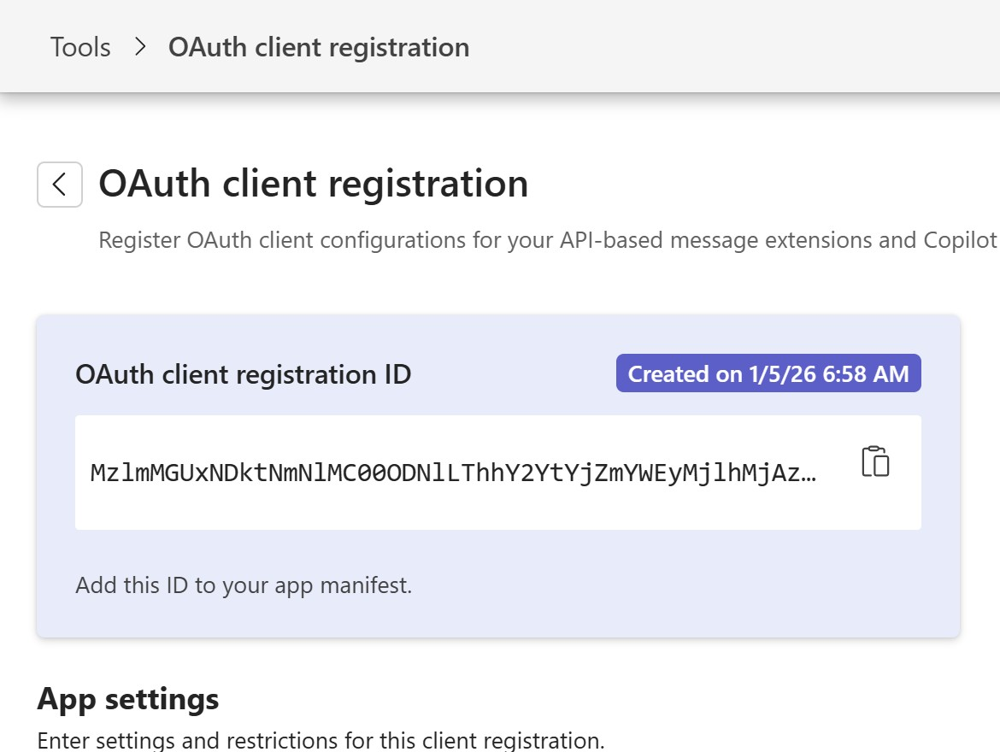

# Invoking Power Automate Agent using TypeSpec for Microsoft 365 Copilot

## Summary

This declarative agent triggers a power automate flow as described in the blog post 
[Build a Microsoft 365 Copilot Agent with Power Automate HTTP Trigger Using Agents Toolkit](https://reshmeeauckloo.com/posts/agentstoolkit-invoking-powerautomate/) with OAuth 2 using TypeSpec. 



## Features

This sample illustrates the following concepts:

* Building a declarative agent for Microsoft 365 Copilot using TypeSpec for Microsoft 365 Copilot
* Using the service 'https://service.flow.microsoft.com//.default' to invoke the Power Automate
* Using an automated approach to create the Entra ID app and the Developer Portal registration

## Contributors

* [Reshmee Auckloo](https://github.com/reshmee011) - M365 Development MVP

## Version history

Version|Date|Comments
-------|----|--------
1.0 | May 05, 2026 | Initial solution

## Prerequisites

* Microsoft 365 tenant with Microsoft 365 Copilot
* [Visual Studio Code](https://code.visualstudio.com/) with the [Microsoft 365 Agents Toolkit](https://marketplace.visualstudio.com/items?itemName=TeamsDevApp.ms-teams-vscode-extension) extension
* [Node.js v20](https://nodejs.org/en/download/package-manager)

## Minimal path to awesome

* Clone this repository (or [download this solution as a .ZIP file](https://pnp.github.io/download-partial/?url=https://github.com/pnp/copilot-pro-dev-samples/tree/main/samples/da-typespec-powerautomate) then unzip it)
* Open the Agents Toolkit extension and sign in to your Microsoft 365 tenant with Microsoft 365 Copilot
* Select **Preview in Copilot (Edge)** from the launch configuration dropdown

### Step 1: Create Power Automate flow

1. Create a Power Automate flow with a manual trigger. 


2. Set the request Body JSON Schema of the trigger action to:

```Json
{
    "type": "object",
    "properties": {
        "body": {
            "type": "string"
        },
        "email": {
            "type": "string"
        },
        "subject": {
            "type": "string"
        }
    }
}
```
Add any actions like "Send an Email".

3. Set "Who can trigger the flow?" to "Any user in my tenant".

4. Copy the HTTP Url of the flow to use in the subsequent steps

### Step 2: Create the App Registration

1. Go to [Azure portal](https://portal.azure.com/)
2. Select **Microsoft Entra ID** > **Manage** > **App registrations** > **New registration**
3. Enter a name for the app (e.g., Volunteering App)
4. Select **Accounts in this organizational directory only**
5. Under **Redirect URI**, select **Web** and enter `https://teams.microsoft.com/api/platform/v1.0/oAuthRedirect`
6. Select **Register**
7. In the app registration, go to **Certificates & secrets** and create a new client secret
8. Copy the client secret value
9. In the app registration, go to **API permissions** and add the following permissions:
        * **Power Automate** > **Delegated permissions** > `User`
10. Select **Grant admin consent for <your organization>** to grant the permissions


### Step 3: Oauth Client registration in Teams Developer Portal

1. In the Teams Developer Portal, add a new OAuth client registration with the following details:

   - **Registration Name:** InvokePAFlow
   - **Base URL:** https://<environmentname>.09.environment.api.powerplatform.com 
   - **Restrict Usage by Org:** My organization only  

2. **OAuth Settings:**
   - **Client ID:** `<Entra ID Application ID>`  
   - **Client Secret:** `<Entra ID Application Secret>`  
   - **Authorization Endpoint:** https://login.microsoftonline.com/tenantid/oauth2/v2.0/authorize  
   - **Token Endpoint:** https://login.microsoftonline.com/tenantid/oauth2/v2.0/token  
   - **Scope:** https://service.flow.microsoft.com//.default (note the double slash before "default") otherwise you will encounter a forbidden error with a single slash.

Replace `tenantid` with your tenant ID, which is a GUID.

Copy the value of the Oauth Client Registration ID.


### Step 4

1. Open the file `.env.dev` within the `env` folder and update the following variables

- `PAAGENTAUTH_REGISTRATION_ID` is the OAuth client registration ID you copied from step 3.
  Example: `PAAGENTAUTH_REGISTRATION_ID=<oAuth Client Reg Id>`
- `PA_APP_SERVER_URL` is the base URL of the Power Platform environment where your Power Automate flow is hosted.
  Example: `PA_APP_SERVER_URL=https://<environmentname>.api.powerplatform.com`
- `PA_APP_INVOKE_PATH` is the relative invoke path for the flow trigger, not the full URL.
  Use the path portion from the flow HTTP URL after the base Power Platform URL.
  Example: `PA_APP_INVOKE_PATH=/powerautomate/automations/direct/workflows/.../triggers/manual/paths/invoke`

## Help

We do not support samples, but this community is always willing to help, and we want to improve these samples. We use GitHub to track issues, which makes it easy for  community members to volunteer their time and help resolve issues.

You can try looking at [issues related to this sample](https://github.com/pnp/copilot-pro-dev-samples/issues?q=label%3A%22sample%3A%20da-typespec-powerautomate%22) to see if anybody else is having the same issues.

If you encounter any issues using this sample, [create a new issue](https://github.com/pnp/copilot-pro-dev-samples/issues/new).

Finally, if you have an idea for improvement, [make a suggestion](https://github.com/pnp/copilot-pro-dev-samples/issues/new).

## Disclaimer

**THIS CODE IS PROVIDED *AS IS* WITHOUT WARRANTY OF ANY KIND, EITHER EXPRESS OR IMPLIED, INCLUDING ANY IMPLIED WARRANTIES OF FITNESS FOR A PARTICULAR PURPOSE, MERCHANTABILITY, OR NON-INFRINGEMENT.**

