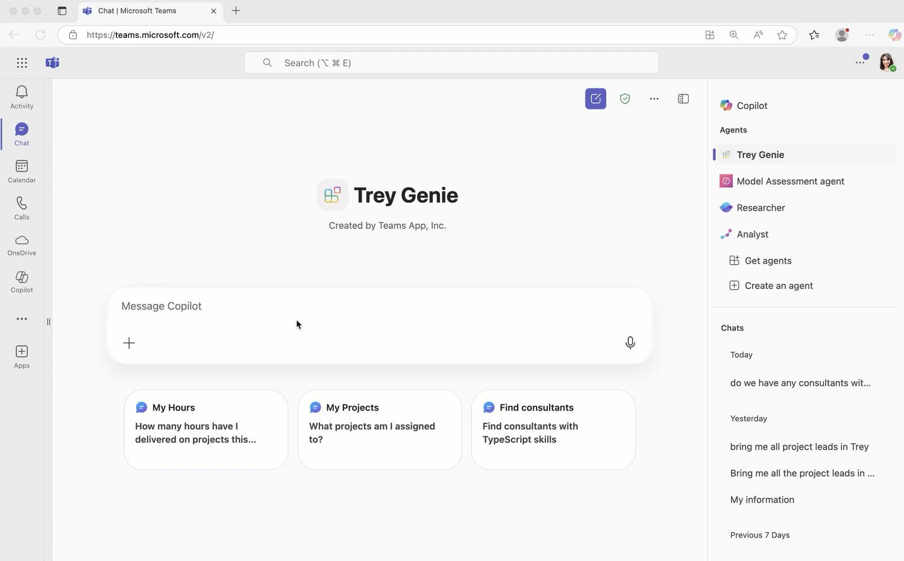

# Trey Research Copilot Declarative Agent (TypeSpec version)

## Summary

Trey Research is a fictitious consulting company that supplies talent in the software and pharmaceuticals industries.

The solution consists of an API plugin that calls a set of Azure functions, which store the consulting data in a Azure Table storage (it uses the Azurite storage emulator when running locally).
TypeSpec is a language developed by Microsoft for designing and describing API contracts in a structured and type-safe way. For a code-first developer TypeSpec files provide  single source of truth that defines how your agent should behave, avoiding confusion when dealing with multiple manifest files like in the case of Declarative Agents.

A declarative agent is provided to converse with users and to call the API plugin, as well as to reference the correct SharePoint document library.
This project has only APIs for Consultants GET operations and /me GET and POST operations similar to [Lab E3 in Copilot Dev Camp](https://microsoft.github.io/copilot-camp/pages/extend-m365-copilot/03-add-declarative-agent/) in this initial version. 

## Features

The sample showcases the following features:

1. Declarative agent with branding and instructions, with access to relevant documents and an API defined using TypeSpec files.
2. API based plugin works with any platform that supports REST requests
3. Copilot will construct queries for specific data using GET requests
4. Copilot updates and adds data using POST requests
5. Multi-parameter queries to filter results
6. Show a confirmation card before POSTing data; capture missing parameters
7. Rich adaptive card responses

## Contributors

* [Bob German](https://github.com/bobgerman)
* [Rabia Williams](https://github.com/rabwill)

## Version history

| Version | Date | Comments |
|--|--|--|
| 1.0 | Agu 7, 2025 | Initial release |

## Prerequisites

* [Node.js](https://nodejs.org/)
* A [Microsoft 365 tenant](https://learn.microsoft.com/en-us/microsoftteams/platform/concepts/build-and-test/prepare-your-o365-tenant) prepared for development
* [Microsoft 365 Agents Toolkit](https://aka.ms/teams-toolkit) Visual Studio Code extension
* A Microsoft 365 Copilot licence

## Minimal path to awesome

### 2. Test the agent

1. In the .env folder, create a new file called **.env.local**.
2. Add this `SECRET_STORAGE_ACCOUNT_CONNECTION_STRING=UseDevelopmentStorage=true` into the file.
3. Press **F5** to start a debug session. If prompted, sign in with your [Microsoft 365 account](https://docs.microsoft.com/microsoftteams/platform/toolkit/accounts). Wait for the provisioning to complete and the browser to open.
4. In the browser, if prompted, sign in with your Microsoft 365 account. The browser will open the declarative agent in Microsoft 365 Copilot after signing in.

> ![IMPORTANT]
> Microsoft 365 Copilot can cache the agent definition, so if you make changes to the agent, you may need to clear the browser cache for changes to be persisted. After the agent is loaded, use Hard Refresh (Ctrl+Shift+R) to ensure the latest version is loaded.

Try the following prompts:

* do we have any consultants with azure certifications?
* which consultants are working with woodgrove bank?
* how many hours has avery delivered this month?
* please find a consultant with python skills who is available immediately
* are any consultants available who are AWS certified?
* does trey research have any architects with javascript skills?
* what designers are working at woodgrove bank?
* please charge 10 hours to woodgrove bank

## Troubleshooting and feature requests

We do not support samples, but this community is always willing to help, and we want to improve these samples. We use GitHub to track issues, which makes it easy for community members to volunteer their time and help resolve issues.

You can try looking at [issues related to this sample](https://github.com/pnp/copilot-pro-dev-samples/issues?q=label%3A%22sample%3A%20da-trey-resarch%22) to see if anybody else is having the same issues.

If you encounter any issues using this sample, [create a new issue](https://github.com/pnp/copilot-pro-dev-samples/issues/new).

Finally, if you have an idea for improvement, [make a suggestion](https://github.com/pnp/copilot-pro-dev-samples/issues/new).

## Disclaimer

**THIS CODE IS PROVIDED *AS IS* WITHOUT WARRANTY OF ANY KIND, EITHER EXPRESS OR IMPLIED, INCLUDING ANY IMPLIED WARRANTIES OF FITNESS FOR A PARTICULAR PURPOSE, MERCHANTABILITY, OR NON-INFRINGEMENT.**

