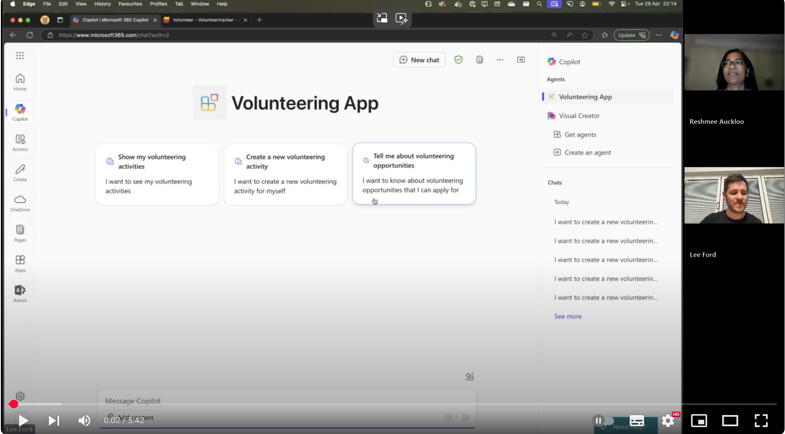

# Declarative Agent - Volunteering App


## Summary

This repository contains a declarative agent that can be used to automate the process of finding and applying for volunteer opportunities. The agent will first ask what kind of volunteering you wish to do. Once decided it will submit your application to the selected opportunity. A key point of emphasis on this agent was making use of multiple Microsoft services using different APIs. The agent uses Microsoft Graph API to get the list of tasks assigned to the user and Azure AI Search to get the list of volunteer opportunities. The agent is built using the Microsoft Teams Toolkit.

## Contributors

* [Reshmee Auckloo](https://github.com/reshmee011) - M365 Development MVP
* [Lee Ford](https://github.com/leeford) - M365 Development MVP

## Version history

Version|Date|Comments
-------|----|--------
1.0 | April 29, 2025 | Initial solution

> **Prerequisites**
>
> To run this app template from your local dev machine, you will need:
>
> * A [Microsoft 365 account for development](https://docs.microsoft.com/microsoftteams/platform/toolkit/accounts).
> * [Teams Toolkit Visual Studio Code Extension](https://aka.ms/teams-toolkit) version 5.0.0 and higher or [Teams Toolkit CLI](https://aka.ms/teamsfx-toolkit-cli)
> * [Microsoft 365 Copilot license](https://learn.microsoft.com/microsoft-365-copilot/extensibility/prerequisites#prerequisites)
> * [Azure AI Search](https://learn.microsoft.com/azure/search/search-what-is-azure-search) service with indexed data from the assets folder.
> * A SharePoint site with a list using the **Issue Tracker** template

## Minimal path to awesome

1. Clone this repository (or [download this solution as a .ZIP file](https://pnp.github.io/download-partial/?url=https://github.com/pnp/copilot-pro-dev-samples/tree/main/samples/da-da-volunteeringapp) then unzip it)

2. Register an EntraID application in Azure:

    1. Go to [Azure portal](https://portal.azure.com/)
    2. Select **Microsoft Entra ID** > **Manage** > **App registrations** > **New registration**
    3. Enter a name for the app (e.g., Volunteering App)
    4. Select **Accounts in this organizational directory only**
    5. Under **Redirect URI**, select **Web** and enter `https://teams.microsoft.com/api/platform/v1.0/oAuthRedirect`
    6. Select **Register**
    7. In the app registration, go to **Certificates & secrets** and create a new client secret
    8. Copy the client secret value
    9. In the app registration, go to **API permissions** and add the following permissions:
        * **Microsoft Graph** > **Delegated permissions** > `Directory.Read.All`, `Sites.ReadWrite.All`, `User.Read`, `email`, `offline_access`, `openid`
    10. Select **Grant admin consent for <your organization>** to grant the permissions

3. Get a copy your Endpoint URL from the Azure AI Search service:

   1. Go to [Azure portal](https://portal.azure.com/)
   2. Find or create your instance under **Azure AI Search**
   3. Under **Overview**, copy the **URL** value. It should look like `https://<your-search-service-name>.search.windows.net/`
   4. Under **Keys**, copy the **Primary Key** value

4. In the [Teams developer portal](https://dev.teams.microsoft.com/) under **Tools**, create a new **OAuth client registration** with the following information (replace `tenantid` with your own value):

    **App settings**

    * **Registration name**: Volunteering App
    * **Base URL**: `https://graph.microsoft.com/v1.0`
    * **Restrict usage by org**: My organization only
    * **Restrict usage by app**: Any Teams app (when agent is deployed, use the Teams app ID)

    **OAuth settings**
    * **Client ID**: &lt;Entra ID App registration client ID&gt;
    * **Client secret**: &lt;Entra ID App registration client secret&gt;
    * **Authorization endpoint**: <https://login.microsoftonline.com/tenantid/oauth2/v2.0/authorize>
    * **Token endpoint**: <https://login.microsoftonline.com/tenantid/oauth2/v2.0/token>
    * **Refresh endpoint**: <https://login.microsoftonline.com/tenantid/oauth2/v2.0/refresh>
    * **Scope**: `Directory.Read.All`, `Sites.ReadWrite.All`, `User.Read`, `email`, `offline_access`, `openid`

    Save the information. A new **OAuth client registration key** will be generated. Copy the key.

5. Staying in the [Teams developer portal](https://dev.teams.microsoft.com/) under **Tools**, create a new **API key registration** with the following information:

    * **API key**: Add a secret with the Azure AI Primary Key you copied in step 3.4
    * **API key name**: e.g., Azure AI Search Key
    * **Base URL**: The Azure AI Search URL you copied in step 3.3
    * **Target tenant**: Home tenant
    * **Restrict usage by app**: Any Teams app (when agent is deployed, use the Teams app ID)

    Save the information. A new **API key registration ID** will be generated. Copy the key.

6. Rename the `.env.dev.example` file to `.env.dev` and update the following values:

    ```bash
    # Built-in environment variables
    TEAMSFX_ENV=dev
    APP_NAME_SUFFIX=dev

    TEAMS_APP_ID=082eb662-19a0-40a0-801a-4eeeae8ecac3
    TEAMS_APP_TENANT_ID=<your-tenant-id>
    M365_TITLE_ID=
    M365_APP_ID=

    AZUREAADV2_REGISTRATION_ID=<oauth-client-registration-id-from-teams-developer-portal>
    APIKEYAUTH_REGISTRATION_ID_FOR_AISEARCH=<api-key-registration-id-from-teams-developer-portal>

    SITE_ID=<your-sharepoint-site-id>
    LIST_ID=<your-sharepoint-list-id>
    ```

7. From Teams Toolkit, sign-in to your Microsoft 365 account.
8. From Teams Toolkit, provision the solution to create the Teams app.
9. Go to [https://www.office.com/chat?auth=2](https://www.office.com/chat?auth=2) URL and enable the developer mode by using the `-developer on` prompt.
10. Use one of the conversation starters to start the agent.

## Features

The following sample demonstrates the following concepts:

* Query the Microsoft Graph API to get the list of tasks assigned to the user
* Query Azure AI Search to get the list of volunteer opportunities
* Register the user to the selected opportunity

## Demo 

[](https://www.youtube.com/watch?v=h8wPL_ZUmC0 "Declarative agent for volunteering app")

<!--
RESERVED FOR REPO MAINTAINERS

We'll add the video from the community call recording here

## Video

[](https://www.youtube.com/watch?v=XXXXX "YouTube video title")
-->

## Help

We do not support samples, but this community is always willing to help, and we want to improve these samples. We use GitHub to track issues, which makes it easy for  community members to volunteer their time and help resolve issues.

You can try looking at [issues related to this sample](https://github.com/pnp/copilot-pro-dev-samples/issues?q=label%3A%22sample%3A%20da-volunteeringapp%22) to see if anybody else is having the same issues.

If you encounter any issues using this sample, [create a new issue](https://github.com/pnp/copilot-pro-dev-samples/issues/new).

Finally, if you have an idea for improvement, [make a suggestion](https://github.com/pnp/copilot-pro-dev-samples/issues/new).

## Disclaimer

**THIS CODE IS PROVIDED *AS IS* WITHOUT WARRANTY OF ANY KIND, EITHER EXPRESS OR IMPLIED, INCLUDING ANY IMPLIED WARRANTIES OF FITNESS FOR A PARTICULAR PURPOSE, MERCHANTABILITY, OR NON-INFRINGEMENT.**


