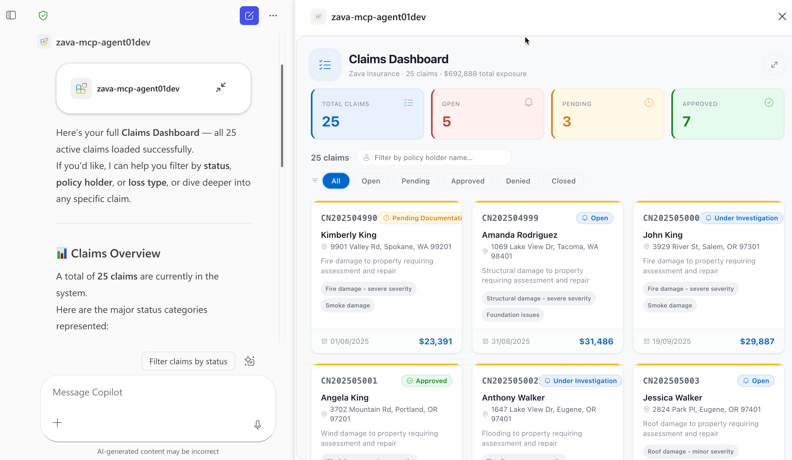

# Zava Insurance — Declarative Agent with MCP Server & Rich UI

A Microsoft 365 Copilot Declarative Agent that connects to the **Zava Insurance MCP Server**, enabling insurance claims management through natural language. The MCP server uses the **OpenAI App SDK** to render rich, interactive widgets directly inside the Copilot chat — including claims dashboards, claim detail views, and contractor lists.


Built with the [Agents Toolkit (ATK)](https://aka.ms/teams-toolkit) in VS Code. Instead of hand-authoring an OpenAPI spec, ATK points at the MCP discovery URL and generates all manifests, wiring in tools and function definitions automatically.

## What This Agent Can Do

### Rich UI Tools (render interactive widgets in chat)

| Tool | Description |
|------|-------------|
| `show-claims-dashboard` | Grid view of all claims with status filters, metrics, and click-to-detail |
| `show-claim-detail` | Detailed view of a single claim with inspections, purchase orders, and a map |
| `show-contractors` | Filterable list of contractors with ratings and specialties |

### Data Tools

| Tool | Description |
|------|-------------|
| `update-claim-status` | Update a claim's status and add notes |
| `update-inspection` | Update inspection status, findings, and recommended actions |
| `update-purchase-order` | Update a purchase order's status |
| `get-claim-summary` | Text summary of a specific claim |
| `list-inspectors` | List all inspectors with specializations |

## Sample Prompts

| Prompt | What it does |
|--------|-------------|
| *Show claims dashboard* | Opens the claims dashboard widget |
| *Show claims that are pending* | Dashboard filtered to pending claims |
| *Show me claim CN202504990* | Opens the detail view for that claim |
| *Approve claim 3 and add a note "Verified by adjuster"* | Updates claim status |
| *Show me all contractors* | Opens the contractors list widget |
| *Show only preferred roofing contractors* | Filtered contractors list |
| *Mark inspection insp-005 as completed with findings "No structural damage found"* | Updates inspection |
| *Approve purchase order po-003* | Updates PO status |
| *Give me a summary of claim 7* | Returns a text summary |
| *List all inspectors* | Shows inspectors and their specializations |

## Prerequisites

- [Node.js](https://nodejs.org/) 18, 20, or 22
- [Microsoft 365 Agents Toolkit](https://aka.ms/teams-toolkit) VS Code extension (v5.0.0+)
- [Microsoft 365 Copilot license](https://learn.microsoft.com/microsoft-365-copilot/extensibility/prerequisites#prerequisites)
- A [Microsoft 365 developer account](https://docs.microsoft.com/microsoftteams/platform/toolkit/accounts)

## Getting Started

Run all scripts from `src/mcpserver/`

1. **Install dependencies** — run `npm run install:all`
2. **Start Azurite** (local storage emulator) — `npm run start:azurite` in a separate terminal
3. **Seed the database** — `npm run seed`
4. **Build widgets** — `npm run build:widgets`
5. **Start the MCP server** — `npm run dev:server` (runs on `http://localhost:3001/mcp`)
6. **Create a dev tunnel** — Use [Dev Tunnels](https://learn.microsoft.com/azure/developer/dev-tunnels/) to expose your local MCP server publicly:
   ```bash
   devtunnel host -p 3001 --allow-anonymous
   ```
   Copy the forwarded URL (e.g. `https://<tunnel-id>.devtunnels.ms`) and update the `url` field under the `RemoteMCPServer` runtime in `appPackage/ai-plugin.json`:
   ```json
   "runtimes": [
       {
           "type": "RemoteMCPServer",
           "spec": {
               "url": "https://<your-tunnel-url>/mcp"
           }
       }
   ]
   ```
7. **Provision & debug** — Use the ATK Provision button, then Start Debugging to preview the agent in Copilot

## Project Structure

| Folder | Description |
|--------|-------------|
| `appPackage/` | Agent manifests — `ai-plugin.json` (tool definitions & auth), `declarativeAgent.json` (agent config), `manifest.json` (Teams/Outlook integration) |
| `src/mcpserver/server/` | MCP server — Express + StreamableHTTP transport, Azure Table Storage data layer |
| `src/mcpserver/widgets/` | React 18 + Fluent UI v9 widgets built as single-file HTML via OpenAI App SDK (claims dashboard, claim detail, contractors list) |
| `src/mcpserver/db/` | Seed data (JSON) |
| `env/` | Local environment files |
| `m365agents.yml` | ATK lifecycle configuration |

## Learn More

- [Build Declarative Agents](https://learn.microsoft.com/microsoft-365-copilot/extensibility/build-declarative-agents)
- [Build Declarative Agents for Microsoft 365 Copilot with MCP](https://devblogs.microsoft.com/microsoft365dev/build-declarative-agents-for-microsoft-365-copilot-with-mcp/)
- [Model Context Protocol (MCP)](https://modelcontextprotocol.io/)
