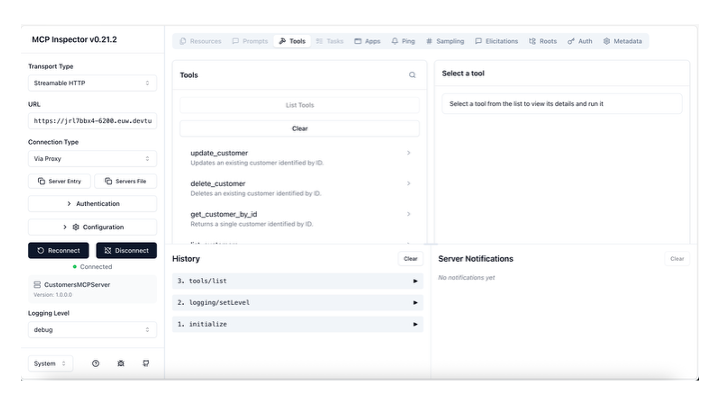

# Secure Customers MCP Server with C# and ASP.NET Core

This sample shows how to build and run a secure Model Context Protocol (MCP) server in C# with ASP.NET Core, Microsoft Identity Web, and scope-based authorization.



## What this sample contains

- A .NET 10 MCP server (`CustomersMCPServer`) hosted as an ASP.NET Core web app.
- MCP tools for customer CRUD operations backed by `data/customers.json`.
- Optional security toggle to enable/disable JWT authentication and authorization.
- Entra ID integration for token validation and scoped MCP access.

## Code overview (`CustomersMCPServer`)

- `Program.cs`
  - Configures MCP transport and tool registration (`.AddMcpServer().WithHttpTransport().WithTools<CustomersTools>()`).
  - Reads security and MCP settings from configuration.
  - Enables Microsoft Identity Web authentication when `Security:Enabled` is `true`.
  - Applies scope-based authorization policy using configured scopes (for example `Customers.ReadWrite.All`).
  - Configures CORS and forwarded headers for browser clients and reverse-proxy scenarios.
- `Tools/CustomersTools.cs`
  - Exposes MCP tools:
    - `ListCustomers`
    - `GetCustomerById`
    - `InsertCustomer`
    - `UpdateCustomer`
    - `DeleteCustomer`
  - Includes validation logic and in-memory synchronization.
  - Loads customer data from `data/customers.json`.
- `appsettings.json.sample`
  - Template for MCP endpoint, security toggle, and Entra ID values.
- `CustomersMCPServer.csproj`
  - Targets `net10.0` and uses:
    - `ModelContextProtocol.AspNetCore`
    - `Microsoft.Identity.Web`
    - `Microsoft.AspNetCore.Authentication.JwtBearer`

## Quick start

### 1. Create runtime settings from sample

From solution root:

```bash
cp CustomersMCPServer/appsettings.json.sample CustomersMCPServer/appsettings.json
```

### 2. Edit `appsettings.json`

Set at least:

- `Mcp.ServerUrl` (for local dev use `http://localhost:6200/`)
- `Mcp.AllowedOrigins` (for local Inspector/browser use `http://localhost:6274`)
- `Mcp.UniqueUri` (`api://<CustomersMCPServer-client-id>`)
- `Mcp.ScopesSupported` (for this sample: `Customers.ReadWrite.All`)
- `AzureAd.TenantId`
- `AzureAd.ClientId` (client ID of `CustomersMCPServer` app registration)

### 3. Build

```bash
dotnet build CustomersMCPServer.slnx
```

### 4. (Optional) Use a custom `PORT` in VS Code for public URL access

If you plan to expose the MCP server through a public URL (for example via Dev Tunnel, Codespaces, or another proxy), run it on a known custom port so your public endpoint and local listener stay aligned.

Basic steps:

1. Choose a port (example: `6200`).
2. Configure `PORT` in VS Code for your run/debug profile.
3. Forward the same port in VS Code and set its visibility to public.
4. Update `CustomersMCPServer/appsettings.json` so `Mcp.ServerUrl` uses the same local port.
5. Update `Mcp.AllowedOrigins` to include the origin that will call your MCP endpoint (for public endpoints, use the forwarded/public URL origin).

#### VS Code UI steps: create and publish a port

1. Open **Run and Debug** in VS Code.
2. Create or edit your launch profile and set `PORT` (see example below).
3. Start the app once so VS Code detects the listening port.
4. Open the **Ports** view:
  - **View** > **Terminal** > **Ports** (or use Command Palette and search for `Ports: Focus on Ports View`).
5. Add/forward the port if it is not already listed:
  - Click **Forward a Port** and enter `6200` (or your chosen value).
6. Make the forwarded port public:
  - In the **Ports** view, find the forwarded port row.
  - Open the context menu and change **Port Visibility** to **Public**.
7. Copy the generated public URL from the **Ports** view and use it where needed (for example client/server settings and allowed origins).

Example VS Code `launch.json` snippet:

```json
{
  "name": "Run CustomersMCPServer",
  "type": "coreclr",
  "request": "launch",
  "program": "${workspaceFolder}/CustomersMCPServer/bin/Debug/net10.0/CustomersMCPServer.dll",
  "cwd": "${workspaceFolder}/CustomersMCPServer",
  "env": {
    "PORT": "6200"
  }
}
```

Example `appsettings.json` value:

```json
{
  "Mcp": {
    "ServerUrl": "http://localhost:6200/"
  }
}
```

When using a public forwarded URL, keep `Mcp.ServerUrl` as your local bind address (localhost), and use the public URL as the caller endpoint and as an allowed origin when applicable.

### 5. Run the MCP server

```bash
PORT=6200 dotnet run --project CustomersMCPServer/CustomersMCPServer.csproj
```

Default local endpoint:

- `http://localhost:6200`

### 6. Start MCP Inspector

```bash
npx @modelcontextprotocol/inspector
```

Then connect Inspector to:

- Server URL: `http://localhost:6200`

## Security toggle (enable/disable)

In `CustomersMCPServer/appsettings.json`:

```json
{
  "Security": {
    "Enabled": true
  }
}
```

- `true`: Entra token validation and scope authorization are enforced.
- `false`: MCP endpoint is open (no authentication/authorization).

## Entra ID app registration

Create two app registrations in your Entra tenant:

- `CustomersMCPServer` (resource API / MCP server)
- `CustomersMCPConsumer` (client app that requests tokens)

### A. Register `CustomersMCPServer` (API)

1. Create app registration named `CustomersMCPServer`.
2. In **Expose an API**:
   - Set Application ID URI (for example `api://<server-client-id>`).
   - Add delegated scope: `Customers.ReadWrite.All`.
3. In **Authentication**, configure redirect URIs only if needed by your flow.
4. Copy values into `CustomersMCPServer/appsettings.json`:
   - `AzureAd.TenantId`
   - `AzureAd.ClientId`
   - `Mcp.UniqueUri` to match your Application ID URI.

### B. Register `CustomersMCPConsumer` (client)

1. Create app registration named `CustomersMCPConsumer`.
2. In **API permissions**, add delegated permissions:
   - From `CustomersMCPServer`: `Customers.ReadWrite.All`
   - From Microsoft Graph: `openid`, `email`, `profile`, `User.Read`
3. Grant admin consent for the tenant.

### C. Tenant admin grant

A tenant admin must grant consent for the requested delegated permissions (especially custom API scopes and Graph permissions) so users can obtain tokens without per-user consent prompts.

## References

- [Create a minimal MCP server using C#](https://learn.microsoft.com/en-us/dotnet/ai/quickstarts/build-mcp-server)
- [MCP C# SDK](https://modelcontextprotocol.github.io/csharp-sdk)
- [Microsoft Identity Web for protected web APIs](https://learn.microsoft.com/entra/identity-platform/scenario-protected-web-api-overview)
