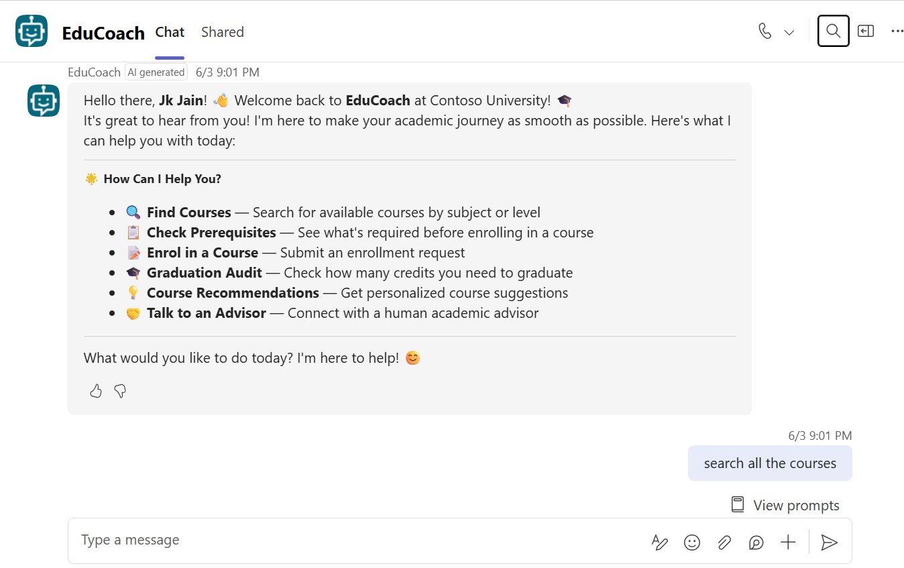

# EduCoach – Academic Advising Agent

## Summary

EduCoach is a Microsoft Copilot Studio agent that acts as a friendly academic advising assistant for undergraduate students. It helps students navigate their academic journey by answering grounded questions from a SharePoint Courses list and a Student Handbook document.

**Key capabilities:**

| Capability | Description |
|---|---|
| Course Search | Find courses by subject, semester, or degree requirement |
| Prerequisite Check | Verify eligibility before enrolling in a course |
| Enrollment Request | Submit an enrollment request via adaptive card; confirmation sent by email and tracked in Planner |
| Course Recommendations | Get personalised suggestions based on major and career interests |
| Graduation Audit | Check credit progress and remaining degree requirements |
| Waitlist Notification | Automatic notification when a waitlisted course opens (Power Automate trigger) |
| Escalation | Hand off to a human advisor for grade appeals, medical withdrawals, or academic petitions |

The agent is published to **Microsoft Teams** and **Microsoft 365 Copilot** and uses generative AI orchestration to route intents to specialised topics without explicit keyword matching.



## Demo

[](https://www.youtube.com/watch?v=0vh3zlRdgyg)

> Watch the full walkthrough on YouTube: [EduCoach – Academic Advising Agent Demo](https://www.youtube.com/watch?v=0vh3zlRdgyg)

## Frameworks


## Prerequisites

* Microsoft 365 tenant with a **Microsoft Copilot Studio** licence
* **Power Platform** environment with Dataverse enabled
* Permissions to create connections for:
  * SharePoint Online
  * Microsoft Planner
  * Office 365 Outlook
  * Microsoft Copilot Studio (for the Power Automate trigger)
* A **SharePoint site** containing:
  * A `Courses` list with columns: `Title` (course code), `title` (course name), `credits`, `prerequisites`, `degree_requirement`, `semester_offered`
  * A `Student Handbook` document (`.md` or `.docx`) in the site's Shared Documents library
* A **Microsoft Planner** plan with at least one bucket for tracking enrollment requests
* [Power Platform CLI (`pac`)](https://learn.microsoft.com/power-platform/developer/cli/introduction) – required only if importing via solution

## Contributors

mcs-EduCoach | Lovy Jain ([@lovyjain](https://github.com/lovyjain))

## Version history

Version | Date | Author | Comments
--------|------|--------|---------
1.0 | June 15, 2026 | Lovy Jain | Initial release

## Disclaimer

**THIS CODE IS PROVIDED *AS IS* WITHOUT WARRANTY OF ANY KIND, EITHER EXPRESS OR IMPLIED, INCLUDING ANY IMPLIED WARRANTIES OF FITNESS FOR A PARTICULAR PURPOSE, MERCHANTABILITY, OR NON-INFRINGEMENT.**

---

## Minimal Path to Awesome

### 1. Prepare your SharePoint site

Sample data files are included in `src/sharepoint-data/` to help you get started quickly:

| File | Purpose |
|---|---|
| `sample-course-catalog.csv` | 50 sample courses — import directly into the SharePoint Courses list |
| `student-handbook.md` | Student handbook document — upload to Shared Documents as-is |

**Steps:**

1. Create (or reuse) a SharePoint site, e.g. `https://YOUR_TENANT.sharepoint.com/sites/YOUR_SITE`.
2. Create a **Courses** list with the following columns:

   | Column internal name | Type | Notes |
   |---|---|---|
   | `Title` | Single line of text | Course code, e.g. `CS101` |
   | `title` | Single line of text | Course name |
   | `credits` | Number | Credit hours |
   | `prerequisites` | Single line of text | Semicolon-separated course codes, or `None` |
   | `degree_requirement` | Single line of text | e.g. `General Education`, `Major Required`, `Major Elective`, `Free Elective` |
   | `semester_offered` | Single line of text | Semicolon-separated semesters, e.g. `Fall;Spring` |

3. Import the sample data from `src/sharepoint-data/sample-course-catalog.csv` into the Courses list. You can use the SharePoint **Import Spreadsheet** app or paste rows manually.

4. Upload `src/sharepoint-data/student-handbook.md` to the site's **Shared Documents** library. The agent uses this file as the grounding document for all policy and graduation questions.

### 2. Prepare Microsoft Planner

1. Create a Planner **plan** inside the Microsoft 365 group of your choice.
2. Add a **bucket** named `Enrollment Requests` (or any name you prefer).
3. Note the **Plan ID** and **Bucket ID** from the Planner URL or via the [Microsoft Graph Explorer](https://developer.microsoft.com/graph/graph-explorer).

### 3. Clone the repository

```bash
git clone https://github.com/pnp/copilot-pro-dev-samples.git
cd copilot-pro-dev-samples/samples/mcs-EduCoach/src
```

### 4. Update placeholder values

Before importing, replace all placeholder strings in the source files:

| File | Placeholder | Replace with |
|---|---|---|
| `EduCoach/knowledge/edu_EduCoach.topic.EduCoach_vyWFXDQOMlURhPjjvZccG.mcs.yml` | `YOUR_TENANT.sharepoint.com/sites/YOUR_SITE` | Your SharePoint site URL |
| `EduCoach/knowledge/edu_EduCoach.topic.StudentHandbook.mcs.yml` | `YOUR_TENANT.sharepoint.com/sites/YOUR_SITE` | Your SharePoint site URL |
| `EduCoach/actions/CreatePlannerEnrollmentTask.mcs.yml` | `YOUR_PLANNER_PLAN_ID` | Your Planner plan ID |
| `EduCoach/actions/CreatePlannerEnrollmentTask.mcs.yml` | `YOUR_PLANNER_BUCKET_ID` | Your Planner bucket ID |
| `EduCoach/workflows/.../workflow.json` | `YOUR_TENANT.sharepoint.com/sites/YOUR_SITE` | Your SharePoint site URL |
| `EduCoach/workflows/.../workflow.json` | `YOUR_SHAREPOINT_LIST_ID` | GUID of your Courses list |

> **Tip:** You can find the Courses list GUID in the SharePoint list settings URL: `…/_layouts/15/listedit.aspx?List={GUID}`.

### 5. Import the agent into Copilot Studio

**Option A – Copilot Studio CLI (recommended)**

```bash
pac auth create --environment <YOUR_ENVIRONMENT_ID>
pac copilot import --path EduCoach
```

**Option B – Copilot Studio portal**

1. Open [Copilot Studio](https://copilotstudio.microsoft.com) and select your environment.
2. Go to **Agents** → **Import** and upload the `EduCoach` folder.

### 6. Configure connections

After importing, Copilot Studio will prompt you to assign connections for:

* **SharePoint Online** – connect with an account that has read access to the Courses list and Student Handbook.
* **Office 365 Outlook** – connect with the account that sends enrollment confirmation emails.
* **Microsoft Planner** – connect with an account that has write access to the Planner plan.
* **Microsoft Copilot Studio** – used by the Power Automate trigger workflow.

### 7. Activate the Power Automate trigger

1. In Copilot Studio, open the **EduCoach** agent → **Triggers**.
2. Enable the **New course added in Courses** trigger.
3. Open the generated Power Automate flow and confirm the SharePoint site and list are pointing to your Courses list.

### 8. Publish the agent

1. In Copilot Studio, select **Publish** → **Publish**.
2. Once published, open **Channels** and enable **Microsoft Teams** and/or **Microsoft 365 Copilot**.

### 9. Test the agent

In Microsoft Teams, start a chat with **EduCoach** and try the built-in conversation starters:

* `What courses can I take next semester for computer science?`
* `Can I take CS101 if I have not completed MATH100?`
* `Help me submit an enrollment request for CS101.`
* `I am not sure what to take next, can you recommend courses?`

---

## Architecture

```
Student (Teams / M365 Copilot)
        │
        ▼
 ┌─────────────────────────────────┐
 │       EduCoach (Copilot Studio) │
 │  Generative AI Orchestration    │
 │                                 │
 │  Topics                         │
 │  ├── CourseSearch               │
 │  ├── CheckPrerequisites         │
 │  ├── CourseEnrolmentCard        │
 │  ├── CourseRecommendation       │
 │  ├── GraduationAudit            │
 │  ├── WaitlistSpotAvailable      │
 │  └── EscalateToHumanAdvisor     │
 │                                 │
 │  Knowledge Sources              │
 │  ├── SharePoint Courses list    │
 │  └── Student Handbook doc       │
 │                                 │
 │  Actions                        │
 │  ├── Create Planner Task        │
 │  └── Send Outlook Email         │
 └────────────┬────────────────────┘
              │ Trigger
              ▼
 ┌─────────────────────────────────┐
 │  Power Automate Flow            │
 │  "New course added in Courses"  │
 │  SharePoint list → Agent prompt │
 └─────────────────────────────────┘
```

## Features

* **Generative AI orchestration** – no explicit keyword triggers; the agent routes requests using intent understanding.
* **Grounded responses** – the agent only answers from verified SharePoint sources; it will not hallucinate courses or policies.
* **Adaptive card enrollment** – students fill out a structured card; data is written to Planner and confirmed by email.
* **Automatic waitlist notification** – a Power Automate flow fires when a new course is added to the SharePoint list and proactively contacts students who were waiting.
* **Human escalation** – requests involving grade appeals, medical withdrawals, or academic petitions are routed to a human advisor without asking extra questions.
* **Multi-topic design** – each capability is an independent topic, making the agent easy to extend or customise.


