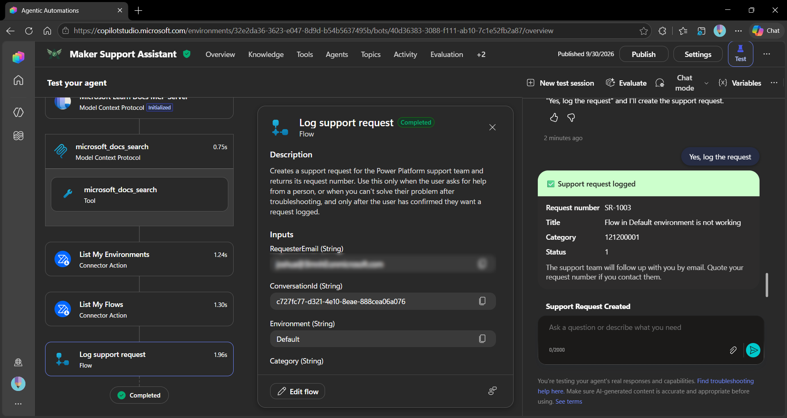

# Maker Support Assistant

## Summary

Maker Support Assistant is a Copilot Studio agent that helps Power Platform makers, developers and administrators build, understand and troubleshoot their solutions. It answers how-to questions from official Microsoft Learn documentation, looks up the user's own environments and cloud flows, and logs a support request with a confirmation card when it can't solve a problem.



▶️ [Watch the demo on YouTube](https://www.youtube.com/watch?v=OCf8e4FOZVs)

## Contributors

* [Josh Bray](https://github.com/brayjosh)

## Version history

Version|Date|Comments
-------|----|--------
1.0|October 01, 2026|Initial release

## Prerequisites

* A Power Platform environment with Microsoft Dataverse
* A Microsoft Copilot Studio licence or trial in that environment
* The **System Customizer** or **System Administrator** security role in the environment, to import the solution
* The [Power Platform CLI](https://learn.microsoft.com/power-platform/developer/cli/introduction)

## Minimal path to awesome

### Copilot Studio using Solution Import

This sample uses the Power Platform CLI to import samples, for documentation and installation instructions please visit: [What is Microsoft Power Platform CLI? | Microsoft Learn](https://learn.microsoft.com/en-us/power-platform/developer/cli/introduction)

- Ensure you are authenticated with ```pac auth```

```powershell

# From the samples/mcs-MakerSupportAssistant folder, package up the solution
pac solution pack --zipfile MakerSupportAssistant.zip --folder ./src

# Import into Power Platform (default environment)
pac solution import --path MakerSupportAssistant.zip

# Import into specific environment
pac env list
pac solution import --path MakerSupportAssistant.zip --environment <environment-guid>

```

### After importing

1. In [Power Apps](https://make.powerapps.com), open **Solutions > Maker Support Assistant > Connection references** and set a connection for each of these:
   * **Microsoft Learn Docs MCP**
   * **Power Automate Management**
   * **Microsoft Dataverse**
2. Open **Cloud flows** in the solution and make sure **Log support request** is turned on.
3. In [Copilot Studio](https://copilotstudio.microsoft.com), open **Maker Support Assistant** and select **Publish**.
4. Give anyone who should be able to log support requests **Create** and **Read** privileges on the **Support Request** table, for example by adding them to a custom security role. The flow runs under each user's own Dataverse connection, so users without these privileges can't log requests.
5. Share the agent with your users, or add it to a channel such as Microsoft Teams.

## Features

Using this sample you can extend Microsoft 365 Copilot with an agent that:

* Answers questions about Power Apps, Power Automate, Dataverse, Power Pages, Power BI, Copilot Studio, ALM and governance using the **Microsoft Learn Docs MCP Server**
* Lists the user's own environments and cloud flows, including flows that are turned off or at risk of suspension, using the **Power Automate Management** connector
* Troubleshoots a user's flow by checking its state and connectors first, then finding the fix in Microsoft Learn
* Logs a support request in Dataverse through an **agent flow**, after the user confirms, and replies with an **Adaptive Card** showing the request number

This sample illustrates the following concepts:

* Combining an MCP server and Power Platform connector tools in one agent
* Chaining tools, where the agent looks up an environment's internal name before listing its flows
* Structured agent instructions that follow Microsoft's guidance for generative orchestration
* An agent flow used as a tool, with inputs filled automatically from system variables (`User.Email` and `Conversation.Id`)
* An Adaptive Card response from a tool
* A Dataverse table with an autonumber column (`SR-1000`) and custom Status Reason values (New, In progress, Resolved)

### Suggested prompts

* Which Power Platform environments do I have access to?
* Which of my flows in my default environment are turned off?
* Are any of my flows at risk of being suspended?
* One of my flows isn't running. Can you help me find out why?

### Security notes

* The connector tools use **end user credentials**, so each person only sees their own environments and flows.
* The **Log support request** flow's **Microsoft Dataverse** connection is set to **Provided by run-only user**, and the flow can only create rows in the Support Request table.
* The requester's email and conversation ID are filled from the signed-in user and the conversation, not from anything the user types.
* Apart from logging support requests, the agent only reads information. It never changes, turns off or deletes anything.
* Web search is turned off, so answers come from Microsoft Learn documentation and the user's own data only.

### Limitations

* The flow tools only return flows the signed-in user created. Flows shared with the user aren't listed.
* The Power Automate Management connector allows 5 calls per minute per connection, so very rapid testing can be throttled.
* The connector can't read flow run history, so the agent can report a flow's state and connectors but not individual run errors.

## Help

We do not support samples, but this community is always willing to help, and we want to improve these samples. We use GitHub to track issues, which makes it easy for community members to volunteer their time and help resolve issues.

You can try looking at [issues related to this sample](https://github.com/pnp/copilot-pro-dev-samples/issues?q=label%3A%22sample%3A%20mcs-MakerSupportAssistant%22) to see if anybody else is having the same issues.

If you encounter any issues using this sample, [create a new issue](https://github.com/pnp/copilot-pro-dev-samples/issues/new).

Finally, if you have an idea for improvement, [make a suggestion](https://github.com/pnp/copilot-pro-dev-samples/issues/new).

## Disclaimer

**THIS CODE IS PROVIDED *AS IS* WITHOUT WARRANTY OF ANY KIND, EITHER EXPRESS OR IMPLIED, INCLUDING ANY IMPLIED WARRANTIES OF FITNESS FOR A PARTICULAR PURPOSE, MERCHANTABILITY, OR NON-INFRINGEMENT.**

