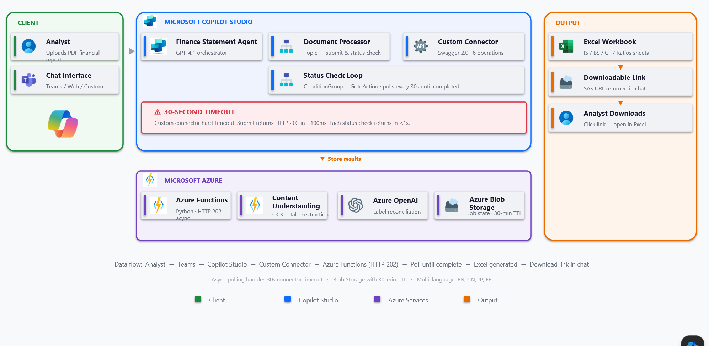

# Finance Statement Agent

## Summary

Conversational AI for credit financial statement extraction. An analyst uploads a PDF financial report in Microsoft Teams; a Copilot Studio agent orchestrates an Azure-hosted pipeline that extracts the **Income Statement, Balance Sheet, Cash Flow,** and computed **Ratios** into a downloadable Excel workbook ready for credit spreading.

Multi-language: English, Chinese, Japanese, French (auto-detected, label-reconciled to a canonical schema).



**Data flow:** Analyst → Teams → Copilot Studio → Custom Connector → Azure Functions (HTTP 202) → Poll until complete → Excel generated → SAS download link in chat.

## Frameworks


## Prerequisites

* Microsoft 365 tenant with **Copilot Studio** licensed
* **Power Platform** environment with Dataverse and custom connector permissions
* **Azure subscription** with rights to create Resource Group, Function App, Content Understanding (or Document Intelligence), Azure OpenAI (with `gpt-4.1` deployment), and Storage Account
* [Azure CLI](https://learn.microsoft.com/cli/azure/install-azure-cli) 2.50+
* [Azure Functions Core Tools](https://learn.microsoft.com/azure/azure-functions/functions-run-local) 4.x
* [Power Platform CLI (`pac`)](https://learn.microsoft.com/power-platform/developer/cli/introduction)
* Python 3.11+, Node.js 18+

## Contributors

mcs-finance-statement-agent | Shaji Sivaraman ([@sgshaji](https://github.com/sgshaji)), Microsoft

## Version history

Version | Date | Author | Comments
--------|------|--------|---------
1.0 | April 30, 2026 | Shaji Sivaraman | Initial release

## Disclaimer

**THIS CODE IS PROVIDED *AS IS* WITHOUT WARRANTY OF ANY KIND, EITHER EXPRESS OR IMPLIED, INCLUDING ANY IMPLIED WARRANTIES OF FITNESS FOR A PARTICULAR PURPOSE, MERCHANTABILITY, OR NON-INFRINGEMENT.**

---

## Minimal Path to Awesome

The sample is split across three deployables: an **Azure Functions** backend, a **Copilot Studio** agent, and an optional **Power Apps Code App** for human-in-the-loop review.

### 1. Clone and authenticate

```bash
git clone https://github.com/pnp/copilot-pro-dev-samples.git
cd copilot-pro-dev-samples/samples/mcs-finance-statement-agent/src
az login
az account set --subscription "<subscription-id>"
```

### 2. Provision Azure resources

Create the resources listed in **Prerequisites**. Grant the Function App's **system-assigned managed identity** these roles at the resource group scope:
* `Cognitive Services User` — Content Understanding / Document Intelligence
* `Cognitive Services OpenAI User` — Azure OpenAI
* `Storage Blob Data Contributor` — Storage Account

### 3. Configure and run the backend

```bash
cd azure-functions
cp .env.example .env
# edit .env with your endpoints (no API keys — Managed Identity handles auth)
pip install -r requirements.txt
func start                      # http://localhost:7071/api/health
```

### 4. Deploy the Function

```bash
func azure functionapp publish <your-function-app> --python
```

### 5. Set up the custom connector

1. Power Platform → **Custom connectors → New → Import OpenAPI file** → `docs/custom-connector-swagger.yml`
2. Update the Host to your Function App
3. Authentication: **API key** (header `x-functions-key`) — retrieve via:
   ```bash
   az functionapp keys list --name <your-function-app> --resource-group <your-rg>
   ```
4. Create a connection using the new connector

### 6. Push the Copilot Studio agent

```bash
cd ../copilot-studio-agent
pac copilot push --environment <env-id>
```

### 7. (Optional) Deploy the HITL review Code App

```bash
cd ../code-app
npm install && npm run build
pac code push
```

## Features

This sample demonstrates an end-to-end agentic pattern for processing long-running document workloads from Copilot Studio:

* **Async extraction with polling** — Power Platform custom connectors have a default 30-second synchronous request timeout. The pipeline returns `HTTP 202 {jobId}` in ~100 ms; the Copilot Studio topic polls `/extract/status/{jobId}` every 30 s until `completed` (`ConditionGroup` + `GotoAction` loop bounded by max-attempts)
* **Pluggable extraction backend** — Content Understanding (default), Document Intelligence, Textract, or local pdfplumber, selectable via `EXTRACTION_BACKEND`
* **5-stage pipeline** — analyze → select → extract → enrich → validate. Backends emit a common markdown + HTML-table format so Stages 2–5 are reusable
* **Multi-language label reconciliation** — Azure OpenAI maps source-language labels to a canonical English schema for English, Chinese, Japanese, and French statements
* **Managed Identity end-to-end** — no API keys for Azure service-to-service auth. The only secret is the Function key consumed by the Power Platform custom connector
* **Job state in Blob with 30-min TTL** — bounded storage; SAS URLs returned in chat for the generated Excel
* **Human-in-the-loop review** — optional Power Apps Code App provides an analyst grid backed by Dataverse for correcting extracted values before downstream credit spreading
* **Multi-row column-header parsing** — handles statements where Q4 and FY columns share a parent header (e.g., Meta Income Statement)
* **>5 MB upload handling** — uses Copilot Studio `Question` node bound to `FilePrebuiltEntity` (direct `Activity.Attachments` access fails for files > 5 MB)

### Repository layout (under `src/`)

```
src/
├── azure-functions/         # Python backend (HTTP 202 async pipeline)
│   ├── function_app.py      # HTTP router
│   └── extractor/           # 5-stage pipeline + clients (CU, DI, Textract, pdfplumber)
├── copilot-studio-agent/    # Copilot Studio YAML (agent, topics, actions, workflows)
├── code-app/                # Power Apps Code App — React HITL review grid (Dataverse)
└── docs/
    ├── architecture.png             # Architecture diagram
    └── custom-connector-swagger.yml # Swagger 2.0 spec for the custom connector
```


