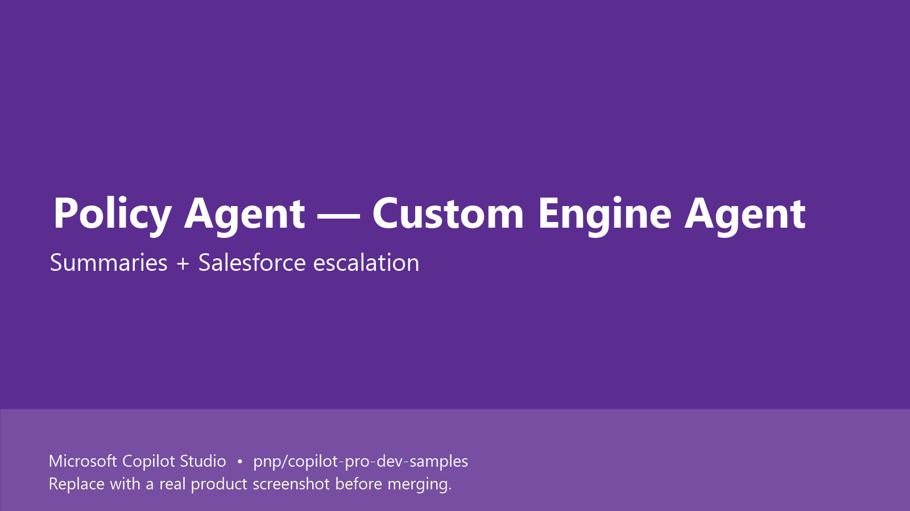

# Policy Agent (Custom Engine Agent with Salesforce Escalation) for Copilot Studio

## Summary

A **Custom Engine Agent (CEA)** built in **Microsoft Copilot Studio** that handles both summary-level and detailed clause-level policy queries. When the user asks for in-depth information ("give me more details…"), the agent escalates to **Salesforce** via an Agent Flow to fetch authoritative clause-level data and continue the conversation.

This pattern is useful when self-service answers are not enough and you need a clean hand-off to an expert / system of record without losing context.

## Demo

https://github.com/user-attachments/assets/cc37e754-7ecd-4627-aa7e-3a8cf059467b

> Note: This is one of three sibling samples — `mcs-policy-agent-da` (declarative / knowledge-only) and `mcs-policy-agent-topics` (deterministic topic routing) cover the same business scenario in different styles.

## Contributors

* [Keshav](https://github.com/keshavk-msft)

## Version history

Version|Date|Comments
-------|----|--------
1.0|June 25, 2026|Initial release

## Prerequisites

* Microsoft 365 tenant with Microsoft 365 Copilot
* Microsoft Copilot Studio license
* SharePoint site containing your policy documents (used as the primary knowledge source)
* Salesforce instance with API access — used by the Agent Flow for escalation
* (Optional) [Power Platform Tools for VS Code](https://marketplace.visualstudio.com/items?itemName=microsoft-IsvExpTools.powerplatform-vscode) and the [Copilot Studio extension for VS Code](https://marketplace.visualstudio.com/items?itemName=ms-CopilotStudio.vscode-copilotstudio)

## Minimal path to awesome

### Copilot Studio using cloned source

This sample was exported using the Copilot Studio extension for VS Code (Method 2 in the contributing guide). The agent source files live under `src/` and use the `.mcs.yml` format.

1. Open Microsoft Copilot Studio in your environment.
2. Create a new Custom Engine Agent.
3. From VS Code with the Copilot Studio extension installed, connect to the same environment and pull down the new agent.
4. Replace the generated files with the contents of `src/` from this sample. Folder layout:
   * `agent.mcs.yml`, `settings.mcs.yml` — agent definition + settings
   * `knowledge/` — SharePoint knowledge source (update the URL to your tenant's policy site)
   * `topics/` — full topic set (`Greeting`, `Fallback`, `Escalate`, `Search`, `Signin`, etc.)
   * `actions/SalesforceFlow.mcs.yml` — declarative action that calls the Salesforce escalation flow
   * `workflows/SalesforceFlow-*/` — Agent Flow definition (`workflow.json` + `metadata.yml`) — connect it to **your** Salesforce connection
5. Update the Salesforce connection reference in the workflow to point to a connection in your environment.
6. Push the changes back to Copilot Studio and publish.
7. Test in the **Test your agent** panel:
   * **Summary path** — "How many paid holidays do employees get per year?"
   * **Escalation path** — "Give me more details about the parental leave policy" (this should trigger `Escalate` topic and call the Salesforce flow)

## Features

This sample shows how to build a Copilot Studio CEA that:

* Answers everyday policy questions from a SharePoint knowledge source
* Recognises when the user wants deeper clause-level information and routes to an `Escalate` topic
* Calls an **Agent Flow** that talks to **Salesforce** to retrieve the detailed payload
* Brings the response back into the same conversation — no channel switch for the user

Concepts illustrated:

* Custom Engine Agent topology in Copilot Studio
* SharePoint as primary knowledge source
* Declarative action (`actions/*.mcs.yml`) pointing to an Agent Flow
* Agent Flow with a third-party connector (Salesforce) used as an escalation backend
* Source-controlled Copilot Studio agent (`.mcs.yml`)

## Help

We do not support samples, but the community is willing to help. We use GitHub to track issues.

You can look at [issues related to this sample](https://github.com/pnp/copilot-pro-dev-samples/issues?q=label%3A%22sample%3A%20mcs-policy-agent-cea%22) to see if anybody else is having the same issues.

If you encounter any issues using this sample, [create a new issue](https://github.com/pnp/copilot-pro-dev-samples/issues/new).

If you have an idea for improvement, [make a suggestion](https://github.com/pnp/copilot-pro-dev-samples/issues/new).

## Disclaimer

**THIS CODE IS PROVIDED *AS IS* WITHOUT WARRANTY OF ANY KIND, EITHER EXPRESS OR IMPLIED, INCLUDING ANY IMPLIED WARRANTIES OF FITNESS FOR A PARTICULAR PURPOSE, MERCHANTABILITY, OR NON-INFRINGEMENT.**

