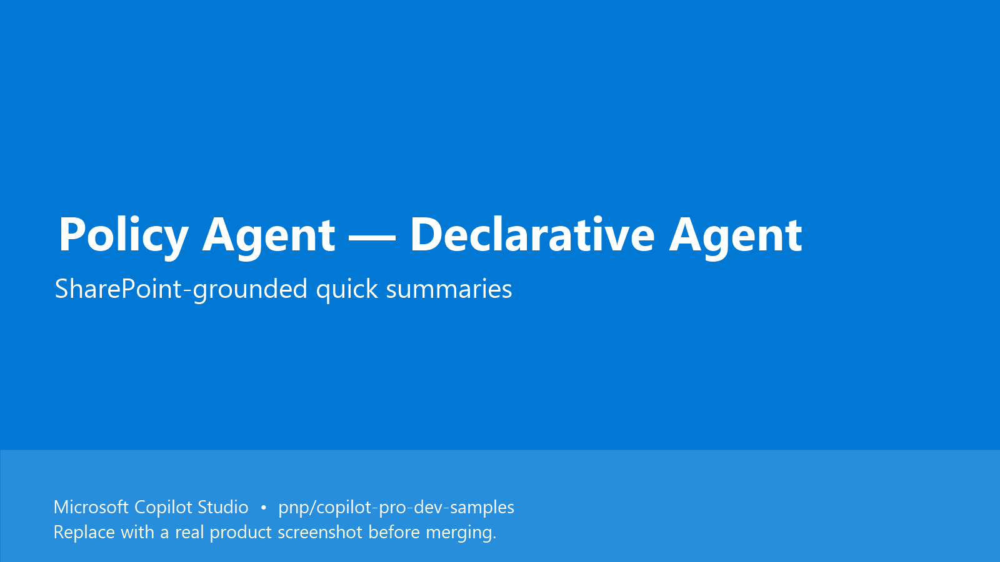

# Policy Agent (Declarative Agent) for Copilot Studio

## Summary

A SharePoint-grounded **Declarative Agent** built in **Microsoft Copilot Studio** that gives employees quick, summary-level answers to internal policy questions across HR, IT, Finance and other departments — without forcing them to dig through multiple SharePoint sites.

The agent relies on Microsoft 365 grounding so it can return rich, multi-file referenced answers with very little configuration.

## Demo

https://github.com/user-attachments/assets/2d68cfe9-1742-472a-ac77-f36d05d009b6

> Note: This agent is built with Copilot Studio. Two sibling samples (`mcs-policy-agent-cea` and `mcs-policy-agent-topics`) show the same business problem solved as a Custom Engine Agent and as a topic-based agent respectively.

## Contributors

* [Keshav](https://github.com/keshavk-msft)

## Version history

Version|Date|Comments
-------|----|--------
1.0|June 25, 2026|Initial release

## Prerequisites

* Microsoft 365 tenant with Microsoft 365 Copilot
* Microsoft Copilot Studio license
* A SharePoint site containing your policy documents (HR, IT, Finance, etc.)
* (Optional) [Power Platform Tools for VS Code](https://marketplace.visualstudio.com/items?itemName=microsoft-IsvExpTools.powerplatform-vscode) and the [Copilot Studio extension for VS Code](https://marketplace.visualstudio.com/items?itemName=ms-CopilotStudio.vscode-copilotstudio) if you want to clone / edit the agent from source

## Minimal path to awesome

### Copilot Studio using cloned source

This sample was exported using the Copilot Studio extension for VS Code (Method 2 in the contributing guide). The agent source files live under `src/` and use the `.mcs.yml` format.

1. Open Microsoft Copilot Studio in your environment.
2. Create a new agent (Declarative Agent).
3. From VS Code with the Copilot Studio extension installed, connect to the same environment and pull down the new agent.
4. Replace the generated files with the contents of `src/` from this sample:
   * `agent.mcs.yml` — agent definition (name, description, instructions)
   * `settings.mcs.yml` — agent settings
   * `knowledge/SharePointSearchSource.0.mcs.yml` — SharePoint knowledge source — **update the site URL to point to your tenant's policy site**
   * `topics/OnError.mcs.yml` — global error topic
5. Push the changes back to Copilot Studio.
6. Test in the **Test your agent** panel with prompts like:
   * "What is the company's IT usage policy?"
   * "Summarize the vacation policy for full-time employees"
   * "What documents are required under the health insurance policy?"
7. Publish to your channel of choice (Microsoft 365 Copilot, Teams, etc.).

## Features

This sample shows how to extend Microsoft 365 Copilot with a Declarative Agent that:

* Answers policy questions grounded on a SharePoint site
* Returns multi-file referenced summaries instead of forcing the user to open documents
* Ships as a small, fully declarative footprint — no custom code, no plugin

Key concepts illustrated:

* Declarative Agent + SharePoint knowledge source
* Source-controlled Copilot Studio agent (`.mcs.yml`)
* Minimal configuration / fastest time-to-value path for a knowledge agent

## Help

We do not support samples, but the community is willing to help. We use GitHub to track issues.

You can look at [issues related to this sample](https://github.com/pnp/copilot-pro-dev-samples/issues?q=label%3A%22sample%3A%20mcs-policy-agent-da%22) to see if anybody else is having the same issues.

If you encounter any issues using this sample, [create a new issue](https://github.com/pnp/copilot-pro-dev-samples/issues/new).

If you have an idea for improvement, [make a suggestion](https://github.com/pnp/copilot-pro-dev-samples/issues/new).

## Disclaimer

**THIS CODE IS PROVIDED *AS IS* WITHOUT WARRANTY OF ANY KIND, EITHER EXPRESS OR IMPLIED, INCLUDING ANY IMPLIED WARRANTIES OF FITNESS FOR A PARTICULAR PURPOSE, MERCHANTABILITY, OR NON-INFRINGEMENT.**

