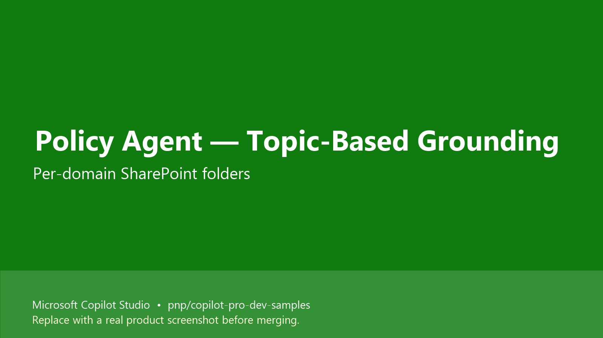

# Policy Agent (Topic-Based Grounding) for Copilot Studio

## Summary

A **Custom Engine Agent** built in **Microsoft Copilot Studio** that uses a topic-based grounding pattern: each policy domain (HR, Finance, IT Security, Legal & Compliance, Operations & Administration) maps to a dedicated SharePoint folder and a dedicated agent topic. This gives **deterministic** routing — the agent reaches into the right knowledge source for the right question instead of relying on a single generic search.



> Note: This is one of three sibling samples — `mcs-policy-agent-da` (declarative / knowledge-only) and `mcs-policy-agent-cea` (CEA with Salesforce escalation) cover the same business scenario in different styles.

## Contributors

* [Keshav](https://github.com/keshavk-msft)

## Version history

Version|Date|Comments
-------|----|--------
1.0|June 25, 2026|Initial release

## Prerequisites

* Microsoft 365 tenant with Microsoft 365 Copilot
* Microsoft Copilot Studio license
* SharePoint site with policy documents organised into per-domain folders (see below)
* (Optional) [Power Platform Tools for VS Code](https://marketplace.visualstudio.com/items?itemName=microsoft-IsvExpTools.powerplatform-vscode) and the [Copilot Studio extension for VS Code](https://marketplace.visualstudio.com/items?itemName=ms-CopilotStudio.vscode-copilotstudio)

### Recommended SharePoint folder layout

```
/Policies
├── /Finance        → Finance topic
├── /HR             → HR topic
├── /IT             → IT Security topic
├── /Legal          → Legal & Compliance topic
└── /Operations     → Operations & Administration topic
```

Each folder is wired to its own knowledge source under `src/knowledge/` and to its own topic under `src/topics/`.

## Minimal path to awesome

### Copilot Studio using cloned source

This sample was exported using the Copilot Studio extension for VS Code (Method 2 in the contributing guide). The agent source files live under `src/` and use the `.mcs.yml` format.

1. Open Microsoft Copilot Studio in your environment.
2. Create a new Custom Engine Agent.
3. From VS Code with the Copilot Studio extension installed, connect to the same environment and pull down the new agent.
4. Replace the generated files with the contents of `src/` from this sample. Folder layout:
   * `agent.mcs.yml`, `settings.mcs.yml` — agent definition + settings
   * `knowledge/` — three SharePoint knowledge sources (Finance, HR, IT Security) — **update the SharePoint URLs to your tenant**
   * `topics/` — per-domain topics: `Finance`, `HR`, `ITSecurity`, `LegalCompliance`, `OperationsAdministration`, plus the standard system topics
5. Push the changes back to Copilot Studio.
6. Test in the **Test your agent** panel:
   * "How do I request time off according to HR policy?" → routes to **HR**
   * "Explain the step-by-step process for submitting expense claims" → routes to **Finance**
   * "What are the IT security guidelines for remote work?" → routes to **IT Security**
7. Publish to your channel of choice.

## Features

This sample shows how to build a Copilot Studio agent that:

* Routes each user question to the right departmental policy topic
* Grounds each topic on a focused SharePoint folder for precision
* Gives consistent, deterministic answers — no cross-domain "blending" of unrelated policies
* Scales cleanly: add a new department by adding one knowledge source and one topic

Concepts illustrated:

* Topic-based routing in Copilot Studio
* SharePoint folder-per-domain knowledge pattern
* Per-topic knowledge scoping for higher precision than a single global search
* Source-controlled Copilot Studio agent (`.mcs.yml`)

## Help

We do not support samples, but the community is willing to help. We use GitHub to track issues.

You can look at [issues related to this sample](https://github.com/pnp/copilot-pro-dev-samples/issues?q=label%3A%22sample%3A%20mcs-policy-agent-topics%22) to see if anybody else is having the same issues.

If you encounter any issues using this sample, [create a new issue](https://github.com/pnp/copilot-pro-dev-samples/issues/new).

If you have an idea for improvement, [make a suggestion](https://github.com/pnp/copilot-pro-dev-samples/issues/new).

## Disclaimer

**THIS CODE IS PROVIDED *AS IS* WITHOUT WARRANTY OF ANY KIND, EITHER EXPRESS OR IMPLIED, INCLUDING ANY IMPLIED WARRANTIES OF FITNESS FOR A PARTICULAR PURPOSE, MERCHANTABILITY, OR NON-INFRINGEMENT.**


